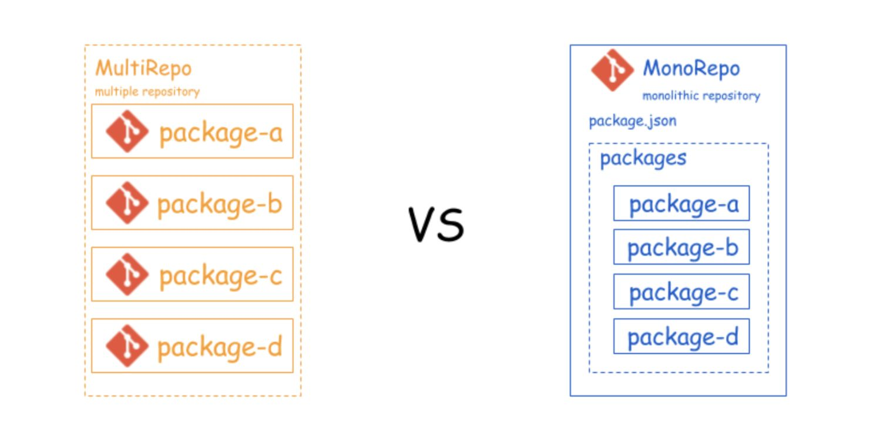

## Monorepo

日常开发中，如果有多个前端项目或者工具库，我们总是习惯性地给每个工具库建一个仓库，单独维护，在开发者本地也需要创建相对应的项目，即multi-repo。

还有就是很多公司在新人入职时，需要要花很长的时间才能让新人开始动手干活，并不一定是内部系统要学的东西很多，可能只是因为有很多的部落知识并没有很好地『传承』，就像很多项目的所有依赖从网上单独拉下来，然后配置好开发环境才开干。除此之外，还要说明不时说明哪些配置是必须的。

还有类似的场景，在一个前端项目变得很大以后，构建后的bundle包会达到20M甚至是更大，也更复杂。对于这个体积的bundle包，首要的任务是从用户体出发对工程进行优化并重新组织。

项目在放养式的维护状态下，通常是乱遭糟的，很难理清项目间的依赖。这样不仅仅增加了维护成本，而且也加重了心智负担。

如果有一种工程管理方式，能够将相关的工程从逻辑上组织起来。最直观的好处是能够快速地导航到目标项目，可以像在一个网络文件系统上一样进行导航。还可以对项目和依赖包进行同频发布。

你可能会想到npm包或者submodules的方式。如果把它们发布到 npm，可只要有一个新的版本变更，每个依赖的项目都要跟着改，并且本地调试稍显复杂。本地调试npm包，一般通过npm link或者yalc link到本地项目里，越是link的包多，管理这些link就越复杂。

还有什么好办法吗？也许你还会想到 git submodules，把这些相同的部分放到 git 仓库里面，通过 submodules 的形式来集成进来。submodules 确实可以缓解这个问题，但还不能规避调重复安装依赖的问题。

下面我们看下单一仓库monorepo的实现。

对于多项目管理

#### yarn workspace + lerna
lerna创建过程

安装本工程的包依赖

安装3rd包、启动、运行

注意问题：
"private": true会确保根目录不被发布出去。

包名不能重复：lerna ERR! E403 You do not have permission to publish "basic-utils". Are you logged in as the correct user?
解决办法： 检查包名

命令行少参数： lerna ERR! E401 [UNAUTHORIZED] Login first。 
解决办法是加 --conventional-commits

不能发私有包：npm ERR! You must sign up for private packages 。 
解决办法： npm publish --access public
 
 
#### yarn workspace 

#### Monorepo的好处
