## 第1章 前端研发体系建设

​      一个完善的前（后）端研发体系建设可以更好地保障日常开发、测试、部署、上线，特别在是加速业务开发、规范各个开发环节、"约束"各个环节顺利工作方面。各公司针对前端研发体系的建设方式各有不同，互联网大厂，如阿里、美团、菜鸟、优酷、咸鱼等更偏向大前端团队或者叫做体验技术部（主要包括UED、前端、客户端、Node、Go、数据可视化、Docker、工程、产品、运营等），并且都有各自的研发套件、构建平台、部署平台等方面的基础服务。但是对于中小企业的前端团队而言，似乎很难享受这么完整的开发红利。

​     研发体系在中小企业中的落地也并没有那么容易，原因是多方面的，第一是收益回报比较慢，或者说没有直接的利益回报，因为仅为本公司服务，很难对外服务话。第二是成本问题，开发体系建设需要有人力持续投入、服务器投入，后期还需要不断迭代、问题修改、紧急问题修复，对中小企业来讲在人员不足且持续无直接利益回报的投入就变得非常奢侈。第三个问题是时间投入，研发体系建设需要比较长的时间投入进行预研、开发、部署、测试。

​    本章从技术角度出发，以面向中小企业快速搭建前端研发体系为出发点，详细阐述研发体系各部分的技术实现。希望通过本章内容能降低研发体系建设的门槛，缩短建设时间。

### 1.1 研发体系建设背景

​     中小公司如果没有脚手架的支持，作为前端开发者（或者是非专业的前端开发者），部门启动新项目，准备工程的过程是不是这样的：


<center>图1-1</center>

​     这种方法的好处就是能快速开始业务开发，节省技术预研时间和框架搭建过程，大部分的开源项目模板中都集成了项目优化方案，开箱即用，确实很方便。但是缺点也很明显，现有的项目框架能力转化为知识积累的周期变长了， 特别是在很多服务已经发布成三方包的情况下 。再者就是知识探索的软实力不能充分发挥，只会被动接收，这是能力成长路上最大的绊脚石。

还有一种搭建新项目的方式是这样的：


<center>图1-2</center>

   很多前端开发者倾向这种准备项目的方式，能锻炼锻炼项目的搭建能力，但是要求搭建者有广阔的技术视野，对相应的中间件有横向和纵向的对比能力，分析优缺点；对构建工具配置需要非常熟悉甚至精通，有系统的配置、优化方案；熟悉代码的优化组织形式，实现代码的可插拔；......

   缺少部署工具情况又会是怎么样的？首先手动生成bundle包，再通过ssh工具连接到远程服务器（甚至还需要中转机跳转），然后找到原部署目录，删除原来的目录，上传新目录。这样的操作，不但繁琐，而且速度慢、容易出错（服务器链接断开、命令操作出错等）。如果是开发环境每天需要部署多次，这样的操作也就需要重复多次。

   缺少研发体系支撑的开发，需要人工频繁介入开发流程的各个环节来保证畅通、结果正确。工作不但繁琐、工作量大，而且对各个环节还是缺少必要的监督，出错率大大增加。

   前端研发体系其实从前端专业化开始萌芽。专业化之前前端开发经历了"石器时代"，是以前端三核心（HTML，JavaScript，Css）配合jQuery，之后是前端的"白银时代"，模块规范（Amd，Cmd）出现，出现了yeoman脚手架，配合generator工具生成项目代码，配合grunt、gulp做为最初的构建工具，专业化前端基本。真正迎来前端开发"黄金时代"的是nodejs的出现，因为其跨平台性，很大程度上拓展了前端的知识边界，大量"轮子"疯狂出现，打包工具webpack横空出世，重新定义了前端开发方式。如今的前端黄金时代还在不断演进，基于Go和Rust的工具，不再拘泥于js的性能诟病，高性能、低延迟、高可用正在前端社区慢慢铺开。

   前后端的独立开发模式对研发体系建设是隐喻的要求，要解决前端的系统需求，开发框架应该怎么选，组件库应该怎么选，状态库是否需要，需要的话应该选哪个，构建工具怎么选，已经积累的组件怎么汇总在一起，还有就是是否支持移动端，支持移动端的话框架的性能如何，等等问题。抛开每个问题的螺旋上升不提，该怎么去解决这一系列的问题，该是中小企业前端负责人该认真思考并解决的问题。前端系统中的很多问题可以映射到前端研发体系的建设中。

   个人认为，前端研发体系应该包括一下几个方面：

   （1）工具辅助：方便代码产出

​    开发者的工作过程，是经过不断的思考、沟通和讨论，将想法形成方案，将方案转换成代码，经过上线发布得到最终的产品。但编码的过程是可以组装的，将各开发环节涉及到的问题统一规划、统一解决，形成工具包或者脚手架，甚至开箱即用的开发框架，公司统一使用，统一维护升级。

   （2）生命周期管理

​       前端的生命周期管理是软件生命周期管理的子集，包含从项目创建到上线监控。所以应用如何创建？如何构建和打包？如何进行部署？运行状态如何？性能优化怎么怎样？每个环节都应有相关的解决方案。

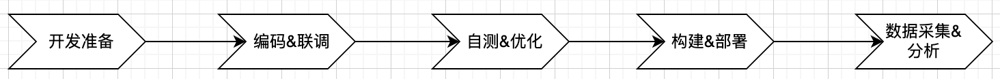

<center>图1-3</center>

  （3）前端版本管理

​    前端的版本主要包含核心库（Vue，React，打包工具，UI组件等）版本管理，项目代码升级，脚手架版本、组件库版本。最核心的是核心库版本管理，因为核心库版本的升级很大程度上将引起组件库和脚手架的迭代升级。

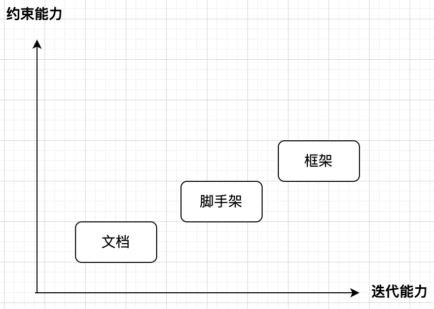

<center>图1-4</center>

大部分的核心库版本都支持语义化版本 2.0要求，即：主版本号.次版本号.修订号

- 主版本号：当做了不兼容的 API 修改
- 次版本号：当做了向下兼容的功能性新增
- 修订号：当做了向下兼容的问题修正

所以当有升级核心库版本的需求时，需要详细测试最新版本，评估升级风险，完善升级策略。

（4）知识库建设：沉淀知识资料

​     开发是一项知识生产活动，这些抽象的知识往往存在于每位开发者的大脑中，如果不能以一种可重现的方式分享出来，那么就会极大地增加沟通成本。所以，需要一种载体，将所有人的知识成果保存下来，用来知识传递。


建设前端研发体系的目的是做技术收敛，从公司层面保持前端开发体验的一致性、交付的一致性，保障交付速度和质量。一致性的保障手段最常见的有3类：

- 开发文档约束
- 集成脚手架约束
- 自研框架约束


<center>图1-5</center>

​      文档约束是这三种约束方式中最弱的。每位开发人员的风格迥异，规范五花八门，比起约束他们更擅长自由发挥。更高一层的约束是脚手架，根据前端技术栈、结合不同业务开发脚手架，内置约束，在代码提交前、打包前等节点执行约束检查，检查失败禁止下一步操作。最高级别的约束是开发自己框架，如阿里的umi、bigfish，严格约定如文件即路由、权限的access文件、Mock文件约束、数据流约束等。框架约束虽然对开发最友好，但是对框架作者的要求也最高，构建工具（可能是支持多个）的深度定制、工程编译方案、约束编译方案、缓存方案、社区最佳实践集成、数据流集成方案、高效精准的错误提示方案、性能优化方案等等。在面向业务和人力资源短缺的中小企业里，技术积累、人力资源情况和时间成本都是限制形成框架层约束的阻力。

   我们本章主要采取从脚手架约束的角度展开，详细说明前端研发体系的建设。

  从公司的角度看多技术栈的前端项目简直就是一种灾难，多技术栈就意味可能需要更多的前端人员，成本升高；组件化积累工作量增加或者组件效果重复；组件维护成本增加；兼顾多种技术栈的招人成本更高；技术栈演进规划、执行更困难。所以公司更希望有一套统一的技术栈，在此基础上建设组件库、工具库，统一规划技术演进和进行项目布局。

​    一般来说，前端研发体系主要包含以下几个方面：

- Npm私有仓库建设：进行私有包、修改的三方包、组件库和由组件库构成的板块管理，
- 开发框架、中间件统一和技术积累
- 脚手架搭建：根据团队需求不通快速构建项目，也方便进行技术栈的更新
- 业务组件库建设：积累公司的业务组件，提高研发效率
- npm包开发和维护：常用的组件和工具发布成npm包，方便公用
- 开发规范统一：方便业务维护
- 部署管理：通过CI、CD或者前端部署工具
- 知识库建设：知识共享，前端团队对齐开发技能

### 1.2 npm私有仓库搭建

   npm 的出现，对 JavaScript 生态产生了深远影响，让我们可以轻松使用第三方模块，也让我们可以轻松发布自己的模块包。随着企业的发展，公司内部对私有的 npm 仓库的需求越来越多。下面就来介绍一下，企业级 npm 私有仓库建设、部署方案。

为什么需要npm私有仓库呢？有以下几点原因：

- 内网访问，速度快
- 更加稳定并且完全可控
- 支持不方便对外的私有包
- 及时处理包的安全问题
- 方便权限隔离

私有仓库建设有开源版和收费版。我们先考虑开源的前端方案，目前可选的有：

| 名称                 | 技术栈      | star数量 |
| -------------------- | ----------- | -------- |
| verdaccio            | node        | 15.6K    |
| Nexus-public         | Java        | 1.6k     |
| Cnpmcore             | eggjs(node) | 524      |
| Cnpmjs（已停止维护） | Node        |          |

​    作为前端，我们首先选择Node工程作为私有仓库搭建工具，当然如果公司有有同步管理 maven、docker等需求，也可以考虑Nexus-public。 基于Node的verdaccio界面简洁，功能齐全，社区活跃，是一个不错的选择，并且也非常轻量，安装和配置都非常简单，但是身份验证、存储和通知等功能需要定制，这些默认只提供了简陋的实现。cnpmcore 是淘宝 NPM 镜像站服务 npmmirror.com 背后的核心，基于 eggjs 开发的，并有很好的二次开发能力。

   企业服务，要求数据和服务分离，既要保证数据的安全和可靠性，又要保证服务的持续升级迭代。私有仓库更关注内网私有化部署，除了满足内网 npm 基本服务要求，更多的是企业定制化需求，不用面对公网的流量。

  所以cnpmcore对于企业级 npm 私有仓库部署方案来说，是一个不错的解决方案。这是下面我们将围绕cnpmcore详细介绍其建设过程。

  在生产环境中，可以直接部署 cnpmcore 系统，实现完整的 Registry 镜像功能，尚无web管理功能。 但是，通常在企业内部会有一些内部的服务、要求，例如文件存储、缓存服务、登录鉴权流程等需要集成。

   cnpmcore除了提供了源码部署、二次开发的方式，还提供了 npm 包的方式，便于在 tegg（Strong Type framework with eggjs） 应用中进行集成。 这样既可以享受到丰富的自定义扩展能力，又可以享受到 cnpmcore 持续迭代的能力。需要注意的是，cnpmcore依赖数据库（mysql或者mariadb）服务、redis服务、包存储默认是本地文件系统，推荐使用对象存储（OSS或者s3）服务。

   先看下cnpmcore的分层架构依赖图：

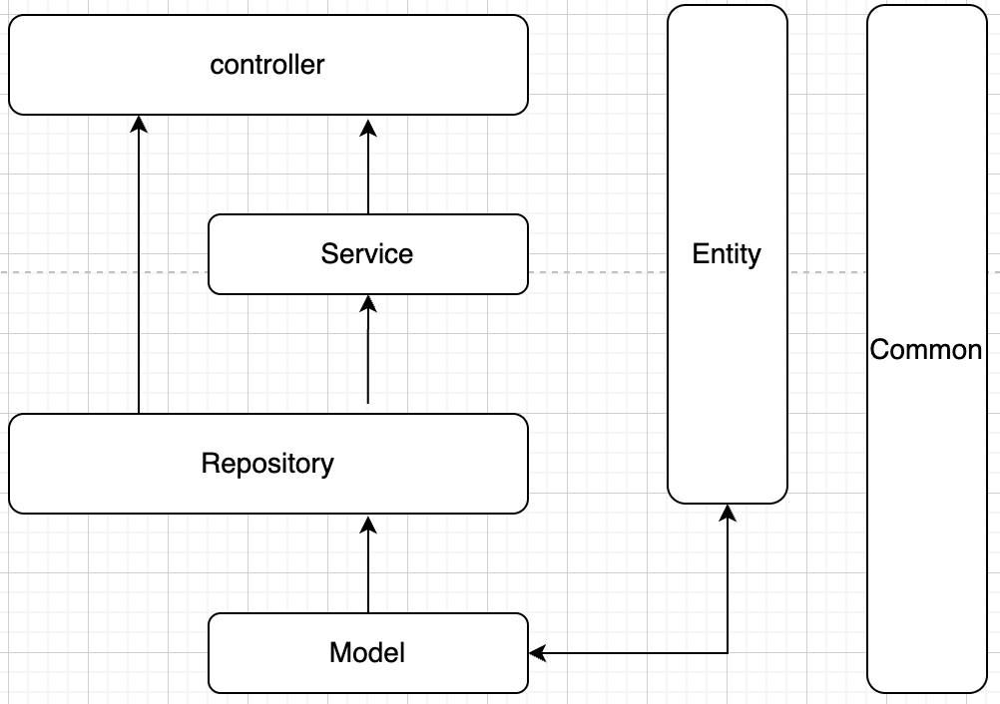

<center>图1-6</center>

对这个架构图做下简要的说明：

- 总体：按照功能分层，包括 common（包括通用工具、服务调用、抽象类、适配器等）、core（核心业务逻辑，实体、服务、事件）、repository（数据存储和查询）、port（HTTP 控制器）、infra（基于 PaaS 的基础设置实现）等
- Controller：处理 HTTP 请求，主要继承 AbstractController 和 MiddlewareController。AbstractController 封装了一些基础的数据 Entity 访问方法，MiddlewareController 主要负责编排中间件的加载顺序
- 请求合法性校验：请求合法性校验包括请求参数校验、用户认证和资源操作权限校验。请求参数校验使用 egg-typebox-validate，用户认证和资源操作权限校验通过 UserRoleManager 进行
- Service：依赖 Repository，然后由 Controller 依赖。
- Repository：依赖 Model，然后由Service 和 Controller 依赖。Repository 类方法命名规则包括 findSomething（查询）、saveSomething（保存）、removeSomething（删除）和 listSomethings（查询）

从功能的角度看，有如下几个：

- npm镜像功能：加速安装
- 私有包发布：企业内部私有包发布
- 多registory同步：无痛历史迁移
- bug-version：快速应急开源社区问题
- 二次研发：开发属于自己的npmcore

   根据cnpmcore官方建议，该项目依赖MySQL 数据服务、Redis 缓存服务。包存储默认是本地文件系统，为了性能考虑推荐使用对象存储服务或者s3服务，这里我使用了阿里云OSS，你当然也可以选择七牛云存储，又拍云云存储，青云云存储服务，或者是腾讯云的Cos服务，官方都封装成了npm包，开箱即用。
   
   Cnpmcore提供了完整的SQL接入服务，官方库的sql目录下提供了支持mysql5.x 、mysql8.x版本完整的脚本 ，需要全部导入 。

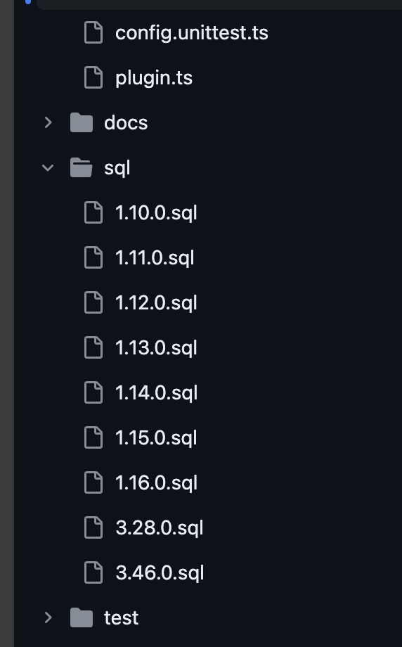

<center>图1-7</center>

接着，准备aliyun OSS服务，新建bucket

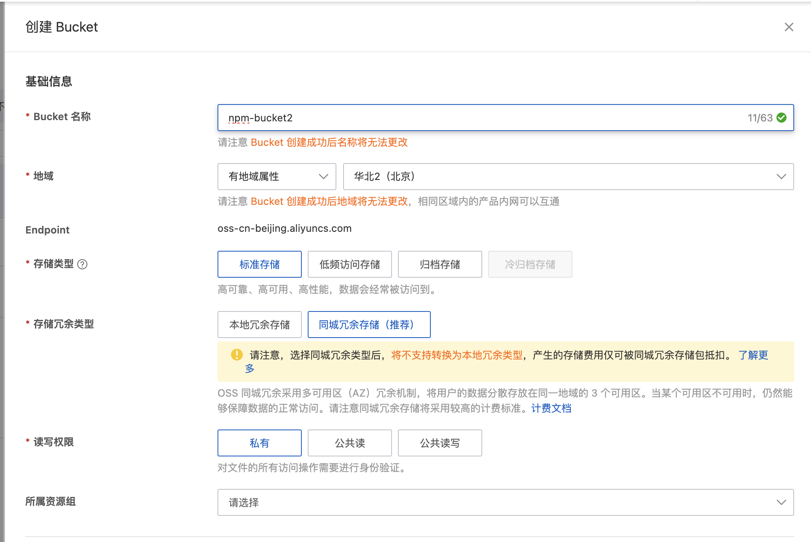

<center>图1-8</center>

接入点地址和bucket名称需要在oss初始化使用，请妥善保存，`oss-cnpm`包还需要accessKeyId和accessKeySecret。

```js
const Client = require('oss-cnpm');
const client = new Client({
  accessKeyId: 'your id',
  accessKeySecret: 'your secret',
  endpoint: 'https://oss-cn-shenzhen.aliyuncs.com',
  bucket: 'your bucket',
  mode: 'public or private',
});
```

accessKeyId和accessKeySecret需要在accessKey管理中生成。

安装redis服务，新建连接

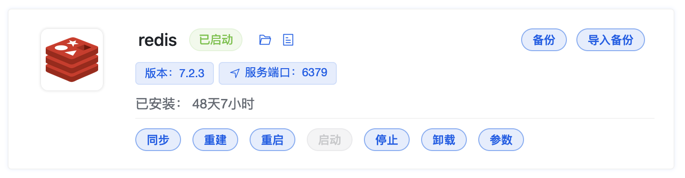

<center>图1-9</center>

基础服务准备就绪，下面开始服务搭建。

首先，克隆master分支。

```js
git clone https://github.com/cnpm/cnpmcore.git
```

mysql，oss和redis这三个服务的配置信息需要在tegg项目config/config.default.ts中修改，`config.default.ts` 是任何环境都使用的默认配置，你也可以创建 config.local.ts或者config.prod.ts来区分不同环境的配置。

先修改基础配置：

```js
config.cnpmcore = {
    name: 'cnpm',
    sourceRegistry: 'https://registry.npmmirror.com',
    // sync mode
    //  - none: don't sync npm package, just redirect it to sourceRegistry
    //  - all: sync all npm packages
    //  - exist: only sync exist packages, effected when `enableCheckRecentlyUpdated` or 	       `enableChangesStream` is enabled
    syncMode: SyncMode.admin,
    syncDeleteMode: SyncDeleteMode.delete,
    registry: process.env.CNPMCORE_CONFIG_REGISTRY || 'http://localhost:7001', // 填写自己的域名
    // white scope list
    allowScopes: [
      '@myscope', // 这里添加自己的 scope
    ],
    admins: {
      // name: email
      admin: 'houyaowei@163.com',
    },
  };
```

name: npm仓库名称

sourceRegistry：原接入点。如果下载的包在目标resgstry中不存在是，会从该字段定义的registry中下载

syncModel：定义npm库同步模式

registry： registry的接入域名，请注意，该域名是已经备案的

allowScopes：定于支持的scope名称。scope是一种把相关的模块组织到一起的一种方式，如包@eggjs/tegg-orm-plugin中@eggjs就是scope名称

admins: npm系统默认管理员，因为cnpmcore独立于npm的账号体系，需要通过admin账号添加用户。

接下来，需要在config/config.default.ts中配置mysql、redis和minio的连接信息，联通各个服务。

```js
config.orm = {
    client: 'mysql',
    database: process.env.MYSQL_DATABASE,
    host: process.env.MYSQL_HOST ,
    port: process.env.MYSQL_PORT,
    user: process.env.MYSQL_USER,
    password: process.env.MYSQL_PASSWORD,
    charset: 'utf8mb4',
  };
config.redis = {
    client: {
      port: 6379,
      host: 'example.com',
      password: 'jhkdjhkjdhsIUTYURTU_MGs8Sh',
      db: 0,
    },
  };
const client = new OSSClient({
    accessKeyId: 'accessKeyId',
    accessKeySecret: 'accessKeySecret',
    endpoint: 'http://oss-cn-beijing.aliyuncs.com',
    bucket: 'npm-bucket',
    defaultHeaders: {
      'Cache-Control': 'max-age=0, s-maxage=60',
    },
  });
  //配置OSS
  config.nfs.client = client;

```


配置完成后，启动服务。

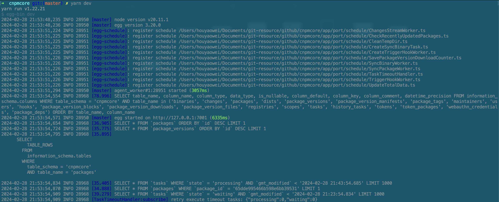

<center>图1-10</center>

添加管理员

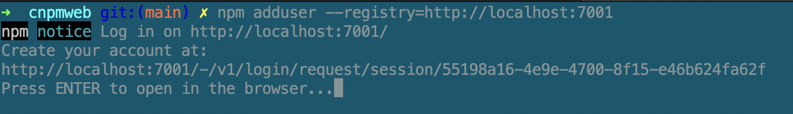

<center>图1-11</center>

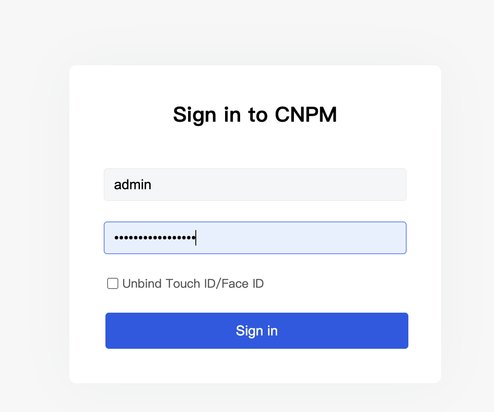

<center>图1-12</center>

输入在`config.default.ts`中配置的admins配置项（admin，houyaowei@163.com），即可完成管理员的注册。注册成功就可以使用兼容npm的操作：登录、发布包、查看登录信息、配置等等。

```js
登录 npm login --registry=http://localhost:7001
发布包  npm login --registry=http://localhost:7001
查看登录账号  npm whoami --registry=http://localhost:7001
配置  npm config set xxx  --registry=http://localhost:7001
...
```

下面测试发布npm包的功能：

（1）准备一套待发布的npm仓库，如：https://github.com/houyaowei/javascript-common-tools

（2）执行 npm login --registry=http://localhost:7001

（3）执行 npm publish --registry=http://localhost:7001

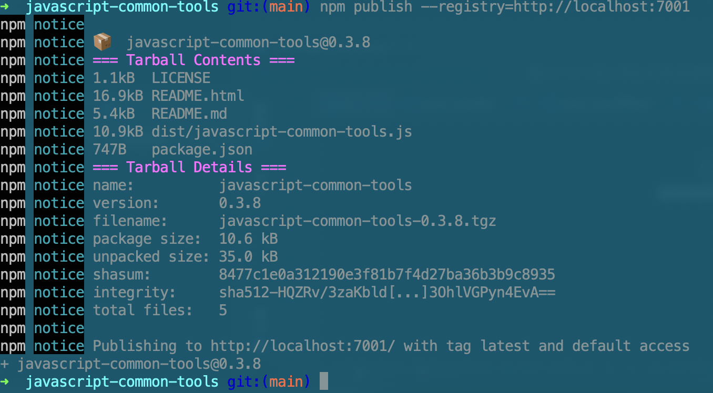

<center>图1-13</center>

发布完成后，我们需要在数据库的package(s)表中确实是否都已经落库和阿里云服务器中包文件是否存在。

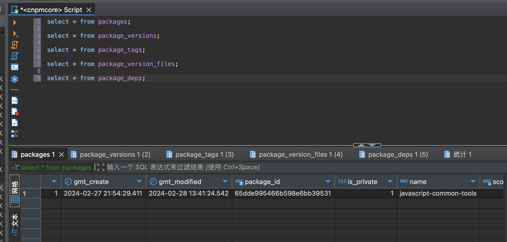

<center>图1-14</center>

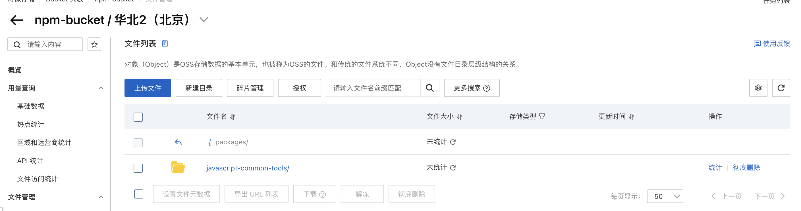

<center>图1-15</center>

到这里，预期的效果已经达到，我们的私有npm服务也已经搭建完成。

cnpmcore虽然提供了npm包管理的完整功能，但是从该库名字能够发现未集成web端，不过也没有关系，因为web端是独立的项目cnpmweb，这是基于Nextjs纯静态部署的项目，只需要修改config.js中的registry即可运行。

### 1.3 开发框架选择

   选择开发框架是开发和知识积累中最重要的环节，没有之一，是所有工作的起点。

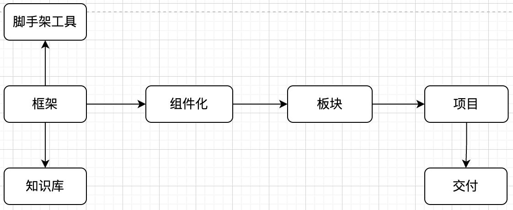

<center>图1-16</center>

​      作为前端负责人或者前端架构师，是前端建设、框架搭建、维护的第一责任人。通常情况下，团队技术情况并非我们所愿，并非整齐划一，技术遗留问题后遗症较大。因此，在项目情况五花把门、人员技术参差不齐的情况下怎么做技术选型？这是个值得讨论的话题。

​    说起常用的前端的开发框架有哪几个，很多前端同学对React、Vue、Angular可谓是非常清楚。甚至对React偏爱的也可能钟情Next.js、Preact、umi.js，喜欢Vue的可能计划Nuxt.js、solid.js，更可能也有人钟情Angular、Svelte、Qwik，钟情jquery的也不是不存在。

  在国内，React、Vue(2&3)、angular早已呈现三足鼎立之势，各自雄踞一方，有自己的拥趸。其他框架就像是割据一方的诸侯，有零散的武将。我们先看下Google trends和npm trends对这三框架的情况：

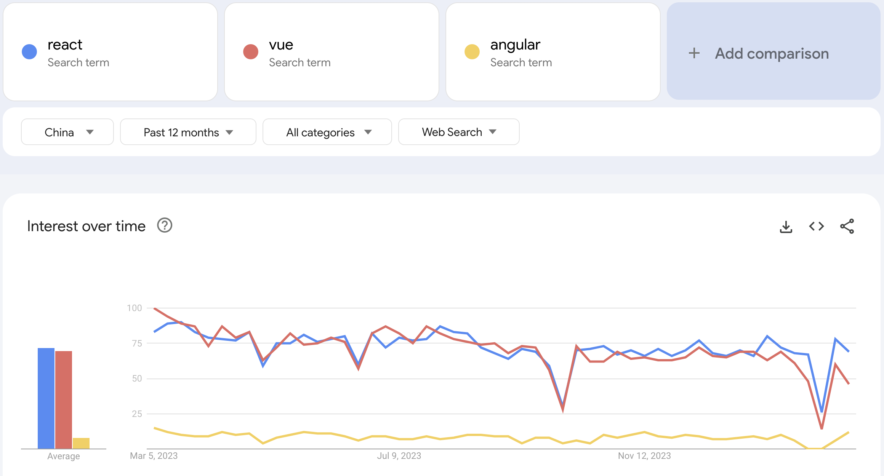

<center>图1-17 国内趋势</center>

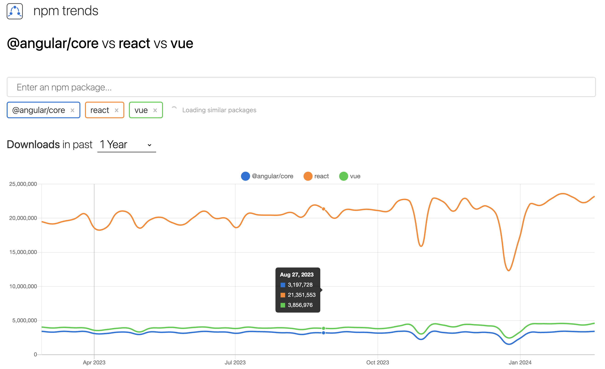

<center>图1-18 全站总下载量</center>


从国内趋势看，React和Vue齐头并进，不差上下，相比angular遥遥领先。从趋势图上看也从侧面验证了前端社区对三大框架的使用情况：国内以React和Vue为主，Vue以易上手、文档友好被更多的公司和开发者接受。从stateofjs 2022（2023的调查数据截止到2024.3.2还未公布）全球调查数据中，针对web 开发框架使用排名的前三名略有不同

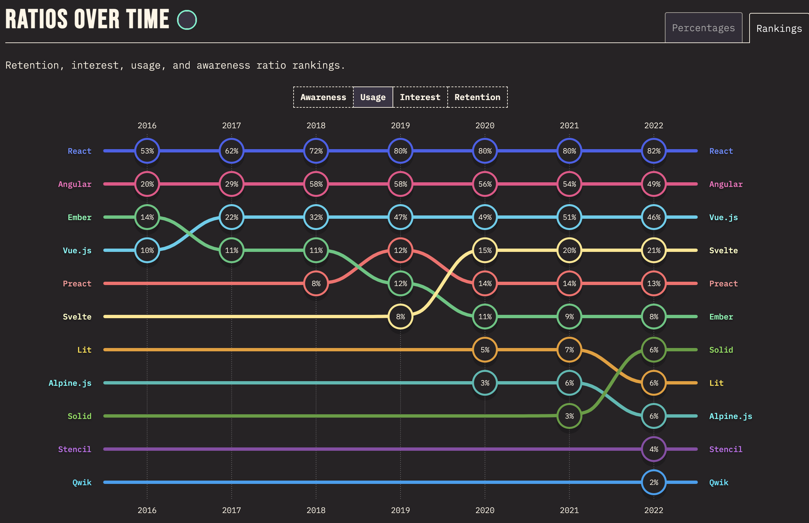

<center>图1-19</center>

顺便看过去一年全栈开发框架下载情况如下，为基础选型做参考：

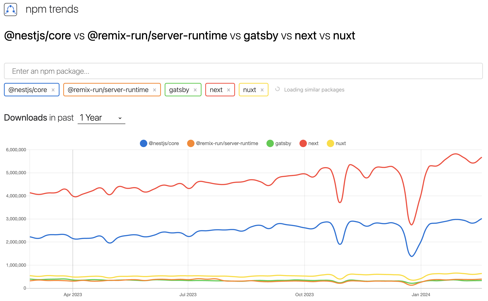

<center>图1-20 全栈开发情况</center>

对于前端技术负责人来说，技术选型是一个系统、繁琐，甚至有时候需要做适当的妥协。技术选型是整个研发体系中很小但是很重要的一环，是全局规划中最底层的一部分，目标是可持续，也是可替换的，终究还是思考反应业务能力的工具或技术产品的构建能力。

个人觉得前端技术选型可以从以下几个方面考虑：

- 实用性
- 持续性
- 经济性
- 团队匹配度
- 项目周期

####  （1）实用性

​     以React、Vue、Angular 三大框架为例，搜索它们的对比，各种帖子满天飞，你一定会看得眼花缭乱。特别是有些比较纬度是没有任何意义，比如: start 数。Angular其实已经把目标定位到企业应用上，企业项目中，需要一个开箱即用的完整解决方案，它的内置依赖注入系统和全面的测试环境使其成为复杂应用程序的理想选择。互联网应用对渲染速度、带宽、应用包体积更加苛刻，轻量化是更重要的考量，所以从早期的JQuery和现在的React、Vue可能更适合。总之，不同的应用类型要用合适的技术。

​    所以，对前端的技术要全面了解，对技术分流，在做技术选型的时候能够根据项目情况快速抉择。

（2）持续性

​     技术是技术团队的根基，需要稳定，升级方便，如果频繁变动不但会带来项目的不稳定还会导致团队的变动。所以，选技术方案要看可持续性，也就是说这套方案能够在将来多长时间内保持它的相对先进、相对健壮，又能用最小的代价进行升级。

   技术栈稳定的参考项有以下几个参考点：

1、技术或框架的作者是谁，技术栈是否完善，甚至需要了解核心开发者背后的项目情况以及对前端社区的贡献，

2、社区是否成熟和活跃。以此技术为核心的生态系统是否成型并且良性发展。现在的前端技术还是以开源、协同开发为主，了解这些项目背后各个成员的参与情况，也能反应出这个项目是否活跃。还有就是从Github issue的数量和解决效率，PR、Commit的数量，版本发布周期等都可以了解到。

3，官方文档是否详细，易于理解。案例是否覆盖比较全面的知识点，是否包含最佳实践。文档的质量反应着开发团队对开源的态度和责任心。

（3）经济性

​    备选的技术方案在整个招聘市场处于什么阶段（萌芽期：适合做技术积累；成长期：少量人在用；爆发期：大量开发人员开始使用；平稳期：持续使用；衰落期：饱和并有替代技术出现），决定你用这套技术的综合经济成本。因为老板或HR只关心成本，通常不懂也不关注技术。但是作为一个合格的前端技术负责人必须考虑当前处于买方市场还是卖方市场的问题。

（4）团队匹配度

   技术不是一成不变的，都在快速的迭代、升级，特别是前端社区里有一种戏谑的说法："没三个月都有一项新技术出现"，团队的每个人对新技术的接收程度是不一样的。这就要求技术负责人在全面掌握技术的同时，要结合团队的技术情况做技术选型，这是个很重要的因素，特别是在项目比较紧急的情况下，这一条足可决定项目是否能成功交付。

（5）项目周期

​    开发周期对技术选型影响非常大，新项目成立之初，如果预留的时间很短，往往我们更倾向用最熟悉的技术栈，而时间足够的话，可以探索业界成熟、更匹配且有一定积累的技术栈。

  总之，技术选型绝不仅仅是技术的选择，还是成本、团队稳定性、团队技术能力、技术稳定性、项目周期、项目性质等直接相关，还有就是技术负责人对技术各方面的可控性。毕竟，按期交付才是最终的目的。

### 1.4 脚手架搭建

   对中小企业而言，研发体系建设的目标是要做技术收敛，保持公司前端开发的一致性，一致性能不同团队降低沟通成本，快速解决问题，也有利于框架统一升级。一致性通常包括：

- 技术栈的一致性
- 开发规范的一致性
- 开发环境的一致性

   开发的一致性有三个层次的约束：文档、脚手架和框架约束。从左到右，约束能力依次增强，同时对人员的隐形要求依次降低，对技术的要求也逐渐增强，因为框架约束规则都需要底层框架提供支持，这种积累有很高的技术门槛。

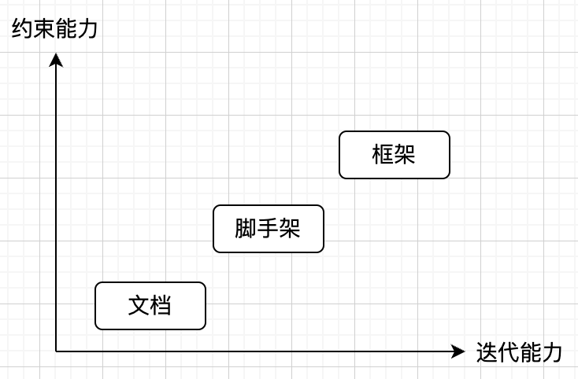

<center>图1-21约束</center>

​    文档约束对人员的隐形要求最高，开发、部署都需要严格遵照文档说明。这种约束实施难度比较大，第一虽然强制要求但是未能完全贯彻执行，再者就是是否遵守约定通常也需要人工检查，不但费人费时，而且也降低了迭代能力。

​    更高一级的约束是脚手架，脚手架对前端开发者来说并不陌生，几乎所有的开发框架都提供了官方脚手架。那为什么还需要其他脚手架呢？和官方的脚手架有什么不同的呢？那是因为官方的脚手架仅提供了开发基本的能力，并未集成UI组件、打包优化配置、最佳实践、集成方案等。

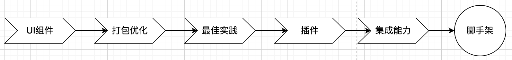

<center>图1-22</center>

另外，考虑到脚手架的通用性，结合公司的业务特点，在脚手架中也需要集成不同的中间件。

最高一层的约束是自研框架约束，如蚂蚁金服的umi。如果你有使用的经验，就会有这些体会：

- page下文件夹自动生成路由
- 新建locales目录，启用国际化
- 建access.ts文件，启用权限策略
- ......

​     这种强约束是框架能力默认不具备的能力，需要定制和技术积累，技术积累同样需要大量的人员投入和时间投入，这两项对中小企业来说都是不小的拦路虎。

​	相比框架约束，脚手架约束是一种『经济实惠』型可选类型，这样即不需要跨越太高的技术屏障也不用太耗费时间，是在开发效率和投入之间做到了很好的平衡。

### 1.5 业务组件库建设

​    几乎每个企业都有『降本增效』的诉求，用最小的资源投入收获最大的效益，也要求前端在保证质量的情况下，提高快速开发能力，快速交付。我们先看下页面开发的常规流程：


<center>图1-23</center>

就日常前端开发任务而言，有几部分组成，大概的占比是这样的：

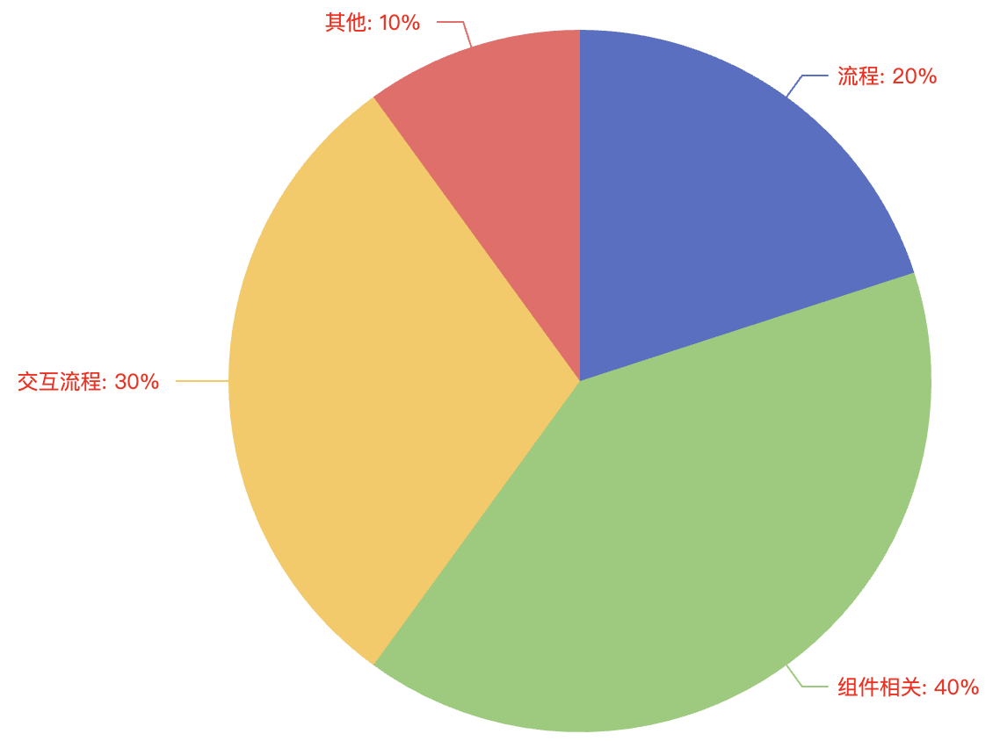

<center>图1-24 前端各部分占比</center>

- 流程相关（20%）： 工程创建、发布、打包等
- 组件相关开发（40% ）：如果有合适组件，直接使用；如果没有，花时间开发
-  交互场景（30%）：接口联调
-  其他（10%）：如业务沟通

   组件开发在前端开发中占着非常大的比重，如果能把已经实现的组件抽取到组件库，一来免掉了拷贝组件代码的麻烦，再者集中的组件库也更方便维护。

   下面我们以Vue3、Typescript为基础框架，以Vite@5作为构建工具。介绍前端组件库MVP版的核心步骤的处理过程：

首先创建Vite工程

```js
pnpm create vite
```

新建文件目录如下

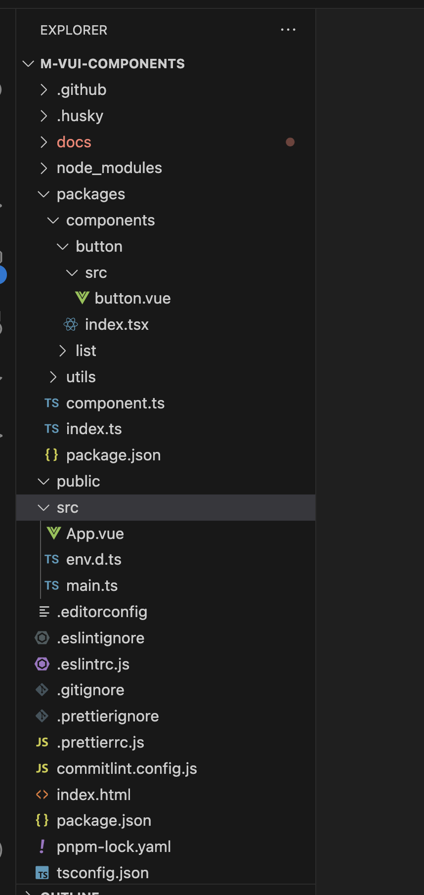

<center>图1-25</center>

docs目录是文档工程（可以基于vitepress快速生成项目），提供效果展示和代码拷贝。业务组件主要存放在packages/components目录下，如现在有的button和list组件。为了让组件库既允许全局调用：

```js
import { createApp } from 'vue'
import App from './App.vue'
import MVui from 'm-vui'
const app = createApp(App)
app.use(MVui).mount('#app')
```

也允许局部调用：

```js
 import { MVuiButton } from 'm-vui'
 Vue.component('m-vui-button', MVuiButton)
```

在component.ts中汇聚所有的组件

```js
import Button from './components/button'
import List from './components/list'

export default [Button, List]

export {
    Button,
    List
}
```

在packages/index.ts中，遍历并注册所有组件.

```js
import { App } from 'vue'
export * from './component'
import components from './component'

// 完整引入组件
const install = function (app: App) {
    components.forEach(component => {
        app.use(component as unknown as { install: () => any })
    })
}

export default {
    install
}
```

完成了上述组件库目录的初始化以后，此时我们的 m-vui 是已经可以被业务侧直接使用了。回到根目录下找到 `src/main.ts` 文件，我们把整个 m-vui引入：

```js
import { createApp } from 'vue'
import App from './App.vue'
import MVui from 'm-vui'
const app = createApp(App)
app.use(MVui).mount('#app')
```

运行 `pnpm dev` 开启 Vite 的服务器以后，就可以直接在浏览器上看到效果了：

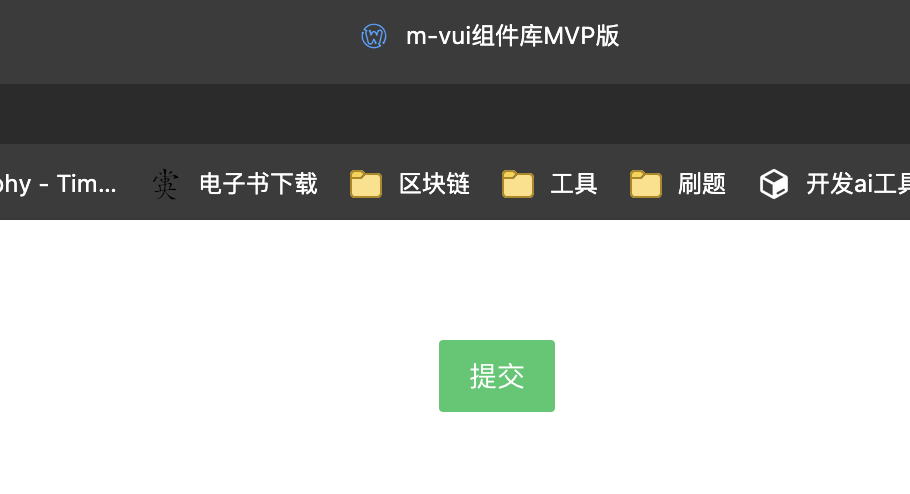

<center>图1-26</center>

 UI组件库会频繁的开发、发布。在本地开发中应该怎么调试？这里推荐两种方式

（1）基于vite.config.js中配置alias，通过匹配名称，映射到packages包

 ```js
 const alias: Alias[] = [
     {
         find: '@',
         replacement: `${resolve(__dirname, './.vitepress/vitepress')}/`,
     },
     {
         find: /^m-vui$/,
         replacement: `${resolve(__dirname, '../packages/index')}/`,
     },
 ]
 ```

（2）借助第三方包yalc

yalc是开发npm包常用的本地调试工具，通过软链接的方式链接到源代码。yalc publish将npm包发布到本地的yalc store，在需要的工程中使用 yalc add 安装。

其他主要打包配置，vite部分：

```js
build: {
      outDir: 'lib',
      lib: {
          entry: resolve(__dirname, './packages/index.ts'),
          name: 'm-vui',
          fileName: 'm-vui'
      },
      rollupOptions: {
          // 确保外部化处理那些你不想打包进库的依赖
          external: ['vue'],
          output: {
              // 在 UMD 构建模式下为这些外部化的依赖提供一个全局变量
              globals: {
                  vue: 'Vue'
              }
          }
      }
  }
```

根据官方库模式配置说明，需要在build的outDir指定bundle文件输出的目录，lib中指定包的入口文件，包名称和文件名称。rollupOptions是传递给rollup的配置，打包是剔除vue依赖，并且在 UMD 构建模式下为外部化的依赖提供一个全局变量。

在package.json中指定包的入口文件和自定义导出规则：

```js
"main": "./lib/m-vui.umd.js",
"module": "./lib/m-vui.mjs",
"exports": {
    ".": {
        "import": "./lib/m-vui.umd.js",
        "require": "./lib/m-vui.mjs"
    },
    "./lib/style.css": "./lib/style.css"
},
```

main中指定commonjs引入方式的程序入口文件，module中指定esmodule引入方式的程序入口文件。


### 1.6  发布自己的npm包

​    前端的模块化已经作为前端必备的一个技能，不管是工具的模块化还是组件的模块化，都是前端实现『降本增效』一个很重要的手段。模块化也带来项目的规模不断变大，项目中的的依赖越来越多。随着项目的多元化，项目和包的依赖也形成了一对多的关系，再需要手动拷贝到各个项目中也变得越来越困难，如果有bug修复或者升级需求，简直就是噩梦操作。如果把功能相似的模块或组件抽取到npm包中，发布到官方或者私有npm仓库，不断迭代升级会是一个很好的方案。

   在上一节中我们介绍了UI组件库的建设，本节主要介绍如何发布一个工具包。

   在发布一个npm包前，有几个问题需要提前确认好：

​    （1）包名称

​    根据npm官方规则，包名不能重复。比如笔者发布过一个名为javascript-common-tools的包，那么以包名为javascript-common-tools的新包将无法继续发布。在npm的包管理系统中，有一种scoped packages机制，用于将一些npm包以 @npm/package-name 的命名形式集中在一个命名空间下面，实现scope级的包管理，如@scope-name/javascript-common-tools可以继续使用。

​    scope级包不仅不用担心会和已有的包名重复，而且也方便对功能类似的包或者一个系列的包进行统一的划分和管理。如Vue3项目模板中的@vitejs/plugin-vue和@vitejs/plugin-vue-jsx，都属于@vitejs scope下的包。

  （2）资源加载

npm包有以下几种类型：

- 浏览器里使用的
- node端使用的
- 浏览器和node端都能使用的

这几种运行环境在package.json中都有想对应的入口文件配置，如main字段，是nodejs的默认入口文件，是一个相对包根目录的相对路径，也就是说在引用某个包时，如require("javascript-common-tools")，会返回入口文件的export对象。

如果没有指定该字段，默认会指向根目录的index.js文件。也可能需要指定完整的文件路径导入需要的功能。

```js  
require("包名/路径名/文件名")
```

   module指定esmodule 模块文件，对于很多的打包工具天然支持esModule，像webpack、rollup、Vite、Bun等，包含node从v8.9.0开始添加--experimental-modules支持，所以在开发npm包的时候支持esm是一个很好的选择。

   browser字段指定在浏览器环境加载的文件。browser的用法有以下两种，如果browser为单个的字符串，则替换main成为浏览器环境的入口文件，一般是umd模块的。browser还可以是一个对象，来声明要替换或者忽略的文件；这种形式比较适合替换部分文件，不需要创建新的入口。key是要替换的module或者文件名，右侧是替换的新的文件，比如在axios的packages.json中就用到了这种替换

```js
"browser": {
    "./lib/adapters/http.js": "./lib/helpers/null.js",
    "./lib/platform/node/index.js": "./lib/platform/browser/index.js",
    "./lib/platform/node/classes/FormData.js": "./lib/helpers/null.js"
  },
```

​     打包工具在打包到浏览器环境时，会将引入来自`./lib/adapters/http.js`的文件内容替换成`./lib/helpers/null.js`的内容。

（3）版本号管理

   npm的版本号遵守语义化版本 2.0.0（ SemVer）规范。格式为： **主版本号.次版本号.修订号**。主版本号表示做了不兼容的 API 修改，次版本号表示做了向下兼容的功能性新增，修订号表示做了向下兼容的bug修复。

​     如果某个版本的改动比较大、并且不稳定，可能无法满足预期的兼容性需求时，就需要发布先行版本。

   先行版本号可以加到  主版本号.次版本号.修订号的后面，通过 - 号连接以点分隔的标识符和版本编译信息：内部版本（alpha）、公测版本（beta）和候选版本rc（即 release candiate），如：

```js
1.0.0-alpha.1
1.2.0-rc.1
1.0.0-beta3.7
```

另外需要注意的是，每次更新npm包都需要更新版本号，否则会报错。

通常在package.json中，你也会发现有`^`、`~`或者`>=`这样的标识符，或者不带标识符的，这些在我们平时开发中对npm包的管理非常重要，这里需要详细说明下

- 不带符号的：完全匹配，必须使用当前版本号
- 有对比符号的：<，>，>=， <=，如vue@3.4.21的engines指定 "node": ">=18.12.0"
- ~号：固定主版本号和次版本号，修订号可以随意更改，例如`~5.0.0`，可以安装 5.0.0、5.0.2 、5.0.9 的版本
- ^号：固定主版本号，次版本号和修订号可以随意更改，例如`^2.0.0`，可以安装 2.0.1、2.2.2 、2.9.9 的版本
- || 符号：设置多个版本号限制规则，例如 >= 12.0.0 || <= 14.2.0

（4）需要发布的文件

​     发布npm包时，可以选择哪些文件发布到仓库中，比如只发布压缩后的代码，过滤源代码；当然也可以通过配置文件来进行指定，大概有以下几种情况：

- 存在`.npmignore`文件： 以`.npmignore`文件为准，优先级最高，配置规则同.gitignore。在该文件中的内容都会被忽略，不会上传；即使有.gitignore配置，也不会生效。
- 不存在.npmignore文件：以`.gitignore`文件为准，一般是无关内容，例如.vscode配置，测试用例。
- 不存在.npmignore和.gitignore： 所有文件都会上传。
- `package.json`中存在files字段：files中指定的文件或目录会被上传。

（5）其他常用配置

​    packageManager： 定义了在处理当前项目时预期使用的包管理器（npm，yarn，pnpm）。 它可以设置为任何支持的包管理器，使用该配置可以团队使用完全相同的包管理器版本。

   engines:  包运行依赖的node版本。

   dependencies：表示生产环境下的依赖管理

   devDependencies：表示开发环境下的依赖管理

   types： 如果包需要支持Typescript，需要替更类型声明文件

​    repository： 该npm包的源码地址

   readme文件：详细介绍包的背景、安装、内置方法、协议、注意事项等。每次发布版本，如果新增、调整功能、API变动等，都需要修改该文件，以保证功能和文档的统一。

​    

​    笔者已发布的javascript-validate-utils@0.2.3，该库提供了一些原生javascript实现了的校验方法，下面已这个库为基础，更新一个npm版本。

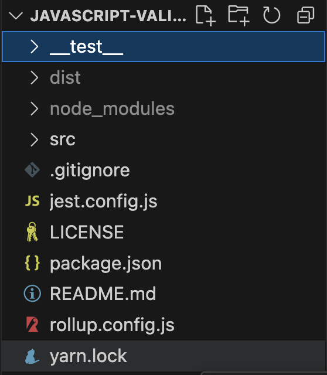

<center>图1-27</center>

该库使用rollup为构建工具，使用jest单元测试。package.json中使用两个script命令，一个运行单元测试，一个用来打包；

```js
"scripts": {
    "build": "rollup -c",
    "test": "jest"
  },
```

在src下增加一个isEqual.js，我们新增一个判断两个对象是否相等的工具方法：

```js
import { isObject } from "./basic";
import { _toString } from "./setup";
import Types from "./types/types";

function isObjectEqual(obj1, obj2) {
  let isObj = (isObject(obj1) && isObject(obj2));
  if (!isObj) {
    return false;
  }
  let _keys1 = Object.keys(obj1);
  let _key2 = Object.keys(obj2);
  //如果长度不相等直接返回false
  if (_keys1.length !== _key2.length) {
    return false;
  }

  for (const key in obj1) {
    if (obj2.hasOwnProperty.call(obj2, key)) {
      let obj1Type = _toString.call(obj1[key]);
      let obj2Type = _toString.call(obj2[key]);
      if(obj1Type === Types.OBJECT || obj2Type === Types.OBJECT) {
        if(!isObjectEqual(obj1[key], obj2[key])) {
          return false;
        }
      } else if (obj1[key] !== obj2[key]) {
        return false;
      }
    } else {
      return false;
    }
  }
  return true; 
}
```

思路并不复杂，很容易理解：

- 判断两个参数是否都是对象，如果不相同返回false
- 判断对象key的个数是否相等，如果不相等，返回false
- 循环、递归遍历对象，判断每个key是否相等

有了实现了的方法，下面进行单元测试。在"__test__"目录下新增测试文件，jest会默认执行test目录下文件名包含spec的文件：

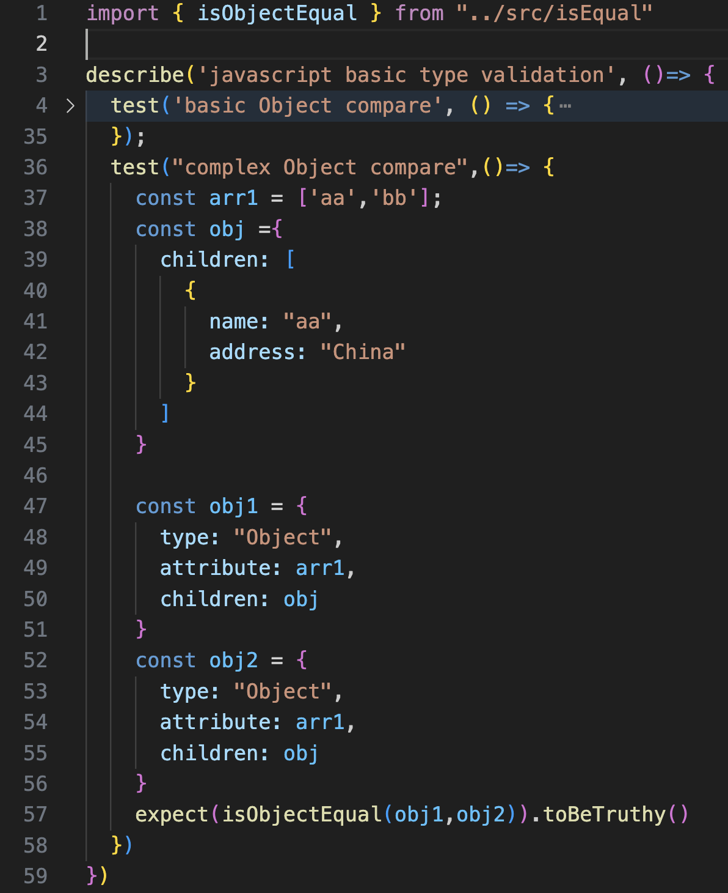

<center>图1-28</center>

使用命令 yarn run test执行单元测试用例，看是否能通过

```js
➜  javascript-validate-utils git:(main) ✗ yarn test
yarn run v1.22.21
$ jest
 PASS  __test__/testObject.spec.js
 PASS  __test__/basic-extend.spec.js
 PASS  __test__/basic.spec.js

Test Suites: 3 passed, 3 total
Tests:       23 passed, 23 total
Snapshots:   0 total
Time:        0.343 s, estimated 1 s
Ran all test suites.
✨  Done in 1.20s.
```

单元测试通过。前面我们介绍过，每上线一个版本，都需要修改版本号、修改readme文件。下面就可以开始打包、发布，一定需要注意的是，如果是私有仓库发布需要加上私有registry地址。

```js
yarn build
npm login,需要输入OTP码
npm publish
```

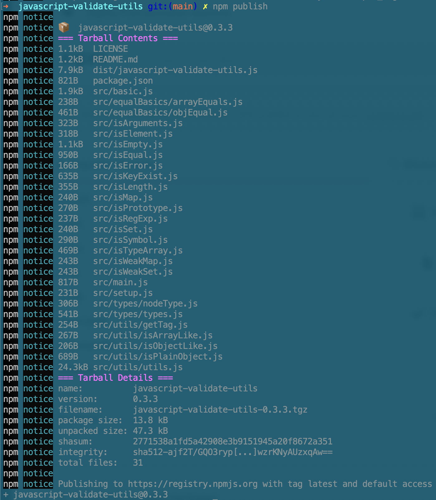

<center>图1-29</center>


### 1.7 其他建设

​     研发体系的建设除了我们前面介绍私有仓库建设、开发框架搭建、组件库建设、npm包发布，还包括其他很多其他的部分，如知识库建设、开发规范建设、部署管理、版本管理等。

#### 1.7.1 开发规范建设

​    在阅读其他人代码的时候，你是否有这样的体会：文件的命名五花八门，变量的命名没有章法，git提交信息随心所欲，文件格式化效果不一致。这些都是开发规范建设缺失所带来的弊端。为什么会有这些现象呢？我想原因无外乎是这几个：

- 紧急的开发任务，回避了质量标准
- 一些所谓有个性的人不会为了团队去改变自己的习惯
- 即使会议上约定达成了一致，也会有开发时依旧我行我素的

​    开发规范很大程度上需要成员从心里认同并遵守，另一方面也需要有一套工具进行辅助。成熟的前端开发规范，对整个团队的正面影响效果是巨大的，总的来说可以概况为以下几个方法：

- 提高代码整体的可读性、可维护性、可复用性，可移植性和可靠性也随之增加，这会从根本上降低开发成本，这个是核心。
- 保证代码的一致性。保持编码风格一致性，更加易于维护，有利于团队其他成员快速理解代码。
- 提升团队整体效率：开发人员不再需要花费大量的时间来解决代码质量问题，都只需要按照规范编写。这样有助于团队尽早发现问题，提高整个交付过程的效率。
- 减少code review效率。

  和前端开发密切相关的开发规范有几个：开发流程的规范、代码规范、git提交信息的规范、UI设计的规范、目录规范等

​     对中小企业而言，开发流程可能并没有规范，只要拿到需求就开始画页面，然后等接口联调。虽有变现出了『高效』，但往往却因为需求理解不到位和前期代码欠缺设计导致bug率高和返工，也不能很好的理解业务。虽然业务的核心在后端，但是前端可以从另外高价值点进行切入：交互和。 在接收到需求后应了解这个需求的背景是什么，这么做到底有没有解决用户的痛点，这样的页面交互是否合理，页面交互怎么更合理。

​     如果是新启动的新产品，新产品也有多个子系统组成。 这中情况下需要进行技术方案调研和设计，并输出详细的设计文档、交互文档、技术架构图、部署架构图。涉及到更关键的节点，还需要将数据流流向、组件设计、技术点等通过脑图的形式呈现出来。

   在没有自己的开发流程的前提下，我认为比较实用的开发流程是这样的，供大家参考：

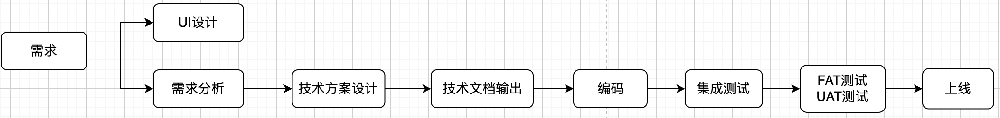   

<center>图1-30</center>

代码格式化

   大家使用的工具不尽相同，这里以基数庞大的VSCode为例，统一使用prettier在适时的时候进行格式化。

   安装依赖

```js
yarn add -D prettier
```

​    新建prettier配置文件.preitterrc.json（也可以创建js风格的prettier.config.js和.prettierrc.js，也可以是yaml风格的.prettierrc or .prettierrc.yaml）和.preitterignore，分别配置格式化规则和格式化需要忽略的文件。并在vscode中启用 FormatOnSave，保存试自动格式化。

   为了确保效果的一致性，有时候需要在打包前进行文件格式检查并修复，这需要新建一个script命令，并在适当的时机触发么，例如检查src下的所有js文件、tsx文件和less文件。

```js
"prettier": "prettier --write src/**/*.{js,tsx,less}"
```


Git提交规范约束

Git信息提交同样很重要，特别是在代码回退的时候。所以我们需要通过cz-customizable、husky和lint-staged保证每次提交的规范性。cz-customizable用来自定义提交信息格式，husky可以帮助我们在 git 阶段检查提交消息、运行测试、检查代码等，方便添加git hooks，lint-staged对暂存区的文件执行格式化的操作。

```js
yarn add --dev husky lint-staged   //安装包
npx husky init  // 初始化.husky目录和pre-commit hook
npm pkg set scripts.prepare="husky install" //在package.json中增加script命令prepare
echo "npx lint-staged" > .husky/pre-commit  //修改pre-commit中的hook命令
```

在package.json中添加以下内容：

```js
{
  "lint-staged": {
    "**/*": "prettier --write --ignore-unknown"
  }
}
```

当执行git commit时执行pre-commit中指定的hook。


#### 1.7.2 部署管理

### 1.7.3  知识库建设