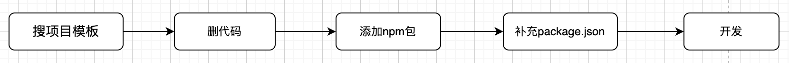
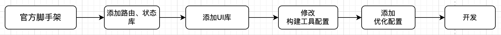

## 第1章 前端研发体系建设

​      一个完善的前（后）端研发体系建设可以更好地保障日常开发、测试、部署、上线，特别在是加速业务开发、规范各个开发环节、"约束"各个环节顺利工作方面。各公司针对前端研发体系的建设方式各有不同，互联网大厂，如阿里、美团、菜鸟、优酷、咸鱼等更偏向大前端团队或者叫做体验技术部（主要包括UED、前端、客户端、Node、Go、数据可视化、Docker、工程、产品、运营等），并且都有各自的研发套件、构建平台、部署平台等方面的基础服务。但是对于中小企业的前端团队而言，似乎很难享受这么完整的开发红利。

​     研发体系在中小企业中的落地也并没有那么容易，原因是多方面的，第一是收益回报比较慢，或者说没有直接的利益回报，因为仅为本公司服务，很难对外服务话。第二是成本问题，开发体系建设需要有人力持续投入、服务器投入，后期还需要不断迭代、问题修改、紧急问题修复，对中小企业来讲在人员不足且持续无直接利益回报的投入就变得非常奢侈。第三个问题是时间投入，研发体系建设需要比较长的时间投入进行预研、开发、部署、测试。

​    本章从技术角度出发，以面向中小企业快速搭建前端研发体系为出发点，详细阐述研发体系各部分的技术实现。希望通过本章内容能降低研发体系建设的门槛，缩短建设时间。

### 1.1 研发体系建设背景

​     中小公司如果没有脚手架的支持，作为前端开发者（或者是非专业的前端开发者），部门启动新项目，准备工程的过程是不是这样的：



<center>图1-1</center>

​     这种方法的好处就是能快速开始业务开发，节省技术预研时间和框架搭建过程，大部分的开源项目模板中都集成了项目优化方案，开箱即用，确实很方便。但是缺点也很明显，现有的项目框架能力转化为知识积累的周期变长了， 特别是在很多服务已经发布成三方包的情况下 。再者就是知识探索的软实力不能充分发挥，只会被动接收，这是能力成长路上最大的绊脚石。

还有一种搭建新项目的方式是这样的：



<center>图1-2</center>

   很多前端开发者倾向这种准备项目的方式，能锻炼锻炼项目的搭建能力，但是要求搭建者有广阔的技术视野，对相应的中间件有横向和纵向的对比能力，分析优缺点；对构建工具配置需要非常熟悉甚至精通，有系统的配置、优化方案；熟悉代码的优化组织形式，实现代码的可插拔；......

   缺少部署工具情况又会是怎么样的？首先手动生成bundle包，再通过ssh工具连接到远程服务器（甚至还需要中转机跳转），然后找到原部署目录，删除原来的目录，上传新目录。这样的操作，不但繁琐，而且速度慢、容易出错（服务器链接断开、命令操作出错等）。如果是开发环境每天需要部署多次，这样的操作也就需要重复多次。

   缺少研发体系支撑的开发，需要人工频繁介入开发流程的各个环节来保证畅通、结果正确。工作不但繁琐、工作量大，而且对各个环节还是缺少必要的监督，出错率大大增加。

   前端研发体系其实从前端专业化开始萌芽。专业化之前前端开发经历了"石器时代"，是以前端三核心（HTML，JavaScript，Css）配合jQuery，之后是前端的"白银时代"，模块规范（Amd，Cmd）出现，出现了yeoman脚手架，配合generator工具生成项目代码，配合grunt、gulp做为最初的构建工具，专业化前端基本。真正迎来前端开发"黄金时代"的是nodejs的出现，因为其跨平台性，很大程度上拓展了前端的知识边界，大量"轮子"疯狂出现，打包工具webpack横空出世，重新定义了前端开发方式。如今的前端黄金时代还在不断演进，基于Go和Rust的工具，不再拘泥于js的性能诟病，高性能、低延迟、高可用正在前端社区慢慢铺开。

   前后端的独立开发模式对研发体系建设是隐喻的要求，要解决前端的系统需求，开发框架应该怎么选，组件库应该怎么选，状态库是否需要，需要的话应该选哪个，构建工具怎么选，已经积累的组件怎么汇总在一起，还有就是是否支持移动端，支持移动端的话框架的性能如何，等等问题。抛开每个问题的螺旋上升不提，该怎么去解决这一系列的问题，该是中小企业前端负责人该认真思考并解决的问题。前端系统中的很多问题可以映射到前端研发体系的建设中。

   个人认为，前端研发体系应该包括一下几个方面：

   （1）工具辅助：方便代码产出

​    开发者的工作过程，是经过不断的思考、沟通和讨论，将想法形成方案，将方案转换成代码，经过上线发布得到最终的产品。但编码的过程是可以组装的，将各开发环节涉及到的问题统一规划、统一解决，形成工具包或者脚手架，甚至开箱即用的开发框架，公司统一使用，统一维护升级。

   （2）生命周期管理

​       前端的生命周期管理是软件生命周期管理的子集，包含从项目创建到上线监控。所以应用如何创建？如何构建和打包？如何进行部署？运行状态如何？性能优化怎么怎样？每个环节都应有相关的解决方案。


<center>图1-3</center>

  （3）前端版本管理

​    前端的版本主要包含核心库（Vue，React，打包工具，UI组件等）版本管理，项目代码升级，脚手架版本、组件库版本。最核心的是核心库版本管理，因为核心库版本的升级很大程度上将引起组件库和脚手架的迭代升级。


<center>图1-4</center>

大部分的核心库版本都支持语义化版本 2.0要求，即：主版本号.次版本号.修订号

- 主版本号：当做了不兼容的 API 修改
- 次版本号：当做了向下兼容的功能性新增
- 修订号：当做了向下兼容的问题修正

所以当有升级核心库版本的需求时，需要详细测试最新版本，评估升级风险，完善升级策略。

（4）知识库建设：沉淀知识资料

​     开发是一项知识生产活动，这些抽象的知识往往存在于每位开发者的大脑中，如果不能以一种可重现的方式分享出来，那么就会极大地增加沟通成本。所以，需要一种载体，将所有人的知识成果保存下来，用来知识传递。


建设前端研发体系的目的是做技术收敛，从公司层面保持前端开发体验的一致性、交付的一致性，保障交付速度和质量。一致性的保障手段最常见的有3类：

- 开发文档约束
- 集成脚手架约束
- 自研框架约束


<center>图1-5</center>

​      文档约束是这三种约束方式中最弱的。每位开发人员的风格迥异，规范五花八门，比起约束他们更擅长自由发挥。更高一层的约束是脚手架，根据前端技术栈、结合不同业务开发脚手架，内置约束，在代码提交前、打包前等节点执行约束检查，检查失败禁止下一步操作。最高级别的约束是开发自己框架，如阿里的umi、bigfish，严格约定如文件即路由、权限的access文件、Mock文件约束、数据流约束等。框架约束虽然对开发最友好，但是对框架作者的要求也最高，构建工具（可能是支持多个）的深度定制、工程编译方案、约束编译方案、缓存方案、社区最佳实践集成、数据流集成方案、高效精准的错误提示方案、性能优化方案等等。在面向业务和人力资源短缺的中小企业里，技术积累、人力资源情况和时间成本都是限制形成框架层约束的阻力。

   我们本章主要采取从脚手架约束的角度展开，详细说明前端研发体系的建设。

  从公司的角度看多技术栈的前端项目简直就是一种灾难，多技术栈就意味可能需要更多的前端人员，成本升高；组件化积累工作量增加或者组件效果重复；组件维护成本增加；兼顾多种技术栈的招人成本更高；技术栈演进规划、执行更困难。所以公司更希望有一套统一的技术栈，在此基础上建设组件库、工具库，统一规划技术演进和进行项目布局。

​    一般来说，前端研发体系主要包含以下几个方面：

- Npm私有仓库建设：进行私有包、修改的三方包、组件库和由组件库构成的板块管理，
- 开发框架、中间件统一和技术积累
- 脚手架搭建：根据团队需求不通快速构建项目，也方便进行技术栈的更新
- 业务组件库建设：积累公司的业务组件，提高研发效率
- npm包开发和维护：常用的组件和工具发布成npm包，方便公用
- 开发规范统一：方便业务维护
- 部署管理：通过CI、CD或者前端部署工具
- 知识库建设：知识共享，前端团队对齐开发技能

### 1.2 npm私有仓库搭建

   npm 的出现，对 JavaScript 生态产生了深远影响，让我们可以轻松使用第三方模块，也让我们可以轻松发布自己的模块包。随着企业的发展，公司内部对私有的 npm 仓库的需求越来越多。下面就来介绍一下，企业级 npm 私有仓库建设、部署方案。

为什么需要npm私有仓库呢？有以下几点原因：

- 内网访问，速度快
- 更加稳定并且完全可控
- 支持不方便对外的私有包
- 及时处理包的安全问题
- 方便权限隔离

私有仓库建设有开源版和收费版。我们先考虑开源的前端方案，目前可选的有：

| 名称                 | 技术栈      | star数量 |
| -------------------- | ----------- | -------- |
| verdaccio            | node        | 15.6K    |
| Nexus-public         | Java        | 1.6k     |
| Cnpmcore             | eggjs(node) | 524      |
| Cnpmjs（已停止维护） | Node        |          |

​    作为前端，我们首先选择Node工程作为私有仓库搭建工具，当然如果公司有有同步管理 maven、docker等需求，也可以考虑Nexus-public。 基于Node的verdaccio界面简洁，功能齐全，社区活跃，是一个不错的选择，并且也非常轻量，安装和配置都非常简单，但是身份验证、存储和通知等功能需要定制，这些默认只提供了简陋的实现。cnpmcore 是淘宝 NPM 镜像站服务 npmmirror.com 背后的核心，基于 eggjs 开发的，并有很好的二次开发能力。

   企业服务，要求数据和服务分离，既要保证数据的安全和可靠性，又要保证服务的持续升级迭代。私有仓库更关注内网私有化部署，除了满足内网 npm 基本服务要求，更多的是企业定制化需求，不用面对公网的流量。

  所以cnpmcore对于企业级 npm 私有仓库部署方案来说，是一个不错的解决方案。这是下面我们将围绕cnpmcore详细介绍其建设过程。

  在生产环境中，可以直接部署 cnpmcore 系统，实现完整的 Registry 镜像功能，尚无web管理功能。 但是，通常在企业内部会有一些内部的服务、要求，例如文件存储、缓存服务、登录鉴权流程等需要集成。

   cnpmcore除了提供了源码部署、二次开发的方式，还提供了 npm 包的方式，便于在 tegg（Strong Type framework with eggjs） 应用中进行集成。 这样既可以享受到丰富的自定义扩展能力，又可以享受到 cnpmcore 持续迭代的能力。需要注意的是，cnpmcore依赖数据库（mysql或者mariadb）服务、redis服务、包存储默认是本地文件系统，推荐使用对象存储（OSS或者s3）服务。

   先看下cnpmcore的分层架构依赖图：


<center>图1-6</center>

对这个架构图做下简要的说明：

- 总体：按照功能分层，包括 common（包括通用工具、服务调用、抽象类、适配器等）、core（核心业务逻辑，实体、服务、事件）、repository（数据存储和查询）、port（HTTP 控制器）、infra（基于 PaaS 的基础设置实现）等
- Controller：处理 HTTP 请求，主要继承 AbstractController 和 MiddlewareController。AbstractController 封装了一些基础的数据 Entity 访问方法，MiddlewareController 主要负责编排中间件的加载顺序
- 请求合法性校验：请求合法性校验包括请求参数校验、用户认证和资源操作权限校验。请求参数校验使用 egg-typebox-validate，用户认证和资源操作权限校验通过 UserRoleManager 进行
- Service：依赖 Repository，然后由 Controller 依赖。
- Repository：依赖 Model，然后由Service 和 Controller 依赖。Repository 类方法命名规则包括 findSomething（查询）、saveSomething（保存）、removeSomething（删除）和 listSomethings（查询）

从功能的角度看，有如下几个：

- npm镜像功能：加速安装
- 私有包发布：企业内部私有包发布
- 多registory同步：无痛历史迁移
- bug-version：快速应急开源社区问题
- 二次研发：开发属于自己的npmcore

   根据cnpmcore官方建议，该项目依赖MySQL 数据服务、Redis 缓存服务。包存储默认是本地文件系统，为了性能考虑推荐使用对象存储服务或者s3服务，这里我使用了阿里云OSS，你当然也可以选择七牛云存储，又拍云云存储，青云云存储服务，或者是腾讯云的Cos服务，官方都封装成了npm包，开箱即用。
   
   Cnpmcore提供了完整的SQL接入服务，官方库的sql目录下提供了支持mysql5.x 、mysql8.x版本完整的脚本 ，需要全部导入 。


<center>图1-7</center>

接着，准备aliyun OSS服务，新建bucket


<center>图1-8</center>

接入点地址和bucket名称需要在oss初始化使用，请妥善保存，`oss-cnpm`包还需要accessKeyId和accessKeySecret。

```js
const Client = require('oss-cnpm');
const client = new Client({
  accessKeyId: 'your id',
  accessKeySecret: 'your secret',
  endpoint: 'https://oss-cn-shenzhen.aliyuncs.com',
  bucket: 'your bucket',
  mode: 'public or private',
});
```

accessKeyId和accessKeySecret需要在accessKey管理中生成。

安装redis服务，新建连接


<center>图1-9</center>

基础服务准备就绪，下面开始服务搭建。

首先，克隆master分支。

```js
git clone https://github.com/cnpm/cnpmcore.git
```

mysql，oss和redis这三个服务的配置信息需要在tegg项目config/config.default.ts中修改，`config.default.ts` 是任何环境都使用的默认配置，你也可以创建 config.local.ts或者config.prod.ts来区分不同环境的配置。

先修改基础配置：

```js
config.cnpmcore = {
    name: 'cnpm',
    sourceRegistry: 'https://registry.npmmirror.com',
    // sync mode
    //  - none: don't sync npm package, just redirect it to sourceRegistry
    //  - all: sync all npm packages
    //  - exist: only sync exist packages, effected when `enableCheckRecentlyUpdated` or 	       `enableChangesStream` is enabled
    syncMode: SyncMode.admin,
    syncDeleteMode: SyncDeleteMode.delete,
    registry: process.env.CNPMCORE_CONFIG_REGISTRY || 'http://localhost:7001', // 填写自己的域名
    // white scope list
    allowScopes: [
      '@myscope', // 这里添加自己的 scope
    ],
    admins: {
      // name: email
      admin: 'houyaowei@163.com',
    },
  };
```

name: npm仓库名称

sourceRegistry：原接入点。如果下载的包在目标resgstry中不存在是，会从该字段定义的registry中下载

syncModel：定义npm库同步模式

registry： registry的接入域名，请注意，该域名是已经备案的

allowScopes：定于支持的scope名称。scope是一种把相关的模块组织到一起的一种方式，如包@eggjs/tegg-orm-plugin中@eggjs就是scope名称

admins: npm系统默认管理员，因为cnpmcore独立于npm的账号体系，需要通过admin账号添加用户。

接下来，需要在config/config.default.ts中配置mysql、redis和minio的连接信息，联通各个服务。

```js
config.orm = {
    client: 'mysql',
    database: process.env.MYSQL_DATABASE,
    host: process.env.MYSQL_HOST ,
    port: process.env.MYSQL_PORT,
    user: process.env.MYSQL_USER,
    password: process.env.MYSQL_PASSWORD,
    charset: 'utf8mb4',
  };
config.redis = {
    client: {
      port: 6379,
      host: 'example.com',
      password: 'jhkdjhkjdhsIUTYURTU_MGs8Sh',
      db: 0,
    },
  };
const client = new OSSClient({
    accessKeyId: 'accessKeyId',
    accessKeySecret: 'accessKeySecret',
    endpoint: 'http://oss-cn-beijing.aliyuncs.com',
    bucket: 'npm-bucket',
    defaultHeaders: {
      'Cache-Control': 'max-age=0, s-maxage=60',
    },
  });
  //配置OSS
  config.nfs.client = client;

```


配置完成后，启动服务。


<center>图1-10</center>

添加管理员


<center>图1-11</center>


<center>图1-12</center>

输入在`config.default.ts`中配置的admins配置项（admin，houyaowei@163.com），即可完成管理员的注册。注册成功就可以使用兼容npm的操作：登录、发布包、查看登录信息、配置等等。

```js
登录 npm login --registry=http://localhost:7001
发布包  npm login --registry=http://localhost:7001
查看登录账号  npm whoami --registry=http://localhost:7001
配置  npm config set xxx  --registry=http://localhost:7001
...
```

下面测试发布npm包的功能：

（1）准备一套待发布的npm仓库，如：https://github.com/houyaowei/javascript-common-tools

（2）执行 npm login --registry=http://localhost:7001

（3）执行 npm publish --registry=http://localhost:7001


<center>图1-13</center>

发布完成后，我们需要在数据库的package(s)表中确实是否都已经落库和阿里云服务器中包文件是否存在。


<center>图1-14</center>


<center>图1-16</center>

到这里，预期的效果已经达到，我们的私有npm服务也已经搭建完成。

cnpmcore虽然提供了npm包管理的完整功能，但是从该库名字能够发现未集成web端，不过也没有关系，因为web端是独立的项目cnpmweb，这是基于Nextjs纯静态部署的项目，只需要修改config.js中的registry即可运行。

### 1.3 开发框架选择

### 1.4 脚手架搭建

### 1.5 业务组件库建设

### 1.6  发布自己的npm包

### 1.7 其他建设

#### 1.7.1 开发规范建设

#### 1.7.2 部署管理

### 1.7.3  知识库建设