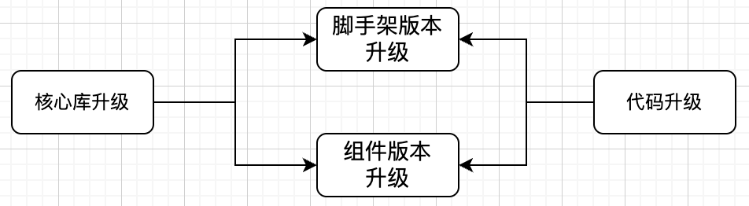

## 第1章 前端研发体系建设

​      一个完善的前（后）端研发体系建设可以很好地保障日常开发、测试、部署、上线，并能很好规范各个开发环节，"约束"各个环节顺利工作。各类公司针对前端研发体系的建设方式各有不同，互联网大厂，如阿里、美团、菜鸟、优酷、咸鱼等更偏向大前端团队或者叫做体验技术部（主要包括UED、前端、客户端、Node、Go、数据可视化、Docker、工程、产品、运营等），并且都有各自的研发套件、构建平台、部署平台。但是对于中小企业的前端团队而言，似乎很难享受这么完整的开发红利。

​     研发体系在中小企业中的落地也并没有那么容易，原因有几个方面，第一是收益回报比较慢，或者说没有直接的利益回报，因为仅为本公司服务，很难对外服务话。第二是人力投入，开发体系建设需要有人力持续投入，对中小企业来讲持续无直接利益回报的投入就变得非常奢侈。

​    本章从技术角度出发，以面向中小企业快速搭建前端研发体系为出发点，详细阐述研发体系各部分的技术实现。希望通过本章内容能降低中小企业研发体系建设的门槛。

### 1.1 研发体系建设背景

​     公司如果没有脚手架支持，作为前端开发者，你是否有这样的体验？部门启动新项目，准备工程的过程可能是这样的：

图1-1

   或许是这样：

图1-2

  如果缺少部署工具情况又会是怎么样的？手动生成bundle包，然后通过ssh工具连接到远程服务器（甚至还需要中转机跳转），找到原部署目录，删除原来的目录，上传新目录。如果是开发环境每天可能需要部署多次，这样的操作需要重复多次。

   缺少研发体系支撑的开发，需要人工频繁介入开发流程的各个环节来保证畅通、结果正确。工作不但繁琐、工作量大，而且对各个环节还是缺少必要的监督，出错率大大增加。

   前端研发体系其实从前端专业化开始萌芽。专业化之前前端开发经历了"石器时代"，是以前端三核心（HTML，JavaScript，Css）配合jQuery，之后是前端的"白银时代"，模块规范（Amd，Cmd）出现，出现了yeoman脚手架，配合generator工具生成项目代码，配合grunt、gulp做为最初的构建工具，专业化前端基本。真正迎来前端开发"黄金时代"的是nodejs的出现，因为其跨平台性，很大程度上拓展了前端的知识边界，大量工具也应允而生，打包工具webpack横空出世，重新定义了前端开发方式。如今的前端黄金时代还在大踏步的前进，基于Go和Rust的工具，不再拘泥于js的性能诟病，高性能、低延迟、高可用正在前端社区慢慢铺开。

   前后端的独立开发模式对研发体系建设是隐喻的要求，要解决一些列系统的要求，开发框架应该怎么选，组件库应该怎么选，状态库是否需要，需要的话应该选哪个，组件库怎么汇总在一起，还有就是是否支持移动端，支持移动端的话框架的性能如何，等等问题。抛开每个问题的螺旋上升不提，该怎么去解决这一系列的问题，该是中小企业前端负责人该认真思考并解决的问题。

   个人认为，前端研发体系应该包括一下几个方面：

   （1）工具辅助：方便代码产出

​    开发者的工作过程，是经过不断的思考、沟通和讨论，将想法形成方案，将方案转换成代码，经过上线发布得到最终的产品。但编码的过程是可以组装的，将各开发环节涉及到的问题统一规划、统一解决，形成工具包或者脚手架，甚至开箱即用的开发框架，公司统一使用，统一维护升级。

   （2）前端的生命周期管理

​       前端的生命周期包含从项目创建到上线监控。所以应用如何创建？如何构建和打包？如何进行部署？运行状态如何？性能数据是怎样的？对于这些问题要有相应的解决方案。

  （3）前端版本管理

​    前端的版本主要包含核心库（Vue，React，打包工具，UI组件等）版本，代码升级，脚手架版本、组件库版本。最关键的是核心库版本升级。

图1-3

大部分的核心库版本都支持语义化版本 2.0要求，即：主版本号.次版本号.修订号

- 主版本号：当做了不兼容的 API 修改
- 次版本号：当做了向下兼容的功能性新增
- 修订号：当做了向下兼容的问题修正

所以当有升级核心库版本的需求时，需要详细测试最新版本，评估升级风险，完善升级策略。

（4）知识库建设：沉淀知识资料

​     开发是一项知识生产活动，这些抽象的知识往往存在于每位开发者的大脑中，如果不能以一种可重现的方式分享出来，那么就会极大地增加沟通成本。所以，需要一种载体，将所有人的知识成果保存下来，用来知识传递。

建设前端研发体系的目的是做技术收敛，从公司层面保持前端开发体验的一致性。一致性的保障手段有3种：文档、脚手架、框架。

图1-4

​      文档是这三种约束方式中最弱的，每位开发人员的风格迥异，规范五花八门，比起约束他们更擅长自由发挥。更高一层的约束是脚手架，根据前端技术栈、结合不同业务开发脚手架，内置约束，在代码提交前、打包前等节点执行约束检查。最高级别的约束是开发自己框架，如阿里的umi、bigfish，严格遵守约定，如文件即路由、权限的access文件、Mock文件约束、数据流约束等。框架约束虽然对开发最友好，但是对框架作者的要求也最高，构建工具（可能是支持多个）的深度定制、工程编译方案、约束编译方案、缓存方案、社区最佳实践集成、数据流集成方案、高效精准的错误提示方案、性能优化方案等等。在面向业务和人力资源短缺的中小企业里、技术积累和时间成本都是限制形成框架层约束的阻力。

   我们本章主要采取从脚手架约束的角度展开，详细说明前端研发体系的建设。

  从公司的角度看多技术栈的前端项目简直就是一种灾难，多技术栈就意味可能需要更多的前端人员，成本升高；组件化积累工作量增加或者组件效果重复；组件维护成本增加；兼顾多种技术栈的招人成本更高；技术栈演进规划更繁琐；所以公司更希望有一套统一的技术栈，在此基础上建设组件库、工具库，统一规划技术演进和进行项目布局。

​    一般来说，前端研发体系主要包含以下几个方面：

- Npm私有仓库建设：进行私有包、修改的三方包、组件库和由组件库构成的板块管理，
- 开发框架、中间件统一和技术积累
- 脚手架搭建：根据团队需求不通快速构建项目，也方便进行技术栈的更新
- 业务组件库建设：积累公司的业务组件，提高研发效率
- npm包开发和维护：常用的组件和工具发布成npm包，方便公用
- 开发规范统一：方便业务维护
- 部署管理：通过CI、CD或者前端部署工具
- 知识库建设：知识共享，前端团队对齐开发技能

### 1.2 npm私有仓库搭建

   npm 的出现，对 JavaScript 生态产生了深远影响，让我们可以轻松使用第三方模块，也让我们可以轻松发布自己的模块。随着企业的发展，公司内部对私有的 npm 仓库的需求越来越多。下面就来介绍一下，企业级 npm 私有仓库部署方案。

为什么需要npm私有仓库呢？有以下几点原因：

- 内网访问，速度快
- 更加稳定并且完全可控
- 支持不需要对外的私有包
- 及时处理包的安全问题
- 方便做权限隔离

我们先考虑开源的前端方案，目前可选的有：

| 名称                 | 技术栈      | star数量 |
| -------------------- | ----------- | -------- |
| verdaccio            | node        | 15.6K    |
| Nexus-public         | Java        | 1.6k     |
| Cnpmcore             | eggjs(node) | 18.7k    |
| Cnpmjs（已停止维护） | Node        |          |

​    作为前端，我们首先选择Node工程作为私有仓库搭建工具，verdaccio 界面简洁，功能齐全，社区活跃，是一个不错的选择。并且也非常轻量，安装和配置都非常简单，但是身份验证、存储和通知等功能需要定制，只提供了简陋的实现。cnpmcore 是淘宝 NPM 镜像站服务 npmmirror.com 背后的核心，基于 eggjs 开发的。

### 1.3 开发框架选择

### 1.4 脚手架搭建

### 1.5 业务组件库建设

### 1.6  发布自己的npm包

### 1.7 其他建设

#### 1.7.1 开发规范建设

#### 1.7.2 部署管理

### 1.7.3  知识库建设