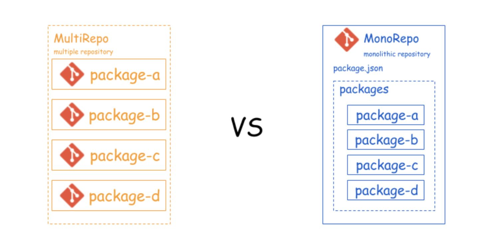
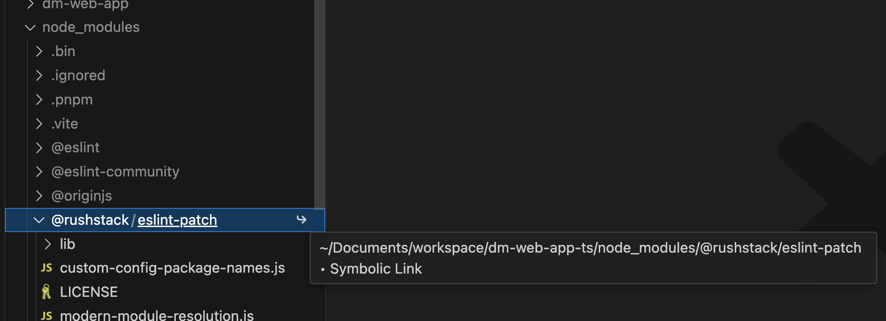

## Monorepo

日常开发中，如果有多个前端项目或者工具库，我们总是习惯性地给每个工具库建一个仓库，单独维护，在开发者本地也需要创建相对应的项目，即multi-repo。

还有就是很多公司在新人入职时，需要要花很长的时间才能让新人开始动手干活，并不一定是内部系统要学的东西很多，可能只是因为有很多的部落知识并没有很好地『传承』，就像很多项目的所有依赖从网上单独拉下来，然后配置好开发环境才开干。除此之外，还要说明不时说明哪些配置是必须的。

还有类似的场景，在一个前端项目变得很大以后，构建后的bundle包会达到20M甚至是更大，也更复杂。对于这个体积的bundle包，首要的任务是从用户体出发对工程进行优化并重新组织。

项目在放养式的维护状态下，通常是乱遭糟的，很难理清项目间的依赖。这样不仅仅增加了维护成本，而且也加重了心智负担。

如果有一种工程管理方式，能够将相关的工程从逻辑上组织起来。最直观的好处是能够快速地导航到目标项目，可以像在一个网络文件系统上一样进行导航。还可以对项目和依赖包进行同频发布。

你可能会想到npm包或者submodules的方式。如果把它们发布到 npm，可只要有一个新的版本变更，每个依赖的项目都要跟着改，并且本地调试稍显复杂。本地调试npm包，一般通过npm link或者yalc link到本地项目里，越是link的包多，管理这些link就越复杂。

还有什么好办法吗？也许你还会想到 git submodules，把这些相同的部分放到 git 仓库里面，通过 submodules 的形式来集成进来。submodules 确实可以缓解这个问题，但还不能规避调重复安装依赖的问题。

下面我们看下单一仓库monorepo的实现。



<center>图2-1</center>

​     到目前为止，现在的node包管理工具都已经支持monorepo式代码管理管理，pnpm workspace和yarn workspace，npm workspace的方式，除了这些，最常用的恐怕就是lerna了。

​    在本章中，我们就以pnpm workspace和lerna介绍monorepo的代码组织形式。在node包管理工具中我们为什么会选择pnpm这是一个值得探索的问题。

  （1）速度提升

  pnpm 相比较于 yarn、npm 这两个常用的包管理工具在性能上也有了极大的提升，根据最新（2024.3.10）官方提供的 benchmark 数据可以看出在一些综合场景下比 npm和yarn 快了大概两倍。


<center>图2-2</center>

（2）依赖管理方式

​    pnpm安装的node_modules之所以比其他包管理装的体积小，是因为采取了Hard Link的机制。Hard Link 使得用户可以通过不同的路径引用方式去寻找文件。pnpm 会在全局的 store 目录（如果在.npmrc中没有指定的话默认是 node_module/.pnpm）里存储项目包的 Hard Link。安装依赖时，如果某个依赖在 store 目录中已经存在，那么就会直接从 store 目录里面去执行hard-link，避免了重复安装带来的消耗，如果不存在的话，就会下载一次。

   如果展开展开根目录下的node_modules目录可以看出来，各个node包都是symlink（符号链接）去找到对应虚拟磁盘目录下(.pnpm 目录)的依赖

   

<center>图2-3</center>

（3）解决了node包幽灵依赖的问题

（4）通过Hard Link解决了对同一个包不同版本依赖的问题

（5）对monorepo很好的支持

下面开始创建pnpm monorepo工程。

首先创建项目，初始化package.json和pnpm-workspaces.yaml文件

```shell
pnpm init -y
touch pnpm-workspaces.yaml
```

在pnpm-workspaces.yaml中配置子工程

```yam
packages:
  - 'packages/*'
```


lerna方式

推荐是用npx 快速安装最新版的lerna进行项目初始化。关于npx稍微做下扩展，npx从npm@5.2后默认安装，它会自动查找当前依赖包中的可执行文件，如果在当前依赖包中找不到或者不存在依赖包是，就会向上在PATH对应的包里寻找。如果再找不到，就会帮自动下载安装。

总体来讲，npx可以做以下几方面的工作：
（1）项目初始化

React项目初始化，不用全局安装脚手架也可以进行项目初始化
```javascript
     npx create-react-app react-app
```

(2) 启动前端web服务。在本本机没有安装lite-server模块，下面的命令会自动下载该模块，在当前目录启动一个 Web 服务。如下：
```javascript
    npx lite-server
```
(3)临时切换node版本执行命令
```javascript
    npx -p node@14.16.0 node -v 
```
命令先指定安装node@14.16.0，然后再执行node -v命令.

(4)调用已经安装的模块
```javascript
node-modules/.bin/react --version  （原）

npx react --version  (新)
```

创建lerna工程
```javascript
    npx lerna@latest init
```
生成lerna工程的骨架，包含基本的lerna配置，package.json和基本的packages文件夹。


对于多项目管理

#### yarn workspace + lerna
lerna创建过程

安装本工程的包依赖

安装3rd包、启动、运行

注意问题：
"private": true会确保根目录不被发布出去。

包名不能重复：lerna ERR! E403 You do not have permission to publish "basic-utils". Are you logged in as the correct user?
解决办法： 检查包名

命令行少参数： lerna ERR! E401 [UNAUTHORIZED] Login first。 
解决办法是加 --conventional-commits

不能发私有包：npm ERR! You must sign up for private packages 。 
解决办法： npm publish --access public


#### yarn workspace 


#### Monorepo的好处
