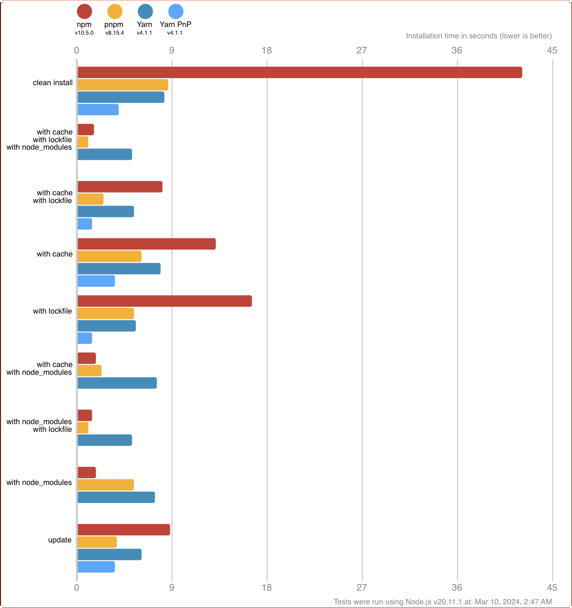

## Monorepo

日常开发中，如果有多个前端项目或者工具库，我们总是习惯性地给每个工具库建一个仓库，单独维护，在开发者本地也需要创建相对应的项目，即multi-repo。

还有就是很多公司在新人入职时，需要要花很长的时间才能让新人开始动手干活，并不一定是内部系统要学的东西很多，可能只是因为有很多的部落知识并没有很好地『传承』，就像很多项目的所有依赖从网上单独拉下来，然后配置好开发环境才开干。除此之外，还要说明不时说明哪些配置是必须的。

还有类似的场景，在一个前端项目变得很大以后，构建后的bundle包会达到20M甚至是更大，也更复杂。对于这个体积的bundle包，首要的任务是从用户体出发对工程进行优化并重新组织。

项目在放养式的维护状态下，通常是乱遭糟的，很难理清项目间的依赖。这样不仅仅增加了维护成本，而且也加重了心智负担。

如果有一种工程管理方式，能够将相关的工程从逻辑上组织起来。最直观的好处是能够快速地导航到目标项目，可以像在一个网络文件系统上一样进行导航。还可以对项目和依赖包进行同频发布。

你可能会想到npm包或者submodules的方式。如果把它们发布到 npm，可只要有一个新的版本变更，每个依赖的项目都要跟着改，并且本地调试稍显复杂。本地调试npm包，一般通过npm link或者yalc link到本地项目里，越是link的包多，管理这些link就越复杂。

还有什么好办法吗？也许你还会想到 git submodules，把这些相同的部分放到 git 仓库里面，通过 submodules 的形式来集成进来。submodules 确实可以缓解这个问题，但还不能规避调重复安装依赖的问题。

下面我们看下单一仓库Monorepo的实现。


<center>图2-1</center>

​     到目前为止，现在的node包管理工具都已经支持monorepo式代码管理管理，pnpm workspace和yarn workspace，npm workspace的方式，轻量化的Monorepo方案除了这些实现，还有Lerna可以选择。还有一种monorepo管理方案是构建型，如Vercel团队的Turborepo，微软团队的Rush，Nrwl团队的Nx，该团队同时也在维护Lerna。构建型工具，主要解决大仓库 Monorepo 构建效率低的问题。随着项目代码仓库越来越庞大，工作流（构建、部署、单元测试、集成测试）也会越来越慢，这类工具，是专门针对这样的场景进行极致的性能优化。适用于包非常多、代码体积非常大的 Monorepo 项目。

​    在本章中，我们就以pnpm workspace和lerna介绍Monorepo的代码组织形式。在node包管理工具中我们为什么会选择pnpm这是一个值得探索的问题。

  （1）速度提升

  pnpm 相比较于 yarn、npm 这两个常用的包管理工具在性能上也有了极大的提升，根据最新（2024.3.10）官方提供的 benchmark 数据可以看出在一些综合场景下比 npm和yarn 快了大概两倍。



<center>图2-2</center>

（2）依赖管理方式

​    pnpm安装的node_modules之所以比其他包管理装的体积小，是因为采取了Hard Link的机制。Hard Link 使得用户可以通过不同的路径引用方式去寻找文件。pnpm 会在全局的 store 目录（如果在.npmrc中没有指定的话默认是 node_module/.pnpm）里存储项目包的 Hard Link。安装依赖时，如果某个依赖在 store 目录中已经存在，那么就会直接从 store 目录里面去执行hard-link，避免了重复安装带来的消耗，如果不存在的话，就会下载一次。

   如果展开展开根目录下的node_modules目录可以看出来，各个node包都是symlink（符号链接）去找到对应虚拟磁盘目录下(.pnpm 目录)的依赖

   

<center>图2-3</center>

（3）解决了node包幽灵依赖的问题

（4）通过Hard Link解决了对同一个包不同版本依赖的问题

（5）对monorepo很好的支持

下面开始创建pnpm monorepo工程。

首先创建项目，初始化package.json和pnpm-workspaces.yaml文件

```shell
pnpm init -y
touch pnpm-workspaces.yaml
```

在pnpm-workspaces.yaml中packages部分配置子工程

```yam
packages:
  - 'packages/*'
```

packages下包含两个示例工程：一个完整的web工程，另一个工具集javascript-validate-tools。在本次示例中，我们演示在不发布工具包的情况下如何在web工程里测试工具包里的方法，同样的方法也适用测试组件库。


<center>图2-4</center>

monorepo工程中，pnpm可以集中控制各个包的操作，如装包、开发启动、打包等。

给所有子工程安装node包

 ```shell
 pnpm install
 ```

如果是只给people-admin子应用安装包，需要增加--filter（或 -F）

```shell
pnpm install ant-design-vue --filter people-admin
```

主应用中的scripts配置：

```shell
"scripts": {
    "clean": "rm -rf node_modules **/*/node_modules",
    "build" : "pnpm run --filter '*' build",
    "dev:web": "pnpm run -C packages/people-admin dev",
    "build:tools": "pnpm run -C packages/javascript-validate-tools build"
  },
```

这里我们配置了两个全局执行的命令，一个是删除所有子应用的node_modules目录，另一个是所有子项目的一键打包。还配置了两个子应用的单独执行命令，避免开发过程中频繁切换目录。

在people-admin项目中增加javascript-validate-tools依赖：

```shell
pnpm add javascript-validate-tools -r --filter people-admin
```

执行完，people-admin项目中增加了一条依赖

```js
"javascript-validate-tools": "workspace:^",
```

还有一个问题需要解决的是，当javascript-validate-tools发布到仓库后，需要将web工程中内部依赖变成外部依赖。当然pnpm也提供了命令publish，当执行了`pnpm publish`后，会把基于的workspace的依赖变成外部依赖，如：

```json
// before  
"dependencies": {
    "javascript-validate-tools": "workspace:^",
  },
// after
"dependencies": {
    "javascript-validate-tools": "^0.0.1",
  },
```

到目前为止，monorepo基本配置已经完成，下面我们测试下javascript-validate-tools包中的方法，测试前需要先执行打包命令，在dist目录下生成bundle文件，这是因为在package.json main字段中配置的是该路径：

```shell
pnpm run build:tools
```

使用Vue3实现一个简单的登录页面，通过reactive绑定各输入项，在submit事件中测试isArray方法是否能正常访问到并且如期望的效果工作：

```js
<script setup>
import { reactive } from 'vue';
import { isArray } from "javascript-validate-tools"
const formState = reactive({
  username: '',
  password: '',
  remember: true,
});
const submit = () => {
  const arr = [formState.username]
  console.log("arr is :", arr)
  if(isArray(arr)) {
    console.log("test successfully!")
  } else {
    alert('test Failed!');
  }
};
</script>
```


<center>图2-5</center>


<center>图2-6</center>

当然Monorepo也支持全量打包：

```shell
➜  pnpm-monorepo git:(main) ✗ pnpm build

> pnpm-monorepo@1.0.0 build /Users/houyaowei/Documents/git-resource/github/front-end-beautifier-in-process/code/pnpm-monorepo
> pnpm run --filter '*' build

Scope: 2 of 3 workspace projects
packages/javascript-validate-utils build$ rollup -c
│ 
│ ./src/main.js → dist/javascript-validate-utils.js...
│ created dist/javascript-validate-utils.js in 33ms
└─ Done in 127ms
packages/people-admin build$ vite build
[5 lines collapsed]
│ dist/index.html                         0.43 kB │ gzip:   0.29 kB
│ dist/assets/AboutView-C6Dx7pxG.css      0.09 kB │ gzip:   0.10 kB
│ dist/assets/index-Oheu5IqK.css          5.78 kB │ gzip:   2.01 kB
│ dist/assets/AboutView--YemTVeN.js       0.23 kB │ gzip:   0.20 kB
│ dist/assets/index-hVoq-Wdx.js       1,518.44 kB │ gzip: 472.47 kB
│ ✓ built in 3.49s
│ (!) Some chunks are larger than 500 kB after minification. Consider:
│ - Using dynamic import() to code-split the application
│ - Use build.rollupOptions.output.manualChunks to improve chunking: https://rollupjs.org/configuration-options/#output-manualchunks
│ - Adjust chunk size limit for this warning via build.chunkSizeWarningLimit.
└─ Done in 3.8s
```

​    根据构建日志可以看出packages下的各包依次执行build script进行构建。这种模式对于日常开发中工具包和应用的同步更新、发布非常方便，并且也支持独立更新、发布。


另一种比较常用的使用Lerna方式

   Lerna是有效的Monorepo仓库管理工具，擅长管理依赖关系和发布。并提供了很多的工作流（Task），解决了**多包依赖**、**发版手动维护版本**等问题。

   推荐是用npx 快速安装最新版的lerna进行项目初始化。关于npx稍微做下扩展，npx从npm@5.2后默认安装，它会自动查找当前依赖包中的可执行文件，如果在当前依赖包中找不到或者不存在依赖包是，就会向上在PATH对应的包里寻找。如果再找不到，就会帮自动下载安装。

总体来讲，npx可以做以下几方面的工作：
（1）项目初始化

React项目初始化，不用全局安装脚手架也可以进行项目初始化
```javascript
     npx create-react-app react-app
```

(2) 启动前端web服务。在本本机没有安装lite-server模块，下面的命令会自动下载该模块，在当前目录启动一个 Web 服务。如下：
```javascript
    npx lite-server
```
(3)临时切换node版本执行命令
```javascript
    npx -p node@14.16.0 node -v 
```
命令先指定安装node@14.16.0，然后再执行node -v命令.

(4)调用已经安装的模块
```javascript
node-modules/.bin/react --version  （原）

npx react --version  (新)
```

下面开始创建lerna工程：
```javascript
    npx lerna@latest init
```
生成lerna工程的骨架，包含基本的lerna配置文件lerna.json，package.json和基本的packages文件夹。

```json
packages
lerna.json
package.json
yarn.lock
```

Lerna 允许使用两种模式来管理项目：

- 固定模式(Fixed)：Lerna 把所有的package当做一个整体工程，每次发布所有package版本号按照lerna.json中的version配置统一升级，保持版本一致，即使是在每个package中都指定了版本号。默认是固定方式。
- 独立模式(Independent)：单独管理每个package的版本号，每次执行发布指令，Git 检查文件变动，只发布有调整的软件包。为了使该模式生效有两种办法，一种是在初始化项目时添加参数--independent，另一种办法是手动修改erna.json中的version，修改为independent。

​     我们的示例采用独立模式。同时需要修改package.json中的private为true。另外Lerna初始化后，默认沿用了workspace配置，如果继续采用Node包管理，那么workspace需要保留。如果采用Lerna，需要把workspace修改为packages。

为了方便用户操作，Lerna提供了自动创建package的命令，包名需要在本地保持唯一。

```shel
lerna create package_name
```

为了对比pnpm monorepo仓库管理，这里的package和pnpm中的保持一致。


<center>图2-7</center>

给所有package安装依赖，会自动为每个依赖包进行 `npm install` 和 `npm link` 操作

```shell
lerna bootstrap
```

为某子应用安装依赖

注意问题：
"private": true会确保根目录不被发布出去。

包名不能重复：lerna ERR! E403 You do not have permission to publish "basic-utils". Are you logged in as the correct user?
解决办法： 检查包名

命令行少参数： lerna ERR! E401 [UNAUTHORIZED] Login first。 
解决办法是加 --conventional-commits

不能发私有包：npm ERR! You must sign up for private packages 。 
解决办法： npm publish --access public


#### 
