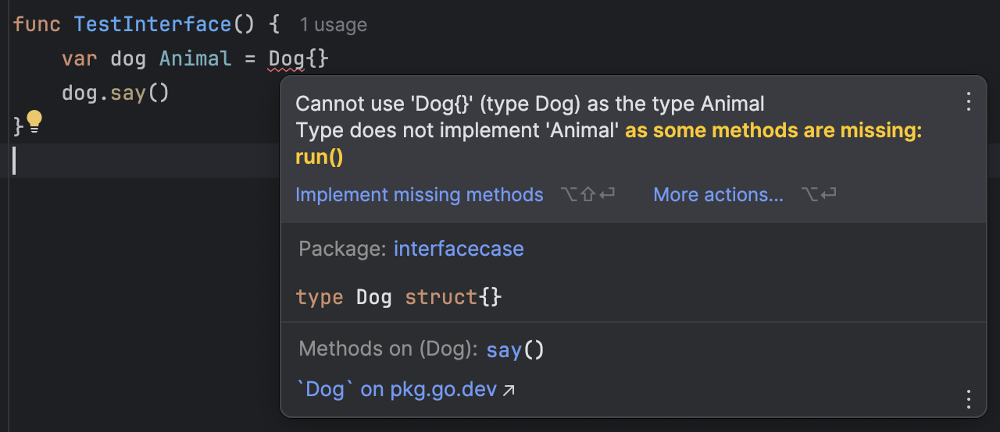
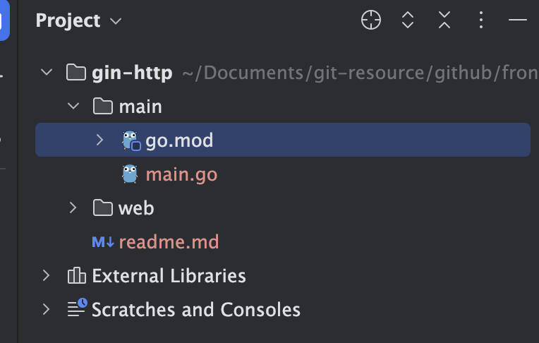
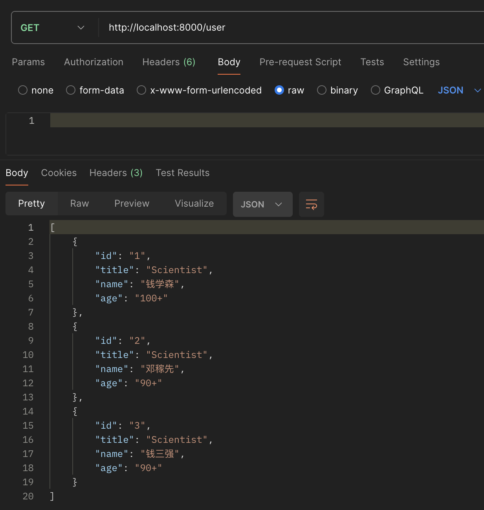
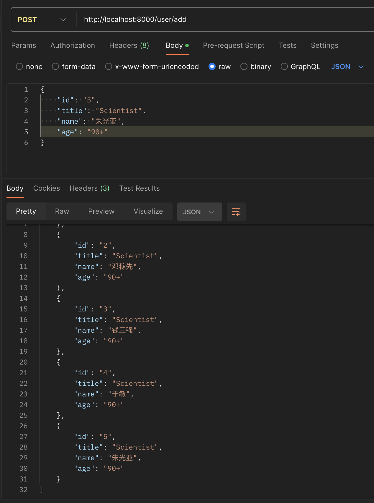
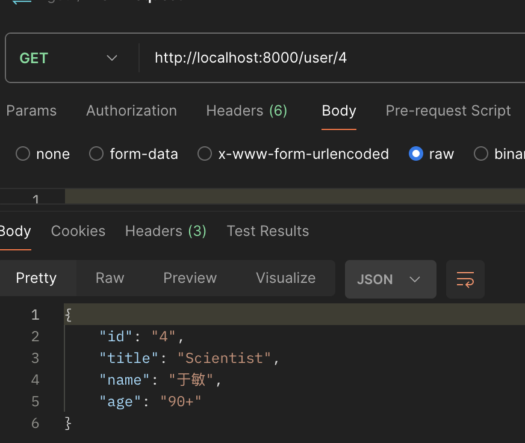

## 第3章 Go语言语言及实践

看到目录你也许会有这样的疑问：我只是一名前端开发人员为什么要了解Go语言？学习G语言对于前端开发者来说，虽然并非是必须的，但是确实可以给我们带来一些额外的优势和机会，特别是在前端在多端全面开花的时候。原因总结起来主要有如下几点：

- 提升自己的全栈能力：Go语言是由Google开发的一种编译型语言，同时它又是强类型的，天然支持并发性、垃圾回收、快速编译、丰富的标准库等。使前端比较容易向后端扩展，这样技能提升开发者的全栈能力，又能更好地理解应用架构。
- 扩展Web编程。这块的应用目前最为广泛。Web开发在当前仍然是热门职位，所以，Go语言的Web开发框架也有很多的选择，像Beego、Buffalo、Echo、Gin、Iris和Revel等。
- 扩展前端工具链。前端构建工具Vite在开发阶段是基于esbuild的，掌握一定的Go语言技巧有助于在适当的时候为Vite工具提供适当的扩展。

​    为了便于代码的组织，本篇基础部分将采用module进行代码组织。Go module是对依赖项进行方便管理的系统，module是一系列Go文件的集合，可以通过统一的module path应用，并保存Go版本信息和toolchain的版本。所有的依赖版本都可以通过 go mod graph命令查看。

​    本地文件的各module按目录存放，在各个目录下可以使用go mod 命令初始化，初始化完成，各目录下都会生成一个go.mod文件。

```shell
go mod init [module path]
```

​    比如初始化一个module path为example.com/variables的：

```shell
go mod init example.com/variables
```

  新建variables.go文件，实现需要被外部调用的方法:

```go
func TestVariablesDeclaration() {
	var name = "houyw"
	fmt.Println("variable name in module:", name)
}
```

在调用模块中使用import导入该module

```go
import (
	"example.com/variables"
)
```

到这里module还不能正常工作，因为编译器还无法解析example.com/variables， 还需要在go.mod中使用replace指令告诉编译器怎么解析这个module path。


<center>图3-1</center>   

接下来通过使用require指令引入example.com/variables。但是这一步通常有命令 go mod tidy自动完成。该命令有两个作用：

1. 引用项目需要的依赖并添加到go.mod中
2. 去掉go.mod文件中项目不需要的依赖

代码组织方式确定后，我们确定entry为入口（package main），其他每个package 名称均为文件夹名称。

下面正式开始Go之旅。


#### 变量声明

Go语言主要有四种类型的声明语句：var、const、type和func，分别对应变量、常量、类型和函数实体对象的声明。

Go中的数据类型有两类：基础数据类型和复合数据类型。

| 基础数据类型 |  复合数据类型  |
| :----------: | :------------: |
|     整型     |      数组      |
|    浮点数    |     Slice      |
|     复数     |      Map       |
|    布尔型    |     结构体     |
|    字符串    |      JSON      |
|     常量     | 文本和HTML模板 |

   字符串是一个不可修改的字节序列。字符串可以包含任意的数据，文本字符串通常被解释为采用UTF8编码的Unicode，Unicode码点对应Go语言中的rune整数类型。

```go
var name string = "houyw"
var address  = "xi'an"
fmt.Println("变量name是:", name, ", 长度:", len(name), ", 第2个字符的:", name[1])
fmt.Println("变量address的子集(字符串切片):", address[3:])
```

执行结果：

```shell
变量name是: houyw , 长度: 5 , 第2个字符的: 111
变量address的子集(字符串切片): an
```

当然也可以一次声明多个变量:

```go
var (
  age    int   = 25
  height int16 = 175
)
fmt.Println("声明多个类型, age:", age, ",height:", height)
```


如果包含的有支持Unicode字符的字符串，

```go
var strUTF8 = "hi,MBP凑活用"
var charCode, _ = utf8.DecodeRuneInString(strUTF8[13:14])
fmt.Println("字符串长度:", len(strUTF8), ",Unicode字符长度:", utf8.RuneCountInString(strUTF8), "，第14位：", charCode)
```

```shell
字符串长度: 15 ,Unicode字符长度: 9 ，第14位： 65533
```

len方法统计的是字节的长度，RuneCountInString统计的是Unicode字符数量。

在Go语言中，字符串还支持UTF8转字符串：

```go
var result = utf8.AppendRune(nil, 0x8C6B)
fmt.Println("unicode 字符串：", string(result))
```

```shell
unicode 字符串： 豫
```

常量

常量是在运行期不可修改的值，并且它们的值都是在编译期完成。每种常量的潜在类型都是基础类型，像boolean、string或数字。

```go
const pi = 3.1415926;
```

常量声明也可以使用iota常量生成器初始化，它用于生成一组以相似规则初始化的常量，但是不用每行都写一遍初始化表达式，iota默认从0开始计数，后面的依次加1。

```go
const (
  ColorRed      = iota
  ColorOrange      
  ColorYellow      
  ColorGrassland   
  ColorCyan            
  ColorBlue            
  ColorPurple      
)
```

ColorOrange为1，ColorYellow为2，依次类推。

循环

在这里，我们不再介绍和其他语言一样语法糖，只介绍Go语言中特有的语法。

for循环是比较常用的结构，range结构非常方便。可以对slice、map、数组、字符串等进行迭代循环。格式如下：

```go
for key, value := range originMap {
    newMap[key] = value
}
```

key或者value是可以省略的，如果是只想访问key，可以这样写：

```go
for key, _ := range originMap
```

如果是只想访问value，可以这样写：

```go
for _, value := range originMap
```

```go
strings := []string{"google", "bing"}
for i, v := range strings {
  fmt.Println(i, v)
}
numbers := [6]int{11, 22, 33, 55}
for i, x := range numbers {
  fmt.Printf("第 %d 位 x 的值 = %d\n", i, x)
} 
```

select语句

select 是 Go 中的一个控制结构，类似于 switch 语句，和switch不同的是select只能操作通道，监听指定通道上的操作。每一个case后必须是通道操作，要么是发送要么是接收。

```go
func TestSelectOperator() {
	c1 := make(chan string)
	c2 := make(chan int)
	go func() {
		time.Sleep(1 * time.Second)
		c1 <- "chanel c1" // 发送信号
	}()
	go func() {
		time.Sleep(2 * time.Second)
		c2 <- 1024 //发送另一个信号
	}()
	for i := 0; i < 2; i++ {
		select {
		case msg1 := <-c1:
			fmt.Println("select received string:", msg1)
		case msg2 := <-c2:
			fmt.Println("select received int:", msg2)
		}
	}
}
```

```go
select received string: chanel c1
select received int: 1024
```


不太一样的switch

在Go语言中，除了可以像JavaScript中使用switch-case的语法结构外，还支持在case中支持类型判断，具体说就是用type-switch 来判断某个 interface 变量中实际存储的变量类型。

```go
func functionOfSomeType() bool {
	return true
}
func TestTypeSwitch() {
	var t interface{}  //空接口
	t = functionOfSomeType()
	switch t := t.(type) {
	default:
		fmt.Printf("unexpected type %T\n", t)
	case bool:
		fmt.Printf("is boolean: %t\n", t)
	case int:
		fmt.Printf("is integer: %d\n", t)
	case *bool:
		fmt.Printf("pointer to boolean: %t\n", *t)
	case *int:
		fmt.Printf("pointer to integer: %d\n", *t)
	}
}
```

```shell
is boolean: true
```

在该示例中我们使用了空接口，空接口通常用来储存未知类型的值。


#### 数组

   数组是一个由固定长度的特定类型元素组成的序列，一个数组可以由零个或多个元素组成。因为数组的长度是固定的，不像在javascript中的数组有push、shift操作可以修改。

  声明固定长度的数组，并进行遍历：

```go
var scores [3]int = [3]int{100, 98, 99}
for i, s := range scores {
  fmt.Println("index :", i, "value is: ", s)
}
```

```shell
index : 0 value is:  100
index : 1 value is:  98
index : 2 value is:  99
```

不用指定长度参数，而是根据初始化数据的数量动态初始化长度字段。


#### Slice（切片）

slice是和数组类似的数据结构，但是更加灵活，功能更强大。它是可以增长和收缩的动态序列，序列中每个元素的类型必须相同。

切片初始化，和数组的字面值语法很类似，它们都是用花括弧包含一系列的初始化元素，但是对于Slice并没有指明序列的长度。一个slice由三个部分构成：指针、长度和容量。指针指向第一个slice元素对应的底层数组元素的地址，要注意的是slice的第一个元素并不一定就是数组的第一个元素。len(长度)对应slice中元素的数目；长度不能超过容量，cap(容量)一般是从slice的开始位置到结构序列的结尾位置。内置的len和cap函数分别返回slice的长度和容量。

```go
scores := []int{100, 98, 99}
fmt.Println("cap:", cap(scores), ", len:", len(scores))   //cap: 3 , len: 3
```

或者也可以根据数组生成切片：

```go
unLengthScores := [...]int{100, 98, 99, 100, 97, 96}
fmt.Println("unLengthScores' length :", len(unLengthScores))
ss := unLengthScores[1:3]
fmt.Println("ss' cap:", cap(ss), ", len:", len(ss))
```

```shell
unLengthScores' length : 6 , cap: 6
ss' cap: 5 , len: 2
```

还有一种创建Slice的方式是使用内置的make方法

```go
letters := make([]string, 5)
fmt.Println("lettters' cap:", cap(letters), ", len:", len(letters))
letters[0] = "a"
fmt.Println("lettters:", letters)
```

```shell
lettters' cap: 5 , len: 5
lettters: [a    ]
```

使用append为切片增加元素（数组）

```go
scores := []int{100, 98, 99}
appendScores := [...]int{120, 89}
for _, v := range appendScores {
  scores = append(scores, v)
}
fmt.Println("scores cap:", cap(scores), ", len:", len(scores)) //scores cap: 6 , len: 5
```

使用append为切片增加元素（Slice）

```go
scores := []int{100, 98, 99}
appendScores := []int{120, 89}
scores = append(scores, appendScores...)
fmt.Println("scores cap:", cap(scores), ", len:", len(scores)) //scores cap: 6 , len: 5
```


#### Map集合

Map是一种实用的数据结构。它是一个无序的key-value对的集合，其中所有的key都是不能重复，但是类型相同，通过给定的key可以在常数时间复杂度内检索、更新或删除对应的value。在Go语言中，map通常表示为map[K]V，其中K和V分别对应key和value。

map实例的生成方式有两种，方式一通过内置的make

```go
person := make(map[string]string)
person["name"] = "houyw"
person["address"] = "xi'an"
```

方式二通过map字面量的方法创建

```go
person2 := map[string]string{
  "name":    "houyw",
  "address": "xi'an",
}
```

map操作

```go
person["name"]  //访问
person["name"] = "hyw" //修改
delete person["address"] //删除
```


#### struct结构体

结构体是一种聚合类型，可以将多个不同类型的值汇聚到一起。如员工的信息， 员工ID可能是int型，姓名是字符串类型，薪资可能是int型，地址为字符串类型.....。我们先使用java的类表示：

```java
public class Employee {
  ID int;
	Name String;
	Address String;
	Salary int;
	ManagerID int;
	EntryTime: String;
}
```

现在我们声明一个Employ的结构体，并声明了一个Employee类型的变量person：

```go
type Employee struct {
  ID        int
  Name      string
  Age       int
  Address   string
  Salary    int
  ManagerID int
}
var person Employee
```

结构体内部也可以嵌套内部匿名结构体

```go
type Student struct {
  Name string
  Age int
  School struct {
    Name string
    Address string
    Phone string
  }
}
```

结构体的字段我们都是以大写字母开头，即可导出的变量，之所以这么写的目的是可以在另一个包中引用。可以一次性初始化所有字段，格式如下，各值需要和声明的顺序保持一致：

```
person := Employee {value1, value2, ...valuen}
```

也可以一个一个设置值：

```go
person.Age=33
person.Name="hyw"
person.ID=1065968
```

也可以对字段进行取址(&)操作。

```go
ref := &person.Address
*ref = "henan"
fmt.Println("after modified address:", person.Address) //after modified address: henan
```

结构体值也可以用结构体字面值表示，结构体字面值可以指定每个成员的值。

```go
type Point struct{ X, Y int }
p := Point{1, 2}
```

以定义指向结构体的指针类似于其他指针变量，即结构体指针，存储的是结构体变量的地址。格式如：

```go
var person_pointer *Employee = &person
fmt.Println("get Name by Pointer:", person_pointer.Name) //get Name by Pointer: houyw
```

结构体也可以不包含任何字段，称为空结构体，表示为struct{}，虽然定义一个空的结构体并没有太大的意义，但在并发编程中，channel之间的通讯，可以使用一个struct{}作为信号量。

```go
ch := make(chan struct{})
ch <- struct{}{}
```

在实际的项目中很难通过单独的数据结构完成特定的功能，比如sql中关联查询的结果作为某个实体的一个属性，这个实体类通常既有基本类型也有组合类型。

我们先声明两个struct，一个定义Animal的详细，另一个Position表示动物在货架上的位置。

```go
type Animal struct {
	Name   string
	Color  string
	Height float32
	Weight float32
	Age    float32
}
type Position struct {
	Lat, Long int
}
```

声明和Animal struct 绑定的方法

```go
func (a Animal) Runing() {
	fmt.Println(a.Name + " is running...")
}
func (a Animal) Eatting() {
	fmt.Println(a.Name + "is eating...")
}
```

接着定义动物（狗）的结构体并初始化。

```go
type Dog struct {
		ID     int
		Pos    Position
		Detail Animal
	}
	var dog = Dog{
		ID: 1001,
		Pos: Position{
			2, 4,
		},
		Detail: Animal{
			Name:   "Labrador",
			Color:  "orange",
			Weight: 30,
			Height: 50,
			Age:    3.5,
		},
	}
	fmt.Println(dog.Detail.Name)
	dog.Detail.Runing()
	dog.Detail.Eatting()
```

运行输出：

```shell
Labrador
Labrador is running...
Labrador is eating...
```


Tags

在定义结构体字段时，除字段名称和数据类型外，还可以使用反引号( `` )为结构体字段声明元信息，这种元信息称为Tag，用于编译阶段关联到字段当中，最常用的就是序列化与反序列化，需要注意的是要额外引入包"encoding/json"，否则也无法解析。

```go
type User struct {
		Name     string `json:"name"`
		Password string `json:"password"`
		Age      int    `json:"age"`
		Address  string `json:"address"`
	}

	user := User{Name: "houyw", Age: 18}
	bs, _ := json.Marshal(user) // 序列化
	fmt.Println(string(bs))
	new_person := User{}
	_ = json.Unmarshal(bs, &new_person) // 反序列化
	fmt.Println(new_person)
```

```shell
{"name":"houyw","password":"","age":18,"address":""}
{houyw  18 }
```


接口

接口类型是由一组方法签名定义的集合，这些方法可以被任意类型实现。interface 类型的变量可以存储任何实现了该接口的类型的值。但是无需像java那样显式implement。同时还有一个约束，如果一个类型实现了一个接口，那么它必须实现该接口中定义的所有方法。

interface的定义形式如下：
```go
type 接口名 interface{
     方法名1(参数列表) 返回值列表
     方法名2(参数列表) 返回值列表
     …
 }
```

先定义一个Animal的接口，接口中定义了两个无返回值的方法say、run，这两个方法无需参数，也无需返回值。

```go
type Animal interface {
	say()
	run()
}
```

定义结构体dog，并实现Animal接口中的say方法，为了验证我们上面所说的必须实现所有方法的约束：

```go
type Dog struct{}
// Dog实现Animal接口
func (d Dog) say() {
	fmt.Println("dog is barking")
}
```

既然已经实现了Animal接口，就可以定义一个 “Animal” 类型的变量，并将它赋值为一个 “Dog” 类型的变量。在 Go语言 中，interface 由两部分组成：类型和值。类型表示实现该接口的类型，值表示该类型的值。当将一个类型的值赋给一个 interface 类型的变量时，编译器会将该值的类型和值分别保存在 interface 变量中，这就是多态，从这点看接口也是值，也可以像其它值一样传递，接口值可以用作函数的参数或返回值。

```go
var dog Animal = Dog{}
dog.say()
```

但是无法顺利执行，并产生一条编译错误。



<center>图3-2</center>   

为了让静态编译通过，需要再实现run方法，编译执行。

```go
func (d Dog) run() {
	fmt.Println("dog is running")
}
```

```go
dog is barking
dog is running
```

在Go语言中，接口是可以嵌套的。由Annimal2接口组合接口Sayer和Mover。

```go
type Sayer interface {
	say()
}
type Mover interface {
	move()
}
type Animal2 interface {
	Sayer
	Mover
}
```

声明Duck 结构体，并实现say方法和move方法

```go
type Duck struct {
	name string
}
func (c Duck) say() {
	fmt.Println("duck is quacking...")
}
func (c Duck) move() {
	fmt.Printf("duck %s can move \n", c.name)
}
```

看下测试代码和输出结果。

```go
var x Animal2
x = Duck{name: "Huahua"}
x.move()
x.say()
```

```shell
duck Huahua can move 
duck is quacking...
```

interface中没有定义的接口成为空接口，空接口可以接收任意类型值，下面是作为参数和作为map值的示例：

```go
// 空接口作为函数参数
func show(a interface{}) {
    fmt.Printf("type:%T value:%v\n", a, a)
}
```

```go
// 空接口作为map值
var studentInfo = make(map[string]interface{})
studentInfo["name"] = "娃哈哈"
studentInfo["age"] = 18
studentInfo["married"] = false
fmt.Println(studentInfo)  // map[age:18 married:false name:娃哈哈]
```


#### 方法和函数

一个方法就是一个包含了接受者的函数，接受者可以是命名类型或者结构体类型的一个值或者是一个指针。Go中，方法总是绑定对象实例，并隐式将实例作为第一实参 (receiver，可以是 T 或 *T)。

```go
func (recevier type) methodName(参数列表)(返回值列表){}
```

如下面方法的实现，在上个小节关于接口实现中我们已经做了说明，现在：

```go
type Test struct{}
// 无参数、无返回值
func (t Test) say() {
}
// 单参数、无返回值
func (t Test) say(str string) {
}
// 单参数、单返回值
func (t Test) say(str string) (p string) {
}
// 多参数、无返回值
func (t *Test) say(x, y int) {
}
```

下面看一个示例

```go
type User struct {
	Name  string
	Email string
}
func (u User) Notify() {
	fmt.Printf("name: %v , email: %v \n", u.Name, u.Email)
  fmt.Printf("value type: %p \n", &u)
}
func TestFunctions() {
	u1 := User{"houyw", "houyaowei@163.com"}
	u1.Notify()
	// 通过指针类型调用方法
	u2 := User{"314254791", "314254791@qq.com"}
	u3 := &u2
	u3.Notify()
}
```

​       示例中通过值类型和指针类型调用，但是需要注意的是当接受者（receiver）不是指针类型时，方法操作对应接受者的值始终副本，即使是使用指针类型调用。

```shell
name: houyw , email: houyaowei@163.com 
value type: 0x1400013e000 
name: 314254791 , email: 314254791@qq.com 
value type: 0x1400013e020 
```

修改Notify方法的接受者（receiver）为指针类型，

```go
func (u *User) Notify() {
	fmt.Printf("name: %v , email: %v \n", u.Name, u.Email)
	fmt.Printf("pointer type : %p \n", u)
}
```

```go
name: houyw , email: houyaowei@163.com 
pointer type : 0x1400012a000 
name: 314254791 , email: 314254791@qq.com 
pointer type : 0x1400012a020 
```

函数的概念对前端朋友更加友好，可以完全使用JavaScript中的概念来理解Go中的函数。函数声明包含一个函数名，参数列表（支持不定 参数）， 返回值列表（支持多个返回值）和函数体

```go
func fucName(参数列表)(返回值列表){}
```

```go
// 返回一个参数
func display(x int, y int) int {
	fmt.Printf("display(): %d, %d \n", x, y)
	return x + y
}
// 返回两个参数
func display2(x int, y int) (int, string) {
	fmt.Printf("display(): %d, %d \n", x, y)
	d := x + y
	return d, strconv.Itoa(d)
}
```

​     在默认情况下，Go 语言使用的是值传递，即在调用过程中不会影响到原始参数，即传递的是值的副本。引用传递指在调用函数时将实际参数的地址直接传递给目标函数，那么在函数中对参数所进行的修改都会反映到原始参数中。虽然Go语言中有值类型和引用类型，但是都是值传递，因为传递指针值，在目标方法中得到是指针值的副本，而不是指向的数据。

​    值类型有int`、`float`、`bool`、`string`、`array`、`sturct。变量通常在栈上分配，存储变量的值在不再引用的时候会被立即回收。引用类型有slice、map、channel、interface、方法，变量通常在堆上分配，存储的是一个内存地址，由这个地址存储最终的值。

   在这里稍做一些引申，根据官方FAQ文档介绍，Map 和 Slice 的值表现和指针一样：它们包含指向底层map或者slice数据指针的描述符。复制 Map 和 Slice 的值，不会复制它们指向的数据。复制接口（interface）的值，会生成一个接口值存储的数据的副本。如果接口值存储的是一个结构体，复制接口值将产生一个结构体的副本。如果接口值存储的是指针，复制接口值会产生一个指针的副本，而不是指针指向的数据的副本。

  还Go语言中也支持匿名函数的写法，匿名函数由一个不带函数名的函数声明和函数体组成，形式如JavaScript中的函数表达式，如下写法：

```javascript
//将匿名函数赋值给变量fn。
var fn= function(){
    return "这是js的匿名函数"
}
```

在Go语言中，也是将匿名方法复制给一个变量，通过函数调用

```go
getSqrt := func(a float64) float64 {
    return math.Sqrt(a)
}
getSqrt(16) //4
```

但是仅仅是上面的写法，似乎也没有什么特别的。如果是把方法的集合赋值给一个变量呢，

```go
fns := [](func(x int) int){
  func(x int) int { return x + 5 },
  func(x int) int { return x * x },
  func(x int) int { return x - 2 },
}
fmt.Println(fns[2](50)) // 48
```

方法同样支持闭包

```go
//闭包
func closure() func() int {
	i := 10
	b := func() int {
		i++
		fmt.Println(i)
		return i
	}
	return b
}
func TestClosure() {
	closureInner := closure()
	closureInner()  // 11
	closureInner()  // 12
}
```


常用的标准库

fmt包：主要分为向外格式化输出内容和获取输入内容。

fmt.print: 标准化输出
fmt.printf: 格式化输出，具体有

| %v   | 值以默认格式表示                                   |
| ---- | -------------------------------------------------- |
| %#v  | 值以Go语法表示                                     |
| %+v  | 类似%v，但输出结构体时会添加声明的字段名           |
| %d   | 输出十进制                                         |
| %x   | 十六进制表示，输出的是小写字母，%X输出的是大写字母 |
| %o   | 输出八进制                                         |
| %s   | 输出字符串或者byte数组                             |
| %p   | 输出以0x开头的十六进制                             |
| %T   | 打印值的类型                                       |

```go
name := "houyw"
age := 18
s2 := fmt.Sprintf("name:%s,age:%d", name, age)
fmt.Println(s2)
fmt.Printf("65对应8进制数: %o \n", 65)
fmt.Printf("10表示为2进制：%b \n", 10)
fmt.Printf("100表示为16进制：%x \n", 100)
fmt.Printf("变量age的地址：%p \n", &age)
s := struct {
  name string
}{
  "houyw",
}
fmt.Printf("默认显示： %v\n", s)
fmt.Printf("显示属性： %+v\n", s)
fmt.Printf("Go语法表示：%#v\n", s)
fmt.Printf("%T\n", s)
```

输出结果:

```shell
name:houyw,age:18
65对应8进制数: 101 
10表示为2进制：1010 
100表示为16进制：64 
变量age的地址：0x14000110018 
默认显示： {houyw}
显示属性： {name:houyw}
Go语法表示：struct { name string }{name:"houyw"}
struct { name string }
```


Strconv包: 包实现了基本数据类型与其字符串表示的转换，主要有以下常用函数：

| Atoi       | 将字符串类型的整数转换为int类型，如果包含非数字字符，会转换失败 |
| ---------- | ------------------------------------------------------------ |
| Itoa       | 将int类型数据转换为对应的字符串                              |
| ParseBool  | 返回字符串表示的bool值，只结束它接受1、0、t、f、T、F、true、false、True、False、TRUE、FALSE，其他均会返回false |
| ParseInt   | 返回字符串表示的整数值，接受正负号                           |
| ParseFloat | 一个表示浮点数的字符串并返回其值                             |
| FormatBool | 根据参数返回”true”或”false”                                  |
| FormatInt  | 返回i的base进制的字符串表示                                  |

```go
s1 := "100x"
i1, err := strconv.Atoi(s1)
if err != nil {
  fmt.Println("can't convert to int")
} else {
  fmt.Printf("type:%T value:%#v\n", i1, i1) //type:int value:100
}
i2 := 200
s2 := strconv.Itoa(i2)
fmt.Printf("value:%#v\n", s2)

p1, _ := strconv.ParseBool("False")
fmt.Println("p1:", p1)
p2, _ := strconv.ParseBool("1")
fmt.Println("p2:", p2)

p3, err2 := strconv.ParseInt("23", 10, 10)
if err2 != nil {
  fmt.Println("can't convert to int")
} else {
  fmt.Printf("type:%T value:%#v\n", p3, p3) //type:int value:100
}
fmt.Println("p3:", p3)

f1 := strconv.FormatBool(false)
fmt.Println(f1)
f2 := strconv.FormatInt(87, 16)
fmt.Println(f2)
```

输出结果:

```go
can't convert to int
value:"200"
p1: false
p2: true
type:int64 value:23
p3: 23
false
57
```


反射(reflect)，反射是指在程序运行期对程序本身进行访问和修改的能力

```go
func getReflectType(a interface{}) {
	//获取类型信息用reflect.TypeOf,获取值类型使用: reflect.ValueOf
	t := reflect.TypeOf(a)
	fmt.Println("type is：", t)
	k := t.Kind()
	switch k {
	case reflect.Float64:
		fmt.Printf("param is float64\n")
	case reflect.String:
		fmt.Println("param is string")
	}
}
func TestReflect() {
	name := "houyw"
	getReflectType(name)
}
```

输出：

```shell
type is： string
param is string
```


基于Gin的Mock Server

​    现阶段Web应用还是占有很大的比重，开发过程中使用的mock server也是一个很重要的部分，用来做前后端分离。Go语言中虽然内置了net/http包，性能也不错，但是还需要做顶层的封装，虽然内置了连接池，但是缺点是HTTP服务端的路由只是一个静态索引匹配，对于动态路由匹配支持的不好，并且每一个请求都会创建一个gouroutine进行处理，如果是遇到海量请求到来时需要考虑这块的性能问题。本文我们以轻便、灵活为出发点介绍mock服务的实现。

  Gin是一个封装灵活，高性能，API友好，支持中间件，集成router能力，支持快速开发web的开发框架。

  新建两个package，main和web，在各自的目录下通过go mod init 生成go.mod 文件，module名称与文件夹名称保持一致。module main用来注册程序入口，package web用来处理web请求



<center>图3-3</center> 

首先需要安装gin

```shell
go get -u github.com/gin-gonic/gin
```

在main.go中导入package web，并引用web包中的入口方法

```go
package main
import "web"
func main() {
	web.WebEntry()
}
```

在 web包入口文件顶部，首先导入gin，并初始化

```go
import (
	"github.com/gin-gonic/gin"
)
// app初始化
var app = gin.Default()
```

接下来设置设置代理、注册路由、设置启动端口。

```go
//package web,entry.go 
func WebEntry() {
	app.SetTrustedProxies([]string{"127.0.0.1"})
	registerRoutes()
	app.Run(":8000")
}
```

本示例中，我们注册两个基础路由组：/user和/news。

```go
func registerRoutes() {
	userGroup := app.Group("/user")
	registerUserRouters(userGroup)
	newsGrous := app.Group("/news")
	registerNewsRoutes(newsGrous)
}
```

再使用registerUserRouters、registerNewsRoutes 分别注册user、news的其他路由

```go
func registerUserRouters(rg *gin.RouterGroup) {
	rg.GET("/", getAllUsers)
	rg.GET("/:id", getFilterUsers)
	rg.POST("/add", saveUser)
}
```

具体的匹配情况如下：

- 路由为/ ，会匹配到 /user
- 路由为 /:id , 匹配到如/user/1
- 路由为 /add, 匹配到如/user/add

先看下初始化的数据及其struct结构, 利用前面已经介绍的tag映射json结构：

```go
type users struct {
	ID    string `json:"id"`
	Title string `json:"title"`
	Name  string `json:"name"`
	Age   string `json:"age"`
}
var us = []users{
	{ID: "1", Title: "Scientist", Name: "钱学森", Age: "100+"},
	{ID: "2", Title: "Scientist", Name: "邓稼先", Age: "90+"},
	{ID: "3", Title: "Scientist", Name: "钱三强", Age: "90+"},
	{ID: "4", Title: "Scientist", Name: "于敏", Age: "90+"},
}
```

先看下查询所有user的方法

```go
func getAllUsers(ctx *gin.Context) {
	var u userIdS
	if err := ctx.ShouldBind(&u); err != nil {
		fmt.Print("bind error")
	} else {
		fmt.Printf("param is: %s", u.ID)
	}
	ctx.IndentedJSON(http.StatusOK, us)
}
```

gin context通过ShouldBind将请求携带的参数和结构体绑定起来，避免多个form字段一个一个解析。使用IndentedJSON将数组输出JSON字符串。



<center>图3-4</center> 

增加user

```go
func saveUser(ctx *gin.Context) {
	var u users
	fmt.Println("aa")
	//BindJSON:将传进来的参数转为user对象，参数用body传
	if err := ctx.BindJSON(&u); err != nil {
		fmt.Print(err)
		return
	}
	fmt.Printf("u: %+v \n", u)
	us = append(us, u)
	ctx.IndentedJSON(http.StatusCreated, us)
}
```

通过BindJSON()可见将`json`请求体绑定到一个结构体上（也可以使用GetRawData，但是需要使用json.Unmarshal反序列化），如果绑定成功，结构体对象u就被赋值为绑定后的数据。控制台打印的数据

```shell
u: {ID:5 Title:test title Name:ttt Age:60}
```

通过内置的append方法，将新增数据添加到原数组中。



<center>图3-5</center> 

按条件过滤user

```go
func getFilterUsers(ctx *gin.Context) {
	// var userId = ctx.Params.ByName("id") //取参数也可以用这种
	var userId = ctx.Param("id")
	fmt.Print("param is:", userId)
	for _, u := range us {
		if u.ID == userId {
			ctx.IndentedJSON(http.StatusOK, u)
		}
	}
}
```

Gin 在 Context结构体的Params上绑定了ByName方法，通过key获得参数value



<center>图3-6</center> 

我们省略了删除功能的实现，这里提供思路供大家参考，先通过id遍历索引值，然后借助append方法生成新数组，伪代码如下:

```go
append(arr[:index], arr[index+1:]...)
```

