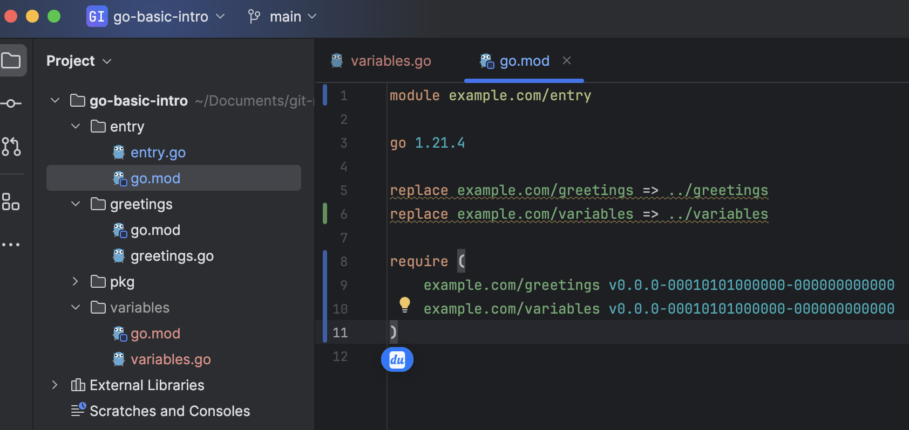

## 第3章 Go语言语言及实践

看到目录你也许会有这样的疑问：我只是一名前端开发人员为什么要了解Go语言？学习G语言对于前端开发者来说，虽然并非是必须的，但是确实可以给我们带来一些额外的优势和机会，特别是在前端在多端全面开花的时候。原因总结起来主要有如下几点：

- 提升自己的全栈能力：Go语言是由Google开发的一种编译型语言，同时它又是强类型的，天然支持并发性、垃圾回收、快速编译、丰富的标准库等。使前端比较容易向后端扩展，这样技能提升开发者的全栈能力，又能更好地理解应用架构。
- 扩展Web编程。这块的应用目前最为广泛。Web开发在当前仍然是热门职位，所以，Go语言的Web开发框架也有很多的选择，像Beego、Buffalo、Echo、Gin、Iris和Revel等。
- 扩展前端工具链。前端构建工具Vite在开发阶段是基于esbuild的，掌握一定的Go语言技巧有助于在适当的时候为Vite工具提供适当的扩展。

​    为了便于代码的组织，本篇基础部分将采用module进行代码组织。Go module是对依赖项进行方便管理的系统，module是一系列Go文件的集合，可以通过统一的module path应用，并保存Go版本信息和toolchain的版本。所有的依赖版本都可以通过 go mod graph命令查看。

​    本地文件的各module按目录存放，在各个目录下可以使用go mod 命令初始化，初始化完成，各目录下都会生成一个go.mod文件。

```shell
go mod init [module path]
```

​    比如初始化一个module path为example.com/variables的：

```shell
go mod init example.com/variables
```

  新建variables.go文件，实现需要被外部调用的方法:

```go
func TestVariablesDeclaration() {
	var name = "houyw"
	fmt.Println("variable name in module:", name)
}
```

在调用模块中使用import导入该module

```go
import (
	"example.com/variables"
)
```

到这里module还不能正常工作，因为编译器还无法解析example.com/variables， 还需要在go.mod中使用replace指令告诉编译器怎么解析这个module path。



<center>图3-1</center>   

接下来通过使用require指令引入example.com/variables。但是这一步通常有命令 go mod tidy自动完成。该命令有两个作用：

1. 引用项目需要的依赖并添加到go.mod中
2. 去掉go.mod文件中项目不需要的依赖

代码组织方式确定后，我们确定entry为入口（package main），其他每个package 名称均为文件夹名称。

下面正式开始Go之旅。


#### 变量声明

Go语言主要有四种类型的声明语句：var、const、type和func，分别对应变量、常量、类型和函数实体对象的声明。

Go中的数据类型有两类：基础数据类型和复合数据类型。

| 基础数据类型 |  复合数据类型  |
| :----------: | :------------: |
|     整型     |      数组      |
|    浮点数    |     Slice      |
|     复数     |      Map       |
|    布尔型    |     结构体     |
|    字符串    |      JSON      |
|     常量     | 文本和HTML模板 |

   字符串是一个不可修改的字节序列。字符串可以包含任意的数据，文本字符串通常被解释为采用UTF8编码的Unicode，Unicode码点对应Go语言中的rune整数类型。

```go
var name string = "houyw"
var address  = "xi'an"
fmt.Println("变量name是:", name, ", 长度:", len(name), ", 第2个字符的:", name[1])
fmt.Println("变量address的子集(字符串切片):", address[3:])
```

执行结果：

```shell
变量name是: houyw , 长度: 5 , 第2个字符的: 111
变量address的子集(字符串切片): an
```

当然也可以一次声明多个变量:

```go
var (
  age    int   = 25
  height int16 = 175
)
fmt.Println("声明多个类型, age:", age, ",height:", height)
```


如果包含的有支持Unicode字符的字符串，

```go
var strUTF8 = "hi,MBP凑活用"
var charCode, _ = utf8.DecodeRuneInString(strUTF8[13:14])
fmt.Println("字符串长度:", len(strUTF8), ",Unicode字符长度:", utf8.RuneCountInString(strUTF8), "，第14位：", charCode)
```

```shell
字符串长度: 15 ,Unicode字符长度: 9 ，第14位： 65533
```

len方法统计的是字节的长度，RuneCountInString统计的是Unicode字符数量。

在Go语言中，字符串还支持UTF8转字符串：

```go
var result = utf8.AppendRune(nil, 0x8C6B)
fmt.Println("unicode 字符串：", string(result))
```

```shell
unicode 字符串： 豫
```

常量

常量是在运行期不可修改的值，并且它们的值都是在编译期完成。每种常量的潜在类型都是基础类型，像boolean、string或数字。

```go
const pi = 3.1415926;
```

常量声明也可以使用iota常量生成器初始化，它用于生成一组以相似规则初始化的常量，但是不用每行都写一遍初始化表达式，iota默认从0开始计数，后面的依次加1。

```go
const (
  ColorRed      = iota
  ColorOrange      
  ColorYellow      
  ColorGrassland   
  ColorCyan            
  ColorBlue            
  ColorPurple      
)
```

ColorOrange为1，ColorYellow为2，依次类推。

数组

   数组是一个由固定长度的特定类型元素组成的序列，一个数组可以由零个或多个元素组成。因为数组的长度是固定的，不像在javascript中的数组有push、shift操作可以修改。

  声明固定长度的数组，并进行遍历：

```go
var scores [3]int = [3]int{100, 98, 99}
for i, s := range scores {
  fmt.Println("index :", i, "value is: ", s)
}
```

```shell
index : 0 value is:  100
index : 1 value is:  98
index : 2 value is:  99
```

不用指定长度参数，而是根据初始化数据的数量动态初始化长度字段。

Slice（切片）

Slice是和数组类似的数据结构，但是更加灵活，功能更强大。它是可以增长和收缩的动态序列，序列中每个元素的类型必须相同。

初始化

```go
scores := []int{100, 98, 99}
fmt.Println("cap:", cap(scores), ", len:", len(scores))   //cap: 3 , len: 3
```

