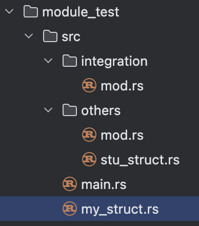

#### Rust：拓展前端工具链

​      有前端同学可能有这样的疑问，前端和Rust有关系吗？那么陡峭的学习曲线前端有学的必要吗？的确，Rust 与 JS 好像就是两个开发体验的极端。我们先看下rust在前端的应用，看是否有一个你钟情的应用让你有些许的热情去了解它。

- 构建工具： Rspack，SWC，Turbo，farm，Rolldown（新一代Vite），Parcel，Biome（Rome的继任者）

- 运行时：Deno

- 框架：next.js，Actix Web

- 桌面应用：Tarui

- 代码转换：SWC   

- webassembly工具：Yew，wasm-bindgen，wasm-pack

- 格式化：dprint

- 编辑器： zed

- 社区：Github，npm

- 与Node交互：napi-rs，neon

- Oxc工具集：lint，AST，minifier，formatter

  
  

​     对于很大一批的前端同学而言，学习一门偏底层的语言太难了。也许学习Rust是一个不错的选择，虽然不见得容易多少，所有权可能已经让你比较头疼了，但是并发更让你一头雾水。但它或许是我们突破安逸太久前端社区的一把钥匙，帮助我们打开通往新世界的大门。

   吸引开发者拥抱Rust的优势也足够明显，高性能的可靠的系统编程语言，更容易实现类型安全；强大的类型系统；并发性，Rust通过其所有权系统即严格的数据访问规则、借用模型（防止数据竞争）内置了对并发编程的支持；内置包管理，简化了项目管理、依赖项跟踪、构建；工程实践上，内置了rustdoc，方便文档的编写；内置类型推导；

Rust语言基础

语句和表达式

程序是有语句（statement）和表达式（Expression）组成。语句通常包括变量赋值，if语句，循环语句，函数声明，函数调用，class声明等。表达式有接收函数返回值，数字运算，函数声明，class声明等。请注意，这里的class特指JavaScript中的，因为在js中函数声明和class声明即可以用作声明也可以用例赋值给变量。

```rust
fn add_with(x: i32, y: i32) -> i32 {
    let x = x + 1; // 语句
    let y = y + 5; // 语句
    x + y // 表达式
}
```

语句和表达式通过以下方式区分：

- 表达式可以被用来赋值或可以作为运算符，而语句只能用作声明，
- 创建语句会产生副作用，而表达式是值或执行产生的值
- 语句可能会包含表达式
- 表达式表达的内容单一，而语句通常具有双面性（如方法执行、不执行）
- 语句有完整的代码结构

在Rust中，语句和表达的区别非常重要，请务必牢记。


所有权和借用

Rust受到广大万人瞩目的原因之一是内存安全，常见的垃圾回收机制又附带引入其他的问题，像性能、内存占用等问题。因此Rust采用了不同的方式，就是所有权系统。Rust中的所有权系统的原则是：

- 每一个值都被一个变量所拥有，该变量被称为值的所有者
- 一个值同时只能被一个变量所拥有
- 当所有者离开作用域范围时，这个值将被丢弃

需要说明的是，Rust中

作用域是变量的生效范围，在这个范围能访问到某个变量的值。

```rust
fn test_variable() {
   let language = String::from("english");
   let other = language;
   println!("String language: {}", language);
} //作用域结束
```

如变量language的作用域是从声明开始，到大括号结尾处结束 。上面的代码首先将"english"绑定给变量language，并保有字符串"english"的所有权。将变量other绑定为language，这个过程就发生了所有权的转移。Rust 认为 language不再有效，这个操作被称为 移动(move)，因此也无需在 language 离开作用域后 drop 任何东西，字符串"english"的所有权由language转移到了other，language 在被赋予other 后就马上失效了.


尝试打印language看会发生什么情况。

```shell
error[E0382]: borrow of moved value: `language`
  --> src/main.rs:64:38
   |
60 |     let language = String::from("english");
   |         -------- move occurs because `language` has type `String`, which does not implement the `Copy` trait
61 |     let other = language;
   |                 -------- value moved here
...
64 |      println!("String language: {}", language);
   |                                      ^^^^^^^^ value borrowed here after move
   |
   = note: this error originates in the macro `$crate::format_args_nl` which comes from the expansion of the macro `println` (in Nightly builds, run with -Z macro-backtrace for more info)
help: consider cloning the value if the performance cost is acceptable
   |
61 |     let other = language.clone();
   |                         ++++++++
```

根据错误提示，language已经发生所有权转移，如果类型兼容，可以考虑使用clone方法进行赋值。修改为下面的形式:

```rust
let language = String::from("english");
let other = language.clone();
```

`String` 类型是一个复杂类型，由存储在栈中的堆指针、字符串长度、字符串容量共同组成，其中**堆指针**是最重要的，它指向了真实存储字符串内容的堆内存，至于长度和容量。这和基础数据类型（数字、布尔、char）的变量绑定不是一样的过程，基本类型是通过**自动拷贝**的方式来赋值的，都被存在栈中，完全无需在堆上分配内存，所以基础数据的再进行绑定时并不会发生所有权转移。

大家可以自行测试如下代码:

```rust
let a = 2;
let _ = a;
println!("basic type i32 a: {}", a);
let b1 = false;
let _ = b1;
println!("boolean b1: {}", b1);
let f1 = 2.3;
let _ = f1;
println!("float f1: {}", f1);
let ch1 = 'a';
let _ = ch1;
println!("char ch1: {}", f1);
```

上面我们介绍的是移动是一次性移动整个变量（如上面的language移动到other）。当然变量也可以进行局部移动（partial move），局部移动仅移动变量的部分内容。例如变量A包含两个元素B和C，局部移动可以将元素B的所有权移动到变量D中。

```rust
struct Person {
    name: String,
    age: u8,
}
let person = Person {
    name: String::from("houyw"),
    age: 20,
};
let Person { name, ref age } = person;
```

属性name的所有权从person中被移走，继续保留对age的所有权。如果通过person访问name或者格式化输出person会报错，下面做下验证：

```rust
println!("get name by object is {}", person.name);
println!("The person is {:?}", person);
```

控制台输出：

```shell
let Person { name, ref age } = person;
   |                  ---- value partially moved here
 84|     println!("get name by object is {}", person.name);
   |                                          ^^^^^^^^^^^ value borrowed here after move
85 |     println!("The person is {:?}", person);
   |                                    ^^^^^^ value borrowed here after partial move
```

将值传递给函数，一样会发生 移动或者 复制，就跟变量绑定一样。

```rust
fn take_ownership(c: String) {
    println!("moved valued is:{}",c);
}
fn test_ownership() {
    let hello = String::from("hi,rust!");
    take_ownership(hello);
    println!("original variable hello: {}", hello);
}
```

在函数test_ownership中，首先绑定变量hello，传入函数take_ownership就会发生所有权移动，再次输出报错也就不足为奇。但是在程序中传递参数也是极为常见的，在Rust中可以使用变量的指针进行传递，也就是借用（borrowing），获取变量的引用，称之为借用(borrowing)。现在我们修改上面的例子，让程序顺利执行。

```rust
fn take_ownership(c: &String) {
    println!("moved valued is:{}",c);
}
fn test_ownership() {
    let hello = String::from("hi,rust!");
    take_ownership(&hello);
    println!("original variable hello: {}", hello);
}
```

调用take_ownership时，传入变量hello的地址，即所有权。take_ownership的参数也需要将String修改为&String。这里，& 符号即是引用，允许使用值，但是不获取所有权。

我们如果在take_ownership中修改原变量的值又会发生什么：

```rust
fn take_ownership(c: &String) {
    c.push_str(" you are good!")
}
```

很不幸的是

```shell
error[E0596]: cannot borrow `*c` as mutable, as it is behind a `&` reference
  --> src/main.rs:92:5
   |
92 |     c.push_str(" you are good!")
   |     ^ `c` is a `&` reference, so the data it refers to cannot be borrowed as mutable
   |
help: consider changing this to be a mutable reference
   |
91 | fn take_ownership(c: &mut String) {
```

正如变量默认不可变一样，引用指向的值默认也是不可变的。根据提示，需要把参数修改可变引用：

```rust
fn take_ownership(c: &mut String) {
    c.push_str(" you are good!"); //在原结尾后追加字符串
}
fn test_ownership() {
    let mut hello = String::from("hi,rust!");
    take_ownership(&mut hello);
    println!("original variable hello: {}", hello);
}
```

首先，声明hello为可变类型，其次创建一个可变的引用&mut hello 和接受可变引用参数c: &mut String 的函数。

```shell
original variable hello: hi,rust! you are good!
```

效果是我们期望的，但是需要注意的是，对一个变量而言同一个作用域，可变引用、不可变引用只能存在一种情况。


Rust基础

熟悉ES6的前端朋友对Rust的变量、常量的声明会比较亲切。变量使用let声明，常量使用const声明

```rust
let chinese = "世界，你好";
let english = "World, hello";
let regions = [chinese, english];
```

在ES6里看似没有特别的，给变量初始化。但是在Rust中这个过程有另一个名字：变量绑定。这个涉及到Rust核心设计的所有权系统，先简单介绍，通过绑定（赋值）给变量绑定一个内存对象，这个变量就拥有了所有权。所有权我们会在稍后详细说明。

按照ES6的语法，变量chinese,english和regions都是可以重新赋值的。先看下在rust里给english变量重新赋值看是否能正常编译、执行。


<center>图4-1</center>   

从报错信息可以看出，"cannot assign twice to immutable variable"，不能给immutable的变量重新赋值，在Rust中绑定的变量默认是不可变（immutable）。细心的朋友可能会发现，在某些编辑器中（如vs code，RustRover）会显式提示变量类型，这得益于Rust的类型推导，在上面的例子中english遍历会被推导成&str类型。


<center>图4-2</center> 

在开发过程中，动态修改变量是非常常见的操作，在Rust中要实现这种效果，需要在变量前添加mut即可，声明为可修改的。

在Rust中字符串有两种类型：String、&str。String有一个可以调整大小的缓冲区，这个缓存是在堆上分配的，并且可以根据需要调整大小。

```rust
let hello = "hello，world".to_owned();
```

如上面的变量hello ,它拥有12个字节的缓冲区，其中11个字节正在使用。可以将String视为Vector，每个元素为无符号类型，简写为vec<u8>


<center>图4-3</center> 

创建String类型可以借助标准库创建，也可以使用to_owned、to_string()将&str转为String：

```rust
let course = String::new("course");
let english: String = "english".to_string(); 
let chinese: String = "chinese".to_string(); 
```

&str总是指向有效 UTF-8 序列的切片（`&[u8]`），并可用来查看 String 的内容。

```rust
let english = "hello,world".to_string();
let sub = &english[6..];
println!("{:?}", sub)   //world
```

上述示例中，sub是对english拥有的文本最后5个字节的一个&str引用。&str是一个胖指针（简单理解为指向动态大小类型的为胖指针，如trait对象和切片。指向静态大小类型的为瘦指针，如数组）。Rust中提供了标准化输出println!，println!并不是一个方法，而是一个宏（都是以感叹号结尾），计算机科学里的宏是一种抽象的,根据一系列预定义的规则替换一定的文本模式。该宏接收一个字符串，该字符串包含一个用"{}"表示的占位符。开发过程中，通常需要输出数据类型以进行调试，使用"{:?}"更加方便。

match表达式

Rust的match表达式类似switch语句，可以理解是switch的简化版，允许客户根据变量值或者操作符 | 连接多个匹配模式，每个模式将按照从左到右进行匹配测试，直到匹配一个结果，同时下划线（_）可以理解为switch中的default。

```rust
fn test_req_status() -> u32 {
    200
}
fn main() {
    let status = test_req_status();
    match status {
        200 => println!("Request successfully!"),
        404 => println!("Service not found!"),
        500 => println!("Service error!"),
        _=> {
            println!("Request failed!")
        }
    }
}
```

运行结果：

```shell
Request successfully!
```

 下一个示例看下多个匹配模式：

```rust
let x = 2;
let message = match x {
    0 | 1  => "very few",
    2 ..= 9 => "a few",
    _      => "lots"
};
println!("test match2 result: {}", message);
```

输出结果：

```shell
test match2 result: a few
```


#### 集合类型

当程序必须处理多个数据时，通常会用到集合类型，在JavaScript中集合类型有列表型（Array，TypedArray）和键值对集合（Map，Set，WeakMap，WeakSet）。在Rust中集合类型有静态数组，动态项目列表vector，元组，map，切片

先声明一个数组，这是一个不可变的数据结构，元素和，

```shell
let array: [i32; 3] = [1, 2, 3];//一维数组，在栈上分配
let demension_array = [[1, 2, 0], [44, 22, 0], [100, 90, 1]]; //二维数组

// 堆上分配数组，被自动强转成切片
let boxed_array: Box<[i32]> = Box::new([1, 2, 3]);
```

元组

元组和数组的不同之处在于：数组中的元素必须有相同的类型，而元组是异构集合，集合中的元素类型就宽松了很多，可以具有不同的类型。

```rust
let num_and_string :(i8,&str) = (25,"hello,tuple");
println!("first tuple : {:?}", num_and_string);
let (age, say) = num_and_string;
println!("elements in tuple: {} and {}", age, say);
println!("get element by index: {} and {}", num_and_string.0, num_and_string.1);
```

```shell
first tuple : (25, "hello,tuple")
elements in tuple: 25 and hello,tuple
get element by index: 25 and hello,tuple
```

在上面示例中，元组num_and_string包含两个元素，类型分别是i8，&str。元组中的元素还可以提取到变量中，提取的原则是逐个赋值，当然也可以通过索引取值。

项目列表vector

vector和数组类似，只不过内容和长度不需要提前指定，长度可以按需增长，在元素在堆上分配。可以通过两种方式创建，一种是使用构造函数，另一种是通过宏创建。

```rust
let mut vec: Vec<_> = Vec::new();
vec.push("name");
vec.push("age");
println!("vec's capbility: {}, length is: {}, second item:{:?}", vec.capacity(), vec.len(), vec.get(1));
```

输出结果：

```shell
vec's capbility: 4, length is: 2, second item:Some("age")
```

从结果来看，容量（capbility）和长度（length）存在不一致的情况，vector 的容量是为将添加到 vector 上的任何元素分配的空间量。与 vector 的长度含义不同，长度指 vector 中的实际元素数量。 如果 vector 的长度超过其容量时，容量将自动增加，但需要重新分配其元素。

从根本上讲，vector 始终是由指针，容量，长度组成三元组，记录元组的信息。


<center>图4-4</center> 

在使用Vec::new，vec![\]，Vec::with_capacity(0)或通过在空 Vec 上调用 shrink_to_fit来构造容量为 0 的 Vec，则它将不会分配内存。当capbility大于0时才会进行内存分配。如果一个 Vec 已分配了内存，那么指针会指向的内存在堆上，它的指针按顺序指向 length个已初始化的连续元素，然后是 capacity - length 逻辑上未初始化的连续元素。

通过ver!宏命令创建：

```rust
let mut v = vec![5,0,9]; //初始化数据
v.push(2);
println!("vec's capbility: {}, length is: {}", v.capacity(), v.len());
```

输出结果

```she
vec's capbility: 6, length is: 4
```

集合中有这么个场景，需要判断元素是否是特定的值。vector中使用vec.get(索引值)获取元素，先看下一个测试案例再进行详细的讨论：

```rust
let mut vec: Vec<_> = Vec::new();
vec.push("name");
vec.push("age");
if vec.get(1) == "age" {
    println!("equal")
}else {
    println!("not equal")
}
```

查看运行结果：

```shell
error[E0308]: mismatched types
  --> src/main.rs:18:22
   |
18 |     if vec.get(1) == "age" {
   |                      ^^^^^ expected `Option<&&str>`, found `&str`
   |
   = note:   expected enum `Option<&&str>`
           found reference `&'static str`
```

查看官方api得知get方法会返回选项Option<T>，所以Option 和&str无法做直接比较。我们先深入了解下Option再看这个报错应该怎么消除。 选项Option有两个变量：

- None：表示失败或缺少值
- Some(value)：元组结构体，封装了一个 T类型的值为 value

```rust
fn test_give_option (gift: Option<&str>) {
    match gift {
        Some("flower") => println!("This is Flower."),
        Some(inner)   => println!("{}? How nice.", inner),
        None          => println!("No gift? Oh well.")
    }
}
```

函数test_give_option中参数为Option类型，下面看下怎么传参：

```rust
let flower = Some("flower");
let void = None;
test_give_option(flower);
test_give_option(void);
```

将&str类型的"flower"封装成选型Option传递给函数test_give_option

```shelll
This is Flower.
No gift? Oh well.
```

现在回到上面报错的示例，报错的原因是因为比较的对象类型不同，所以需要将"age"转化为Option

```rust
let mut vec: Vec<_> = Vec::new();
vec.push("name");
vec.push("age");
if vec.get(1) == Some(&"age") { //将age转换为Option
    println!("equal")
}else {
    println!("not equal")
}
```

执行示例，打印"equal"。


#### 切片（slice）

切片是获取集合类型数据的常用手段，是一种动态尺寸类型（dynamically sized type）， 引用集合特定区间元素进行只读访问，也就是说slice没有所有权问题。切片基本上不是指针就是引用，具体表示为 &T[]，常用的格式有：

- `&[T]`：共享切片，不拥有它指向的数据，只是借用
- `&mut [T]`：可变切片，可变切片借用指向它的数据
- `Box<T>`：拥有所有权的切片

首先看下共享切片

```rust
let numbers:[i32; 4] = [32,20,3,11];
let shared_slice = &numbers[1..3]; //第2个到第3个元素
println!("shared slice: {:?}", shared_slice); //[20, 3]
```

如果想通过共享切片修改相应元素，编译器会提示报错

```rust
shared_slice[0] = 0
```

```shell
 shared_slice[0] = 0;
   |     ^^^^^^^^^^^^^^^ `shared_slice` is a `&` reference, so the data it refers to cannot be written
```

修复的办法就是修改为可变切片:

```rust
let mut mut_numbers:[i32; 4] = [32,20,3,11];
let mutable_slice = &mut mut_numbers[1..3]; //[20, 3]
println!("origin slice: {:?}", mutable_slice);
mutable_slice[0] = 0;
println!("modified slice: {:?}", mutable_slice);
println!("origin array : {:?}", mut_numbers);
```

我们知道，可变切片的借用指向它的数据，所以修改切片的值会同步影像到原始数据。

```shell
origin slice: [20, 3]
modified slice: [0, 3]
origin array : [32, 0, 3, 11]
```

一个堆分配的数组，被自动强转成切片

```rust
let boxed_array = Box::new([1,2,3]);
let boxed_slice = &boxed_array[..];
println!("boxed slice: {:?}", boxed_slice);
```

还有其他常用的变量类型也天然支持切片，像字符串常量（&str类型），数组

```rust
let s = "hello, rust!";
let s_slice = &s[0...6];//hello
let arr = [1, 2, 3, 4, 5];
let arr_slice = &arr[1..3];
```


#### Map结构

map是比较常用的数据结构，和其他语言一样，是一种键值对的集合，将键和值关联起来，方便检索。下面通过简单的几个例子说明map的基础用法，在Rust中，在初始化Map对象前，需要导入（use）标准库的HashMap。

```rust
use std::collections::HashMap;
```

```rust
let mut my_map = HashMap::new();
my_map.insert("name", "hyw".to_string());
my_map.insert("age", 22.to_string());
println!("map: {}, length:{}", my_map.capacity(), my_map.len())
```

使用insert方法，向map集合中插入新值，如果key值相同，会覆盖原来的值。如果key是String类型，需要转换为&str类型

```rust
let address = String::from("address");
let value = "xi'an".to_string();
my_map.insert(&address, value);
my_map.delete(&address);
```

获取map中的元素，使用get方法并返回一个Option。如果键不存在，会返回None。要删除使用remove方法。

```shell
map: {"age": "22", "name": "hyw"}
name in map is: Some("hyw")
```

因为map默认具有iterator特性，所以可以直接遍历。

```rust
for (key, value) in &my_map {
    println!("{}: {}", key, value);
}
```


#### 结构体（struct）

Rust中的结构体类似C++和go语言中得struct和JavaScript中的对象。结构体会把多个不同类型的值组合在一起形成一个单一的值，方便把他们作为一个单元处理。Rust中有3中结构体类型：

- 具名字段型结构体
- 元组型结构体
- 单元型结构体

3种结构体在引用元素上有所不同，具名字段型结构体会为每个元素命名，元组型结构体会根据元素出现的顺序标识，单元型结构比较特殊，根本没有元素。

默认情况下是私有的，即仅在声明的模块及其子模块中可见。如果需要在其他模块中可见，需要在结构体的定义前加上pub。

1、具名字段型结构体

结构体定义形式如下，根据Rust的约定，所有类型的名称都需要首字母大写，即为大驼峰模式。

```rust
struct User {
    is_actived: bool,
    username: String,
    email: String,
    token: String
}
```

User为结构体名称，并声明4个元素is_actived，username, email, token。

实例化

```rust
fn build_instance() -> User {
    User {
        is_actived: false,
        username: String::from("hyw"),
        email: String::from("houyw@163.com"),
        token: 22
    }
}
fn test_struct() {
    let user = build_instance();
    println!("build user is: {:?}", user);
    assert_eq!(user.username,"hyw");
}
```

```shell
build user is: User { is_actived: false, username: "hyw", email: "houyw@163.com", token: "sxWdeeD*990033KSp22cxxkekl@sdf2swXa", age: 22 }
```

2、元组型结构体

结构体之所以成为元组型，因为它和元组很相似。

```rust
struct Position(f32, f32);
```

```rust
fn build_couple_struct() -> Position {
    Position(116.404053,39.915046) //故宫百度坐标
}
fn test_couple_struct() {
    let postion = build_couple_struct();
    println!("GuGong position is: {:?}", postion);
    assert_eq!(postion.0, 3.1415926); //false 
}
```

```rust
GuGong position is: Position(116.40405, 39.915047)
```

3、单元型结构体

结构体可以只作为一种象征而无需任何成员。

```rust
struct Postion2;
```

 这种类型的值不会占用内存，Rust既不会在内存中存储单元型结构体的值，也不会对生成代码对元素进行操作，仅仅通过值的类型推导值的所有权。

Rust中结构体是支持方法调用的，请大家注意的是方法和函数虽然类似，但是方法的执行是通过对象来完成的，函数是独立执行。

我们对上面的User结构体实现结构体方法

```rust
impl User {
    fn say(&self) -> String {
        self.username
    }
}
let u = User {
    is_actived: false,
    username: String::from("hyw"),
    email: String::from("houyw@163.com"),
    token: String::from("sxWdeeD*990033KSp22cxxkekl@sdf2swXa"),
    age: 22
};
print!("username by impl : {}", u.say());
```

在impl块中定义的函数在Rust中成为关联函数，因为是与特定类型相关联的。与关联函数像对应的就是自由函数。


#### 枚举（Enum）

枚举类型提供了允许开发人员创建一个可以从多个不同取值中选其一的可能。枚举中的元素可以定义不同的类型，如下：

 ```rust
 enum Message {
     Quite,
     Move {
         x: i32,
         y: i32
     },
     Write(String),
     ChangeColor(i32, i32, i32)
 }
 ```

在枚举Message中包含四个元素，Quite，Move（该元素是个普通的结构体），Write和ChangeColor这两个是普通的元组。

实例化和测试

```rust
fn test_enum_message(s: Message) {
    match s {
        Message::Quite => println!("Message Quite"),
        Message::Move{x,y} => {
            println!("element in enum ,x: {}, y:{}",x,y);
        },
        Message::Write(c) => println!("Write {}.", c),
        Message::ChangeColor(a,b,c) => {
            println!("element in enum ,a: {}, b:{}, c:{}",a,b,c);
        } ,
    }
}
```

在测试函数test_enum_message中，需要注意的是元组和结构体的传值方式，

```rust
fn test_num () {
    let quite = Message::Quite;
    test_enum_message(quite);
    let e_move = Message::Move {
        x: 32,
        y: 100
    }; //实例化结构体
    let e_change_color = Message::ChangeColor (255,124,83);
    test_enum_message(e_move);
    test_enum_message(e_change_color);
}
```

```shell
Message Quite
element in enum ,x: 32, y:100
element in enum ,a: 255, b:124, c:83
```


#### 函数

函数将一堆指令抽象为具体实体，和其他语言的形式很相似。形式如下，其中函数名称的命名风格是小写字母以下划线分割: 

```rust
fn 函数名 (参数) <返回值>{
  函数体
}
```

其实到现在我们已经接触到了函数，rust程序的入口为main函数，下面的示例中在main函数中调用另外两个函数：

```rust
fn main() {
    test_string();
    test_variable();
}
```

声明带有返回值的函数，参数是两个i8类型（有符号，无符号的为u8），并返回i8类型的结果：

```rust
fn test_add( a:i8, b:i8) -> i8 {
    a+b
}
```

上面的语法糖只要有其他编程语言经验的就很容易理解。但是对于Rust的函数而言，有几种特有的返回值：

1、无返回值()

 这是个0长度的元组，虽然没有什么实际作用，但是可以说明一个函数没有返回值。无返回值的形成有两种情况：函数无返回值、通过分号（;）。

```rust
fn test_variable() {
    let english = "hello,world".to_string();
    let sub = &english[6..];
    println!("{:?}", sub)
}
```

下面我们改造一下前面的test_add函数，只增加一个分号。

```rus
fn test_add( a:i8, b:i8) -> i8 {
    a+b;
}
```

运行，看执行结果


<center>图4-5</center> 

在不含有分号的表达式（a+b）中，会产生一个结果作为返回值。但是以分号结尾的表达式却是无返回值类型，修复的办法也很简单，只需要增加return 关键字即可，显示返回。

2、永不返回的发散函数!

当以!作为函数返回值的时候，表示该函数永不返回。这种函数往往用作会导致后续代码的中断执行或者进入无线循环。需要注意的是使用!作为返回类型永远都是合法的。

```rust
fn test_diverging(b:bool) -> u8{
    if b {
        30
    } else {
        panic!("test diverging")
    }
}
```

在上面的例子中，panic! 是一个发散宏函数，其返回值为 ! ，换句话说任何调用 panic! 的函数都是发散函数。

测试代码：

```rust
let f = test_diverging(true);
println!("diverging functions: {:?}", f); //diverging functions: 30
```

修改函数test_diverging的参数测试:

```rust
let f = test_diverging(false);
println!("diverging functions: {:?}", f);
```

输出结果：

```shell
thread 'main' panicked at src/main.rs:32:9:
test diverging
note: run with `RUST_BACKTRACE=1` environment variable to display a backtrace
```

上面的代码会触发一个panic，并显示"test diverging"作为错误消息。


在JavaScript中有一个在函数式编程中非常重要的特性：高阶函数（Higher Order Function, HOF）。在Rust当中高阶函数依然存在。熟悉JavaScript的同学应该比较清楚，高阶函数的形成有两个条件：

- 一个或者多个函数作为入参
- 返回一个函数

这样的条件同样适合Rust，下面看下在Rust中是怎么实现的。先看函数作为参数传递:

```rust
type Factory = fn(a:i8, b:i8) -> i8;
fn calc(fnc: Factory, a: i8, b: i8) -> i8 {
    fnc(a, b)
}
fn test_add( a:i8, b:i8) -> i8 {
    a+b
}
fn test_sub( a:i8, b:i8) -> i8 {
    a-b
}
```

测试代码：

```shell
println!("HOF add, {}", calc(test_add, 20, 20)); //HOF add, 40
println!("HOF sub, {}", calc(test_sub, 60, 21)); // HOF sub, 39
```

下面看第二种情况，返回值是函数的情况。我们将上面的clac函数同match表达式做下改造，支持返回函数

```rust
fn calc2(m: &str) -> Factory {
    match m {
        "add" => test_add,
        "sub" => test_sub,
        _ => todo!()
    }
}
```

测试代码

```shell
 println!("HOF add2, {}", calc2("add")(20, 20)); //HOF add2, 40
 println!("HOF sub2, {}", calc2("sub")(60, 21)); //HOF sub2, 39
```


#### 条件判断和循环

Rust中的if表达式和循环结构都遵循C语言风格结构，这里不再赘述。主要看下在Rust中有哪些特殊的语法结构，

将if else结构代码块的值分配给变量：

```rust
let a = 22;
let is_bigger = if a > 10  {
    true
}else {
    false
};
println!("variable is bigger than 10? {:?}.", is_bigger); 
```

```shell
variable is bigger than 10 ? true.
```

if let表达式，等价于match表达式。和if不同的是if 的条件是 true 或 false(支持表达式), 而 if let 是模式匹配，

```rust
let num = Some(22);
if let Some(22) = num  {
    println!("matched {:?}", num);
}else {
    println!("not matched");
}
```

这个例子中的if let表达的意思是若let将num解构成Some(22)，就格式化输出 matched Some(22) 语句，否则输出"not matched"。

区间for循环

for循环可以遍历一个迭代器，这条规则在JavaScript中仍然适用，比如js中的Array、Map拥有默认的迭代行为，还有就是对象上（或者原型链中任意对象）只要有一个Symbol.iterator的属性，都可以使用for-of进行迭代。

```js
var myIterator = {
  *[Symbol.iterator]() {
    yield "hello";
    yield "js";
    yield "rust";
  },
};
for (let value of myIterator) {
  console.log(value);  // 分别打印 "hello","js","rust"
}
```

Rust 中创建迭代器最方便的方法就是使用区间(m..n）,左侧为闭区间，右侧为开区间。

```rust
let months = ["January", "February", "March", "April", "May", "June", "July",
    "August", "September", "October", "November", "December"];
for i in 1..3  {
    println!("index: {i}")
}
```

```hell
index: 1
index: 2
```

当然也可以将右侧设置为闭区间

```rust
for i in 1..=3  {
   println!("index: {i}")
}
```

```shell
index: 1
index: 2
index: 3
```

Rust中的for可以像js中的forEach、map一样每次循环获取到索引和当前值。

```rust
for  (i,v) in months.iter().enumerate()  {
   println!("index {i} months item: {v}")
}
```

```shell
index 0 months item: January
...
```

loop循环

loop表示一个无限循环，可以使用break在任何时候退出循环，使用continue跳过本次循环进入到下次循环。

```rust
let mut count = 0;
loop {
    count += 1;
    if count == 3 {
        println!("get three");
        continue;
    }
    if count == 5 {
        println!("big bang");
        break;
    }
}
```


#### 泛型

泛型是一种在编译时期进行类型检查和安全性检查的机制，不需要等到运行时才发现。泛型可增加代码的可读性、可维护性、可复用性，也避免了不必要的类型转换。如果有java开发经验的同学，相信对下面的代码应该不会感到陌生：

```java
public class Box<T> {
    private T value;
    public Box(T value) {
        this.value = value;
    }
    public T getValue() {
        return value;
    }
}
// 初始化泛型类，接受Integer类型
Box<Integer> integerBox = new Box<>(1024);
int iValue = integerBox.getValue();
System.out.println("Integer Value is: " + iValue);
// 初始化泛型类，接受String类型
Box<String> stringBox = new Box<>("Hello, Generics!");
String strValue = stringBox.getValue();
System.out.println("String Value is: " + strValue);
```

上述示例中，第一次泛型初始化为Integer类型，第二次初始化为字符串类型。当然不止支持基础数据类型，更可以支持类，实际项目中当然是类为最普遍。

声明泛型时，类型T仅仅是一个占位符，只有在编译期才会进行类型确定。

下面看下在Rust中怎么定义、初始化泛型。

在Rust中，函数和结构体都支持泛型，先看下函数对泛型的支持

```rust
fn add<T: std::ops::Add<Output = T>>(a:T, b:T) -> T {
    a + b
}
```

```rust
fn test_fn_generic3() {
    let a = 32 ;
    let b = 10;
    println!("generic add ,value is :{}", add(a,b));//generic add ,value is :42
}
```

使用泛型参数，有一个先决条件，就是必需在使用前对其进行声明。

```rust
fn 函数名<T>(参数: T) -> T {}
```

泛型还支持引用传递：

```rust
fn largest<T:std::cmp::PartialOrd>(list: &[T]) -> T {
    let mut largest = list[0];
    for &item in list.iter() {
        if item > largest {
            largest = item;
        }
    }
    largest
}
fn test_fn_generic4() {
    let number_list = vec![34, 50, 25, 100, 65];
    let result = largest(&number_list);
    println!("The largest number is {}", result); // The largest number is 100
}
```

在结构体中声明泛型，和函数声名泛型类似，

```rust
struct Point<T> {
    x: T,
    y: T
}
impl<T> Point<T>  {
    fn console(&self) -> &T {
        &self.x
    }
}
```

```rust
fn test_generic() {
    let p1 = Point{x: 2, y:3}; //类型不一致就报错,如果类型不一样，需要声明两个类型
    println!("p1:{:?}", p1);
    println!("p1.console:{}", p1.console());
}
```

```rust
p1:Point { x: 2, y: 3 }
p1.console:2
```

上面示例中，给结构体中的元素x，y设置了相同的类型（都声明为类型T）。当然也可以在声明泛型的时候声明不同的类型，如下所示：

```rust
struct Circle<T,U> {
    x: T,
    y: U
}
impl<T,U> Circle<T,U>  {
    fn minup<V,W>(self, other: Circle<V,W>) -> Circle<T, W> {
        Circle {
            x: self.x,
            y: other.y
        }
    }
}
```

声明泛型时需要指定各个类型。

```rust
fn test_generic2() {
    let p1 = Circle{x: 2, y:3.33}; 
    let p2 = Circle { x: "Hello", y: 'c'};
    let p = p1.minup(p2);
    println!("test_generic2:{:?}", p); //p1和p2也出现了借用，
}
```


#### 特征（trait）

大家如果翻翻本书的配套代码或者看过Rust相关的代码，不难发现，方法中多次使用了`#[derive(Debug)]`，这就是特征，表示函数、结构体等自动派生Debug特征，支持println!宏的格式化输出。还有就是起到限制的作用，如前面的Add函数

```rust
fn add<T: std::ops::Add<Output = T>>(a:T, b:T) -> T {
    a + b
}
```

众所周知，并不是所有的类型都可以，通过 `std::ops::Add` 特征来限制 `T`，只有 `T` 实现了 `std::ops::Add` 才能进行合法的加法操作。

特征是定义了一组可以被共享的行为，只要实现了该特征，就能继承这组行为（可以类比java中的接口），所以特征需要具体的类型来实现，更方便的是所有的特征都定义了一个隐含类型Self，默认指向实现特征的类型。特征（trait）只能有三部分组成：

- function（函数）
- types（类型）
- constant（常量）


看一个入门版特征，用来格式化打印结构体的信息。

```rust
pub trait Summary {
    fn summarize(&self) -> String;
}
```

这里使用 trait关键字来声明一个特征，Summary是特征名。下面我们使用结构体实现特征

```rust
pub struct Book{
    pub title: String,
    pub author: String,
    pub content: String
}
impl Summary for Book  {
    fn summarize(&self) -> String {
        format!(" book name: {},  author: {}, content is: {}",self.title, self.author, self.content)
    }
}
```

实现特征的语法与为结构体类似，都通过impl实现，表示的意思是为Book类型实现Summary特征。

```rust
let book = Book {
    title: "frontend complete book".to_string(),
    author:"houyw".to_string(),
    content: "development with js".to_string()
};
let msg = book.summarize();
println!("msg: {}", msg);
```

```shell
msg:  book name: frontend complete book,  author: houyw, content is: development with js
```


#### 包和模块

当业务模块逐渐增加时，势必需要考虑根据业务模块进行分模块、分包。这么做的好处一来是有利于代码的抽象和复用，再者就是方便代码的组织和维护。Rust提供了强大的模块系统，可以将代码按层次组织成多个逻辑单元（默认是private的，如果需要暴露给其他模块访问，需要加上pub，变成public的）。

模块中可以包含函数、结构体、特征（trait），其他模块。

在Rust中，模块系统有如下几个部分组成

- 包（Packages）： Cargo 的一个功能，可以构建、测试和分享 crate。
- **Crates** ：一个模块的树形结构，它形成了库或二进制项目，是编译和链接的单元，也是版本控制、版本分发和运行时加载的基本单元。。
- 模块和 **use**： 允许控制作用域和路径的私有性。
- 路径：一个命名例如结构体、函数或模块等项的方式

下面我们实现一个如下代码结构的模块：



<center>图4-6</center> 

结构体类型可以理解成模型（Model），因为结构体可以组合不同类型元素。在开发过程中模型通常是共享的，所以需要将结构体声明为public的。

```rust
pub struct MyStruct{
  pub name:String,
  pub age: i32
}
```

在需要导入的模块，需要首先使用mod语法导入，Rust 自动 为它创建一个模块命名空间（以避免冲突），自动提取文件名，这时候我们还无法直接访问 struct 类型，编译仍然会报错。还需要做的是用use 关键字将完整限定的类型名称映射到类型名。

```rust
use crate::my_struct::MyStruct;
```

use语句中首先使用crate:: ，因为所有Rust 项目都是 crate。 Rust 项目可以由多个模块组成，文件也可以嵌套在文件夹中（也是 *modules*）。 使用crate::表示来访问 module 树的根目录。

在main.rs中引用结构体就变成了以下的形式

```rust
mod my_struct;
use crate::my_struct::MyStruct;
```

my_struct就是结构体所在的文件名，MyStruct为结构体名称。

模块也可以放到其他文件夹中，就如我们要实现的others、integration目录。需要和单个文件module不同的是，需要在文件夹目录下新建一个mod.rs文件，即入口文件。

如other模块，空结构体stu_struct和入口文件mod.rs，设置结构体和方法的可见性。

```rust
pub mod stu_struct;
pub fn say_in_others (str:String) {
  crate::integration::show_hello(str)
}
pub struct AnotherStruct {
  pub name: String
}
```

在方法say_in_others中借用crate::调用其他模块的方法show_hello。该方法中仅格式化输出:

```rust
pub fn show_hello(str:String) {
  println!("fn show_hello called in integration directory! param is : {}", str)
}
```

下面看下完整的main.rs实现

```rust
mod my_struct;
mod others;
mod integration;
use crate::my_struct::MyStruct;
use crate::others::AnotherStruct;
use crate::others::stu_struct:: StuStruct;
fn main() {
    let _ms = MyStruct{ name: "houyw".to_string(), age: 22};
    println!("name in struct is: {}", _ms.name);
    let oms: AnotherStruct = AnotherStruct{ name: "hyw".to_string()};
    println!("name in other struct is: {}", oms.name);
    let _stu = StuStruct{};
    crate::others::say_in_others("from main".to_string());
}
```

输出结果：

```shell
name in struct is: houyw
name in other struct is: hyw
fn show_hello called in integration directory! param is : from main
```

有代码洁癖的应该看不惯这样main.rs实现。如果有更多的模块，需要继续平铺。为了避免这类问题，Rust提供了prelude机制

```rust
use crate::others:: {AnotherStruct, stu_struct:: StuStruct}; //Preludes
```

也可以prelude的inline模式

```rust
mod prelude {
    pub use crate::others:: {AnotherStruct, stu_struct:: StuStruct};
}
use crate::prelude::*;
```

