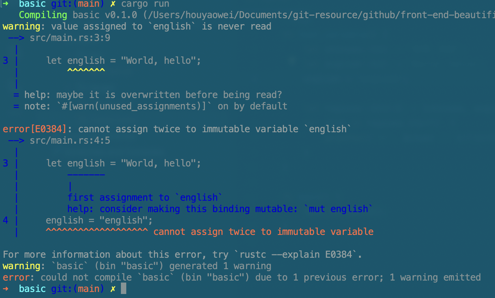
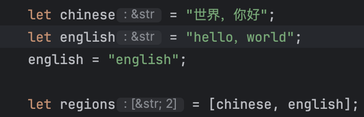
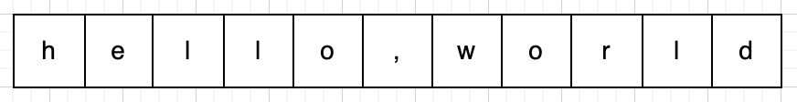
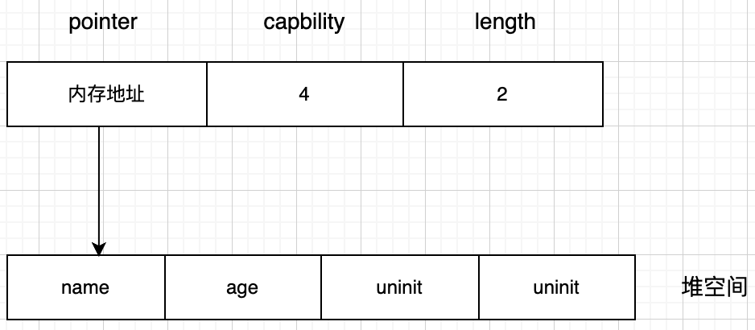
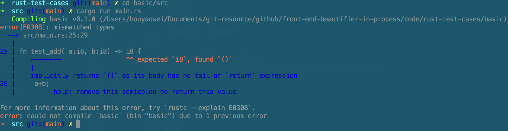

#### Rust：拓展前端工具链

​      有前端同学可能有这样的疑问，前端和Rust有关系吗？那么陡峭的学习曲线前端有学的必要吗？的确，Rust 与 JS 好像就是两个开发体验的极端。我们先看下rust在前端的应用，看是否有一个你钟情的应用让你有些许的热情去了解它。

- 构建工具： Rspack，SWC，Turbo，farm，Rolldown（新一代Vite），Parcel，Biome（Rome的继任者）

- 运行时：Deno

- 框架：next.js，Actix Web

- 桌面应用：Tarui

- 代码转换：SWC   

- webassembly工具：Yew，wasm-bindgen，wasm-pack

- 格式化：dprint

- 编辑器： zed

- 社区：Github，npm

- 与Node交互：napi-rs，neon

- Oxc工具集：lint，AST，minifier，formatter

  
  

​     对于很大一批的前端同学而言，学习一门偏底层的语言太难了。也许学习Rust是一个不错的选择，虽然不见得容易多少，所有权可能已经让你比较头疼了，但是并发更让你一头雾水。但它或许是我们突破安逸太久前端社区的一把钥匙，帮助我们打开通往新世界的大门。

   吸引开发者拥抱Rust的优势也足够明显，高性能的可靠的系统编程语言，更容易实现类型安全；强大的类型系统；并发性，Rust通过其所有权系统即严格的数据访问规则、借用模型（防止数据竞争）内置了对并发编程的支持；内置包管理，简化了项目管理、依赖项跟踪、构建；工程实践上，内置了rustdoc，方便文档的编写；内置类型推导；

Rust语言基础

语句和表达式

程序是有语句（statement）和表达式（Expression）组成。语句通常包括变量赋值，if语句，循环语句，函数声明，函数调用，class声明等。表达式有接收函数返回值，数字运算，函数声明，class声明等。请注意，这里的class特指JavaScript中的，因为在js中函数声明和class声明即可以用作声明也可以用例赋值给变量。

```rust
fn add_with(x: i32, y: i32) -> i32 {
    let x = x + 1; // 语句
    let y = y + 5; // 语句
    x + y // 表达式
}
```

语句和表达式通过以下方式区分：

- 表达式可以被用来赋值或可以作为运算符，而语句只能用作声明，
- 创建语句会产生副作用，而表达式是值或执行产生的值
- 语句可能会包含表达式
- 表达式表达的内容单一，而语句通常具有双面性（如方法执行、不执行）
- 语句有完整的代码结构

在Rust中，语句和表达的区别非常重要，请务必牢记。


Rust基础

熟悉ES6的前端朋友对Rust的变量、常量的声明会比较亲切。变量使用let声明，常量使用const声明

```rust
let chinese = "世界，你好";
let english = "World, hello";
let regions = [chinese, english];
```

在ES6里看似没有特别的，给变量初始化。但是在Rust中这个过程有另一个名字：变量绑定。这个涉及到Rust核心设计的所有权系统，先简单介绍，通过绑定（赋值）给变量绑定一个内存对象，这个变量就拥有了所有权。所有权我们会在稍后详细说明。

按照ES6的语法，变量chinese,english和regions都是可以重新赋值的。先看下在rust里给english变量重新赋值看是否能正常编译、执行。



<center>图4-1</center>   

从报错信息可以看出，"cannot assign twice to immutable variable"，不能给immutable的变量重新赋值，在Rust中绑定的变量默认是不可变（immutable）。细心的朋友可能会发现，在某些编辑器中（如vs code，RustRover）会显式提示变量类型，这得益于Rust的类型推导，在上面的例子中english遍历会被推导成&str类型。



<center>图4-2</center> 

在开发过程中，动态修改变量是非常常见的操作，在Rust中要实现这种效果，需要在变量前添加mut即可，声明为可修改的。

在Rust中字符串有两种类型：String、&str。String有一个可以调整大小的缓冲区，这个缓存是在堆上分配的，并且可以根据需要调整大小。

```rust
let hello = "hello，world".to_owned();
```

如上面的变量hello ,它拥有12个字节的缓冲区，其中11个字节正在使用。可以将String视为Vector，每个元素为无符号类型，简写为vec<u8>



<center>图4-3</center> 

创建String类型可以借助标准库创建，也可以使用to_owned、to_string()将&str转为String：

```rust
let course = String::new("course");
let english: String = "english".to_string(); 
let chinese: String = "chinese".to_string(); 
```

&str总是指向有效 UTF-8 序列的切片（`&[u8]`），并可用来查看 String 的内容。

```rust
let english = "hello,world".to_string();
let sub = &english[6..];
println!("{:?}", sub)   //world
```

上述示例中，sub是对english拥有的文本最后5个字节的一个&str引用。&str是一个胖指针（简单理解为指向动态大小类型的为胖指针，如trait对象和切片。指向静态大小类型的为瘦指针，如数组）。Rust中提供了标准化输出println!，println!并不是一个方法，而是一个宏（都是以感叹号结尾），计算机科学里的宏是一种抽象的,根据一系列预定义的规则替换一定的文本模式。该宏接收一个字符串，该字符串包含一个用"{}"表示的占位符。开发过程中，通常需要输出数据类型以进行调试，使用"{:?}"更加方便。

match表达式

Rust的match表达式类似switch语句，可以理解是switch的简化版，允许客户根据变量值或者操作符 | 连接多个匹配模式，每个模式将按照从左到右进行匹配测试，直到匹配一个结果。

```rust
fn test_req_status() -> u32 {
    200
}
fn main() {
    let status = test_req_status();
    match status {
        200 => println!("Request successfully!"),
        404 => println!("Service not found!"),
        500 => println!("Service error!"),
        _=> {
            println!("Request failed!")
        }
    }
}
```

运行结果：

```shell
Request successfully!
```

 下一个示例看下多个匹配模式：

```rust
let x = 2;
let message = match x {
    0 | 1  => "very few",
    2 ..= 9 => "a few",
    _      => "lots"
};
println!("test match2 result: {}", message);
```

输出结果：

```shell
test match2 result: a few
```


#### 集合类型

当程序必须处理多个数据时，通常会用到集合类型，在JavaScript中集合类型有列表型（Array，TypedArray）和键值对集合（Map，Set，WeakMap，WeakSet）。在Rust中集合类型有静态数组，动态项目列表vector，元组，map，切片

先声明一个数组，这是一个不可变的数据结构，元素和，

```shell
let array: [i32; 3] = [1, 2, 3];//一维数组，在栈上分配
let demension_array = [[1, 2, 0], [44, 22, 0], [100, 90, 1]]; //二维数组

// 堆上分配数组，被自动强转成切片
let boxed_array: Box<[i32]> = Box::new([1, 2, 3]);
```

元组

元组和数组的不同之处在于：数组中的元素必须有相同的类型，而元组是异构集合，集合中的元素类型就宽松了很多，可以具有不同的类型。

```rust
let num_and_string :(i8,&str) = (25,"hello,tuple");
println!("first tuple : {:?}", num_and_string);
let (age, say) = num_and_string;
println!("elements in tuple: {} and {}", age, say);
println!("get element by index: {} and {}", num_and_string.0, num_and_string.1);
```

```shell
first tuple : (25, "hello,tuple")
elements in tuple: 25 and hello,tuple
get element by index: 25 and hello,tuple
```

在上面示例中，元组num_and_string包含两个元素，类型分别是i8，&str。元组中的元素还可以提取到变量中，提取的原则是逐个赋值，当然也可以通过索引取值。

项目列表vector

vector和数组类似，只不过内容和长度不需要提前指定，长度可以按需增长，在元素在堆上分配。可以通过两种方式创建，一种是使用构造函数，另一种是通过宏创建。

```rust
let mut vec: Vec<_> = Vec::new();
vec.push("name");
vec.push("age");
println!("vec's capbility: {}, length is: {}, second item:{:?}", vec.capacity(), vec.len(), vec.get(1));
```

输出结果：

```shell
vec's capbility: 4, length is: 2, second item:Some("age")
```

从结果来看，容量（capbility）和长度（length）存在不一致的情况，vector 的容量是为将添加到 vector 上的任何元素分配的空间量。与 vector 的长度含义不同，长度指 vector 中的实际元素数量。 如果 vector 的长度超过其容量时，容量将自动增加，但需要重新分配其元素。

从根本上讲，vector 始终是由指针，容量，长度组成三元组，记录元组的信息。



<center>图4-4</center> 

在使用Vec::new，vec![\]，Vec::with_capacity(0)或通过在空 Vec 上调用 shrink_to_fit来构造容量为 0 的 Vec，则它将不会分配内存。当capbility大于0时才会进行内存分配。如果一个 Vec 已分配了内存，那么指针会指向的内存在堆上，它的指针按顺序指向 length个已初始化的连续元素，然后是 capacity - length 逻辑上未初始化的连续元素。

通过ver!宏命令创建：

```rust
let mut v = vec![5,0,9]; //初始化数据
v.push(2);
println!("vec's capbility: {}, length is: {}", v.capacity(), v.len());
```

输出结果

```she
vec's capbility: 6, length is: 4
```

集合中有这么个场景，需要判断元素是否是特定的值。vector中使用vec.get(索引值)获取元素，先看下一个测试案例再进行详细的讨论：

```rust
let mut vec: Vec<_> = Vec::new();
vec.push("name");
vec.push("age");
if vec.get(1) == "age" {
    println!("equal")
}else {
    println!("not equal")
}
```

运行结果：

```shell
error[E0308]: mismatched types
  --> src/main.rs:18:22
   |
18 |     if vec.get(1) == "age" {
   |                      ^^^^^ expected `Option<&&str>`, found `&str`
   |
   = note:   expected enum `Option<&&str>`
           found reference `&'static str`
```

但是通过官方api知道get方法会返回选项Option<T>，`Option<T>` 有两个变量：

- `None`，表明失败或缺少值
- `Some(value)`，元组结构体，封装了一个 `T` 类型的值 `value`


#### 切片

切片是 


函数

函数将一堆指令抽象为具体实体，和其他语言的形式很相似。形式如下，其中函数名称的命名风格是小写字母以下划线分割: 

```rust
fn 函数名 (参数) <返回值>{
  函数体
}
```

其实到现在我们已经接触到了函数，rust程序的入口为main函数，下面的示例中在main函数中调用另外两个函数：

```rust
fn main() {
    test_string();
    test_variable();
}
```

声明带有返回值的函数，参数是两个i8类型（有符号，无符号的为u8），并返回i8类型的结果：

```rust
fn test_add( a:i8, b:i8) -> i8 {
    a+b
}
```

上面的语法糖只要有其他编程语言经验的就很容易理解。但是对于Rust的函数而言，有几种特有的返回值：

1、无返回值()

 这是个0长度的元组，虽然没有什么实际作用，但是可以说明一个函数没有返回值。无返回值的形成有两种情况：函数无返回值、通过分号（;）。

```rust
fn test_variable() {
    let english = "hello,world".to_string();
    let sub = &english[6..];
    println!("{:?}", sub)
}
```

下面我们改造一下前面的test_add函数，只增加一个分号。

```rus
fn test_add( a:i8, b:i8) -> i8 {
    a+b;
}
```

运行，看执行结果



<center>图4-5</center> 

在不含有分号的表达式（a+b）中，会产生一个结果作为返回值。但是以分号结尾的表达式却是无返回值类型，修复的办法也很简单，只需要增加return 关键字即可，显示返回。

2、永不返回的发散函数!

当以!作为函数返回值的时候，表示该函数永不返回。这种函数往往用作会导致后续代码的中断执行或者进入无线循环。需要注意的是使用!作为返回类型永远都是合法的。

```rust
fn test_diverging(b:bool) -> u8{
    if b {
        30
    } else {
        panic!("test diverging")
    }
}
```

在上面的例子中，panic! 是一个发散宏函数，其返回值为 ! ，换句话说任何调用 panic! 的函数都是发散函数。

测试代码：

```rust
let f = test_diverging(true);
println!("diverging functions: {:?}", f); //diverging functions: 30
```

修改函数test_diverging的参数测试:

```rust
let f = test_diverging(false);
println!("diverging functions: {:?}", f);
```

输出结果：

```shell
thread 'main' panicked at src/main.rs:32:9:
test diverging
note: run with `RUST_BACKTRACE=1` environment variable to display a backtrace
```

上面的代码会触发一个panic，并显示"test diverging"作为错误消息。


在JavaScript中有一个在函数式编程中非常重要的特性：高阶函数（Higher Order Function, HOF）。在Rust当中高阶函数依然存在。熟悉JavaScript的同学应该比较清楚，高阶函数的形成有两个条件：

- 接受一个或者多个函数作为入参
- 输出一个函数

这样的条件同样适合Rust，下面看下在Rust中是怎么实现的。先看函数作为参数传递:

```rust
type Factory = fn(a:i8, b:i8) -> i8;
fn calc(fnc: Factory, a: i8, b: i8) -> i8 {
    fnc(a, b)
}
fn test_add( a:i8, b:i8) -> i8 {
    a+b
}
fn test_sub( a:i8, b:i8) -> i8 {
    a-b
}
```

测试代码：

```shell
HOF add, 40
HOF sub, 39
```


