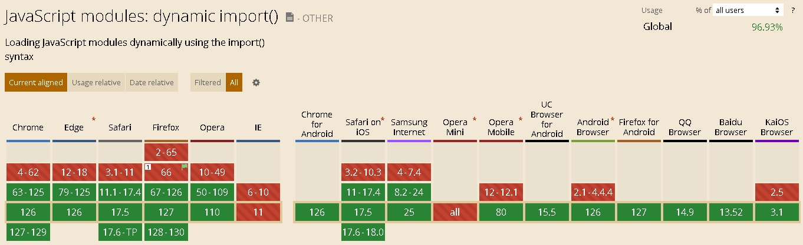
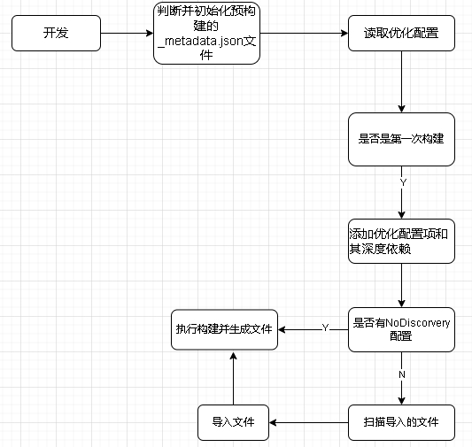
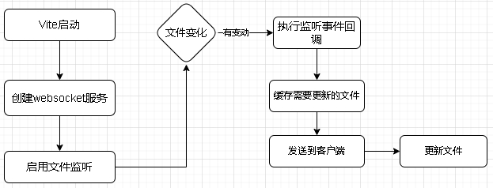
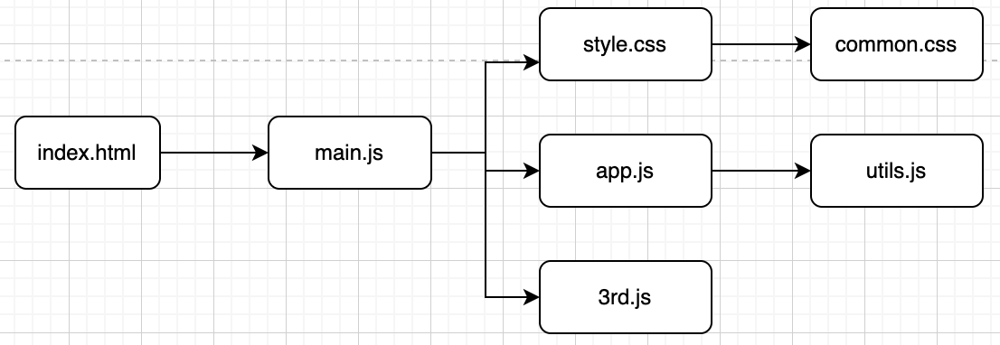
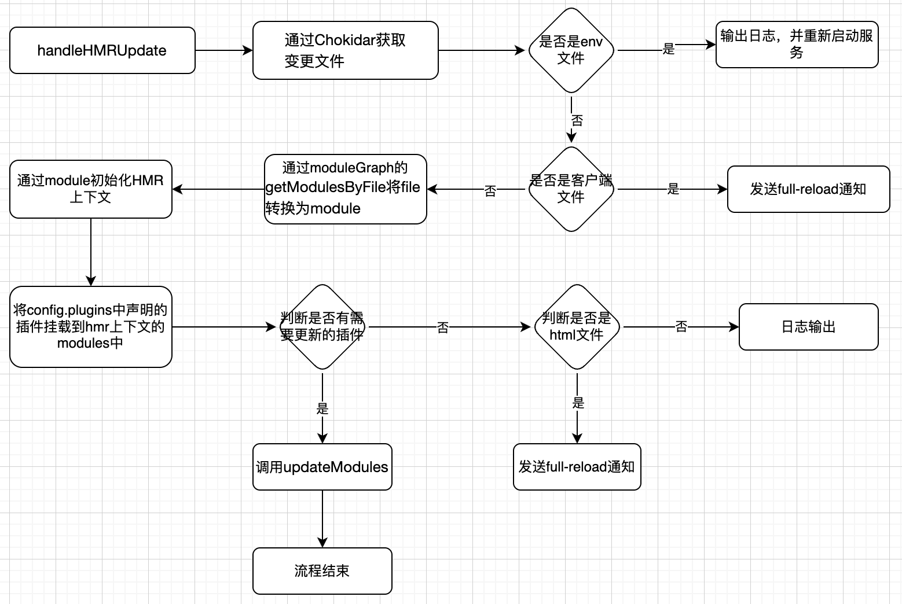
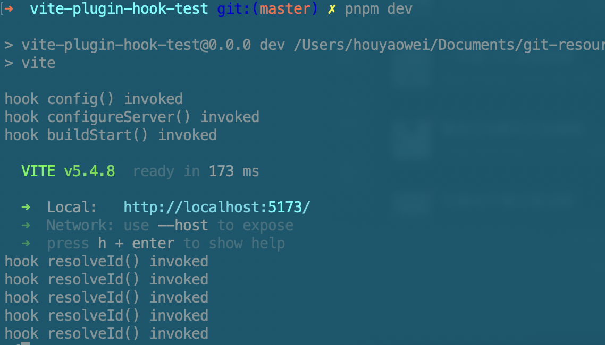
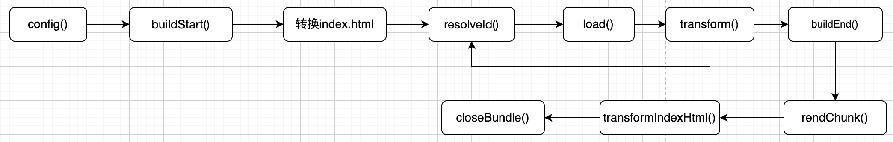

#### 构建工具Vite和Rspack实战

5.1 Vite源码分析

到目前为止，Vite已被很多前端开发所采用，是新一代打包工具。利用浏览器对ESM的天然支持（chrome61+，Edge79+，Safari10.1部分支持，Firefox60+，Opera48+）来组织代码，其实基于ESM能力打包方式最早由snowpack提出，最重要的目的是减少或者避免bundle打包。

这里我们对ESM做下简单的总结，ESM是ECMA International推出的浏览器天然支持的模块标准。不再像以前的模块标准AMD需要requirejs支持，CMD也不需要Seajs支持。在动态模块方案中也可以直接使用import方法。



<center>图5-1</center>  

从统计数据上看，ESM的支持率已接近97%。


模块开发时，是在构建一张模块依赖关系图。当模块加载时，就会从入口文件开始，最终生成完整的模块实例图。

ESM的执行从主体上分为三个阶段：

- 导入模块（GetImportedModule）: 从入口文件下载模块入口文件、下载并将所有的文件解析为模块记录（Module Record）

- 加载并实例化: 模块代码由goal symbol转换为模块记录（Module Record）， 将模块记录转换为一个模块实例，多个引用对可以映射到相同的模块记录实例。映射是宿主环境(host-defined)来完成的。

- 运行：在执行上下文(execute context)中运行代码

Vite的产生是对标Webpack的bundle方式，采用bundleless的方式。总结一下，有如下几种好处：

- 快速的冷启动，bundless+esbuild预构建。

- 模块热更新快，基于ESM的HMR，并利用浏览器缓存提升速度。

- 真正的按需编译。

Vite整合了esbuild和Rollup。esbuild是极速的打包工具，充分借助Go语言的多线程优势，预编译，快速启动。打包环节借助Rollup，为用户提供完善的开箱即用的打包能力。基于该工具构建有几个好处：1、tree-shakinng的支持。2、支持ESM 。3、优良的插件系统 。4、性能良好。作为初中级开发者而言则无需关注Vite的底层原理，更多的是需要关注官方文档配置，像resolve，css部分、build部分、配置代理的server部分、插件配置。如果你是前端负责人，在完善日常开发配置的基础上进行扩展、规避打包工具的问题。所以需要对底层技术细节做下梳理。

  该小节我们就从配置入手，剖析下Vite@5.3.2的预构建、热更新和打包的原理。

  首先看下启动阶段，先分析下esbuild的预编译优化。为什么要进行预编译？我们先总结一下原因，首先是转换导入的commonjs模块，我们介绍过，Vite是借助浏览器支持的ESM能力实现的。所以必须进行提前转换。再者就是减少文件请求数量，现在都在倡导模块化，有些三方包有几十个甚至上百个文件。功能导入是通过导入单独的文件完成的。所以就算是导入一个方法就会导入多个文件，所以就会有多个http请求。

核心代码如下：

创建httpserver的核心代码位于`packages/vite/src/node/server`目录下，借助node中的http模块中的createServer创建server实例。

在创建httpserver后，实用listen方法监听每个http连接。Vite重写了Node内置的listen方法，以保证提前进行预编译（initServer）

```javascript
if (!middlewareMode && httpServer) {
    // overwrite listen to init optimizer before server start
    const listen = httpServer.listen.bind(httpServer)
    httpServer.listen = (async (port: number, ...args: any[]) => {
      try {
        // ensure ws server started
        hot.listen()
        await initServer()
      } catch (e) {
        httpServer.emit('error', e)
        return
      }
      return listen(port, ...args)
    }) 
  } else {
   ...
}
```

initServer方法中调用initDepsOptimizer

```javascript
const initServer = async () => {
	...
    initingServer = (async function () {
      ...
      // start deps optimizer after all container plugins are ready
      if (isDepsOptimizerEnabled(config, false)) {
        await initDepsOptimizer(config, server)
      }
     ...
    })()
    return initingServer
  }
```

在initDepsOptimizer中调用createDepsOptimizer，在createDepsOptimizer方法中初始化cachedMetadata配置文件_metadata.json，该配置文件及其预构建产出的文件会存放到node_modules/.vite目录中。

接下来读取优化配置，

```js
export function getDepOptimizationConfig(
  config: ResolvedConfig,
  ssr: boolean,
): DepOptimizationConfig {
  return ssr ? config.ssr.optimizeDeps : config.optimizeDeps
}
```

如果是服务器端渲染就读取vite配置文件中的ssr.optimizeDeps，否则就读取optimizeDeps字段。

Vite根据是否已经缓存的预构建文件来判断是初次构建

```javascript
 if (!cachedMetadata) {
    currentlyProcessing = true
    const manuallyIncludedDeps: Record<string, string> = {}
    await addManuallyIncludedOptimizeDeps(manuallyIncludedDeps, config, ssr)

    const manuallyIncludedDepsInfo = toDiscoveredDependencies(
      ...
    )
    for (const depInfo of Object.values(manuallyIncludedDepsInfo)) {
      addOptimizedDepInfo(metadata, 'discovered', {
        ...depInfo,
        processing: depOptimizationProcessing.promise,
      })
      newDepsDiscovered = true
    }
```

当所有的静态文件导入后开始进入到预编译流程。在addManuallyIncludedOptimizeDeps中添加优化配置项（前面config文件中的optimizeDeps）。toDiscoveredDependencies深度寻找优化依赖项。并把这些依赖项添加到_metadata.json中的discovered中

```javascript
for (const depInfo of Object.values(manuallyIncludedDepsInfo)) {
  addOptimizedDepInfo(metadata, 'discovered', {
    ...depInfo,
    processing: depOptimizationProcessing.promise,
  })
  newDepsDiscovered = true
}
```

如果未发现优化配置，会立即调用runOptimizer，执行构建产物写入，否则由discoverProjectDependencies重新遍历项目依赖，导入文件。

```javascript
if (noDiscovery) {
      runOptimizer()
    } else {
      // Important, the scanner is dev only
      depsOptimizer.scanProcessing = new Promise((resolve) => {
        ;(async () => {
          try {
            discover = discoverProjectDependencies(config) //导入项目依赖
          	...
            const manuallyIncluded = Object.keys(manuallyIncludedDepsInfo)
            discoveredDepsWhileScanning.push(
              ...Object.keys(metadata.discovered).filter(
                (dep) => !deps[dep] && !manuallyIncluded.includes(dep),
              ),
            )
			...
            optimizationResult = runOptimizeDeps(config, knownDeps, ssr)
          } catch (e) {}
        })()
      })
    }
  }
```

下面看下搜索项目依赖的过程，这个方法

```javascript
export function discoverProjectDependencies(config: ResolvedConfig): {
  cancel: () => Promise<void>
  result: Promise<Record<string, string>>
} {
  const { cancel, result } = scanImports(config) //导入项目依赖的核心方法
  return {
    cancel,
    result: result.then(({ deps, missing }) => {
      const missingIds = Object.keys(missing)
	  ...
      return deps
    }),
  }
}
```

scanImports方法中执行prepareEsbuildScanner，借助esbuild的context方法导入文件。

```javascript
async function prepareEsbuildScanner(
  config: ResolvedConfig,
  entries: string[],
  deps: Record<string, string>,
  missing: Record<string, string>,
  scanContext?: { cancelled: boolean },
): Promise<BuildContext | undefined> {
  const container = await createPluginContainer(config)
  ...
  return await esbuild.context({
    absWorkingDir: process.cwd(),
    write: false,
    stdin: {
      contents: entries.map((e) => `import ${JSON.stringify(e)}`).join('\n'),
      loader: 'js',
    },
    bundle: true,
    format: 'esm',
    logLevel: 'silent',
    plugins: [...plugins, plugin],
    ...esbuildOptions,
    tsconfigRaw,
  })
}
```

搜索开发依赖结束后，由方法runOptimizeDeps执行预构建，并写入文件。

预构建的大概流程是这样的。



<center>图5-2</center>  

热更新

目前所有的打包工具实现热更新的思路都比较类似，主要是通过WebSocket创建浏览器和服务器的通信，通过WS监听文件的改变。当源文件有修改时，服务端发送消息通知客户端修改相应的代码，并进行重新代码编译。

Vite中由ws库创建WebSocket服务，由Chokidar负责监听文件系统的变化。熟悉nodejs的朋友可能会有疑问，为什么不采用fs.watch或者fs.watchFile监听文件变化，默认支持的效率不是更好吗？这里就不得不介绍一下fs.watch的不足。

1、事件报告两次。先看一个入门的例子。

```js
import { watch } from 'node:fs';
watch('./', (eventType, filename) => {
  console.log(`event type is: ${eventType}`);
  if (filename) {
    console.log(`filename provided: ${filename}`);
  } else {
    console.log('filename not provided');
  }
}); 
```

通过watch监听当前目录下的文件，当修改某一个文件是，watch能够进行捕捉到，并执行回调。通过控制台打印可以看到，触发了两次回调

```shell
filename provided: yyy.json
event type is: change
filename provided: yyy.json
event type is: change
```

2、修改、删除和恢复文件都会报告事件为rename

3、在MacOS和windows环境中支持地轨监听（recursive watching），遗憾的是在Linux中并不支持

在Chokidar中以上问题都进行了处理，而且也优化了事件处理和CPU占用率。Chokidar在依赖Nodejs核心模块fs的基础上，依赖各平台的 文件系统和事件API，避免了轮询模式，从而降低了资源占用率和事件处理效率。

下面我们介绍下Vite热更新的详细过程。在Vite中，热更新大概有以下几个过程：

1、创建一个websocket服务端和client

2、由Chokidar监听文件内容的变更

3、服务端有文件变更，将文件推送到客户端

4、页面加载、渲染



<center>图5-3</center>  

下面看下Vite中热更新的处理过程。

Vite在创建本地开发服务前，会进行热更新的一些相关工作(请参考文件vite/src/node/server/index.ts文件)，比如创建websocket服务、创建hmrBroadCast服务、监听文件......

```javascript
const ws = createWebSocketServer(httpServer, config, httpsOptions)
const hot = createHMRBroadcaster().addChannel(ws).addChannel(createServerHMRChannel())
```

websocket服务前面我们做过简要介绍，用来建立客户端和服务端的长连接，采用全双工的方式进行通信，方法createWebSocketServer在ws.ts中进行声明，该方法主要创建websocket并进行监听（on），移除监听（off），消息发送（send）、错误处理的封装。

```javascript
export function createWebSocketServer(
  server: HttpServer | null,
  config: ResolvedConfig,
  httpsOptions?: HttpsServerOptions,
): WebSocketServer {
	...
  let wss: WebSocketServerRaw_  //ws库
  let wsHttpServer: Server | undefined = undefined

  const hmr = isObject(config.server.hmr) && config.server.hmr
  const hmrServer = hmr && hmr.server
  const hmrPort = hmr && hmr.port
  const wsServer = hmrServer || (portsAreCompatible && server)
	//省略部分代码
  const route = ((_, res) => {
    const body = STATUS_CODES[statusCode]
    res.end(body)
    if (httpsOptions) {
      wsHttpServer = createHttpsServer(httpsOptions, route)
    } else {
      wsHttpServer = createHttpServer(route)
    }
    wss = new WebSocketServerRaw({ server: wsHttpServer })
  }
  wss.on('connection', (socket) => {
  })
  wss.on('error', (e: Error & { code: string }) => {
  })
```

对于BroadCast服务也不难理解，Web应用中，客户端和服务器通常是多对一的关系，如果多个客户端（或者浏览器）连接同一个服务器，就需要和服务器建立多少个websocket连接，当需要热更新时，就需要为每一个渠道发送需要更新的文件。

文件位置：vite/src/node/server/hmr.ts

```javascript
export function createHMRBroadcaster(): HMRBroadcaster {
  const channels: HMRChannel[] = []
  const readyChannels = new WeakSet<HMRChannel>()
  const broadcaster: HMRBroadcaster = {
    ...
    addChannel(channel) {
      if (channels.some((c) => c.name === channel.name)) {
        throw new Error(`HMR channel "${channel.name}" is already defined.`)
      }
      channels.push(channel)
      return broadcaster
    },
    on(event: string, listener: (...args: any[]) => any) {
      // emit connection event only when all channels are ready
      if (event === 'connection') {
        // make a copy so we don't wait for channels that might be added after this is triggered
        const channels = this.channels
        channels.forEach((channel) =>
          channel.on('connection', () => {
            readyChannels.add(channel)
            if (channels.every((c) => readyChannels.has(c))) {
              listener()
            }
          }),
        )
        return
      }
      channels.forEach((channel) => channel.on(event, listener))
      return
    },
    off(event, listener) {
      channels.forEach((channel) => channel.off(event, listener))
      return
    },
    send(...args: any[]) {
      channels.forEach((channel) => channel.send(...(args as [any])))
    },
    listen() {
      channels.forEach((channel) => channel.listen())
    },
    close() {
      return Promise.all(channels.map((channel) => channel.close()))
    },
  }
  return broadcaster
}
```

在Vite中可以在server.watch中设置要监听的文件，这些文件会传递给chokidar。对应源码中的配置

文件位置：vite/src/node/server/index.ts

```javascript
const watchEnabled = serverConfig.watch !== null
const watcher = watchEnabled
  ? (chokidar.watch(
      // config file dependencies and env file might be outside of root
      [
        root,
        ...config.configFileDependencies,
        ...getEnvFilesForMode(config.mode, config.envDir),
        ...(publicDir && publicFiles ? [publicDir] : []),
      ],
      resolvedWatchOptions, //watch配置
    ) as FSWatcher)
  : createNoopWatcher(resolvedWatchOptions)
//热更新核心组件
 const moduleGraph: ModuleGraph = new ModuleGraph((url, ssr) =>
    container.resolveId(url, undefined, { ssr }),
  )
```

serverConfig为config配置解构后的server配置。如果没有关于watch的配置，vite会借助node:events内置的事件分发器EventEmitter实现一套和chokidar兼容的API（add，unwatch，ref，unref，close）

文件位置：vite/src/node/watch.ts

```javascript
class NoopWatcher extends EventEmitter implements FSWatcher {
  add() {
  }
  unwatch() {
  }
  getWatched() {
  }
  ref() {
  }
  unref() {
  }
  async close() {
  }
}
export function createNoopWatcher(options: WatchOptions): FSWatcher {
  return new NoopWatcher(options)
}
```

watcher实例初始化，通过on方法监听文件的变化，比较常用的事件主要有如下几个：  

- change事件：文件发生改变
- add：监控的目录下新增加文件
- unlink：文件删除
- addDir: 增加目录
- unlinkDir: 目录删除
- ready：初始化扫描结束，监听文件改变

文件位置：vite/src/node/server/index.ts

```javascript
 watcher.on('change', async (file) => {
   file = normalizePath(file)
    await container.watchChange(file, { event: 'update' })
    moduleGraph.onFileChange(file)
    await onHMRUpdate('update', file)
  })
  watcher.on('add', (file) => {
  })
  watcher.on('unlink', (file) => {
  })
```

Vite中热更新有两个重要的模块：ModuleGraph和handleHMRUpdate。ModuleGraph是Vite定义的用来记录整个应用模块依赖图和热更新状态，在该类内部定义了多个map，这些map分别是`url`、`id`、`file`等与`ModuleNode`的映射。

文件位置：vite/src/node/server/moduleGraph.ts

```javascript
urlToModuleMap = new Map<string, ModuleNode>()
idToModuleMap = new Map<string, ModuleNode>()
etagToModuleMap = new Map<string, ModuleNode>()
fileToModulesMap = new Map<string, Set<ModuleNode>>()
safeModulesPath = new Set<string>()
```

就像一个简易的Vite项目，文件依赖关系用图形化的表现方式可能是这样的一样：



<center>图5-4</center> 

Vite为了记录整个应用的ModuleGraph，需要在每次导入模块（import，require）时、声明插件（plugin）时、服务启动处理index.html时都会在ModuleGraph中进行注册。在需要获取Module信息的时候，可以使用 moduleGraph.getModuleById(模块id)的方式获取模块信息。当然获取模块也提供了其他的方法，如getModuleByUrl和getModulesByFile的方式。

moduleGraph.onFileChange这个函数：主要是用来清空被修改文件对应的ModuleNode对象的transformResult 属性，使之前的模块已有的转换缓存失效。这也就是`Vite`在热更新里的缓存机制。

```js
onFileChange(file: string): void {
    const mods = this.getModulesByFile(file)
    if (mods) {
      const seen = new Set<ModuleNode>()
      mods.forEach((mod) => {
        this.invalidateModule(mod, seen)
      })
    }
  }
  invalidateModule(
    mod: ModuleNode,
    ...  //省略其他参数
  ): void {
    ...
    mod.transformResult = null //清除转换结果
    mod.ssrTransformResult = null
    ...
  }
```

handleHMRUpdate模块主要是监听文件的更改，进行处理和判断通过`WebSocket`给客户端发送消息通知客户端去请求新的模块代码。

文件位置：vite/src/node/server/hmr.ts

工作流程如下图所示：



<center>图5-5</center> 

在客户端测，当建立websocket连接后，通过注册message事件监听服务端推送的内容。客户端文件位于：vite/src/client/client.ts.

```javascript
socket.addEventListener('message', async ({ data }) => {
  handleMessage(JSON.parse(data))
})
```

在handleMessage中区分消息类型（connected、update、custom、full-reload、prune等）进行不同的处理。在实际开发中，热更新使用最频繁的是update(动态加载热更新模块)和full-reload(刷新整个页面)事件。


5.2 Vite插件原理及实现

Vite插件扩展了Rollup的插件接口。所以插件即可以兼容Rollup，还可以仅为Vite专有。但是需要遵循各自的约定:

- Rollup：插件应该有一个带 `rollup-plugin-` 前缀、语义清晰的名称；package.json 中包含 `rollup-plugin` 关键字；插件必须测试；尽量使用异步方法；如果是虚拟模块，需要以`\0`开头；等等。
- Vite：插件应该有一个带 `vite-plugin-` 前缀、语义清晰的名称;在 package.json 中包含 `vite-plugin` 关键字;在插件文档中增加为什么是专属插件的说明。

为了更好地介绍插件的相关原理，还是有必要对插件的基础做基本介绍。

插件是作为一个返回实际插件对象的工厂函数，该函数当然可以接收用于支持插件行为的参数，常用的hook如下所示：

完整的配置选项：vite/src/node/plugin.ts

```javascript
export default function VitePluginAssociation() {
  return {
    name: 'vite-plugin-association',
    enforce: 'pre',
    apply: 'build',
    config(config, env){},
    closeBundle() {},
    configureServer(){},
    buildStart(options){},
    load(){},
    transform() {},
    transformIndexHtml(html){},
    renderChunk(){},
    resolveId(){}
  }
}
```

- `enforce` ：Vite独有，值可以是`pre` 或 `post` ， `pre` 优先级更高，在核心插件前调用，post是在核心插件后调用

- `apply` ：Vite独有，值可以是 `build` 或 `serve`  , 也可以是一个函数，指明插件仅在 `build` 或 `serve` 模式时调用

- `config(config, env)` ：Vite独有，可以在 vite 被解析之前修改 vite 的相关配置。钩子接收用户配置 config 和一个描述配置环境的变量env配置

- `configureServer(server)` ：Vite独有，是用来配置开发服务器的钩子，为 dev-server (connect 应用程序) 添加自定义的中间件。该钩子在内部中间件被安装前调用。

- `transformIndexHtml(html)` ：Vite独有，转换 index.html 的专用钩子。钩子接收当前的 HTML 字符串和转换上下文。

- `handleHotUpdate(ctx)`：Vite独有，执行自定义HMR更新，可以通过解构server往客户端发送自定义（type为custom）的事件
- `closeBundle()`: 在服务器关闭时被调用
- `buildStart(options)`：在每次开始构建时调用
- `load(id)`：在每个传入模块请求时被调用，可以自定义加载器，可用来返回自定义的内容，需要注意的是该hook是在build阶段调用，apply为serve时不执行
- `transform(code, id)`：在每个传入模块请求时被调用，主要是用来转换单个模块；
- `renderChunk(code, chunk, options)`：转译单个的chunk时触发。rollup 输出每一个chunk文件的时候都会调用；
- `resolveId(source, importer, options)`：在每个传入模块请求时被调用，创建自定义确认函数，可以用来定位第三方依赖；

这么多钩子（hook），对于插件开发者新手来说是个不小的挑战，因为新手同学需要了解各个hook的作用及其执行顺序，在能在插件开发中选用合适的hook进行相互配合。下面我们通过简单的例子看下在build和serve模式下钩子的执行顺序。

首先，借用Vite脚手架初始化项目结构，在src中新建插件文件。

```javascript
export default function VitePluginsHookTest() {
  return {
    name: "vite-plugin-hook-test",
    enforce: "pre",
    apply: "serve",
    config(config, env) {
      console.log("hook config() invoked");
    },
    configureServer() {
      console.log("hook configureServer() invoked");
    },
    buildStart(options) {
      console.log("hook buildStart() invoked");
    },
    buildEnd(options) {
      console.log("hook buildEnd() invoked");
    },
    load() {
      console.log("hook load() invoked");
    },
    resolveId() {
      console.log("hook resolveId() invoked");
    },
    transformIndexHtml(html) {
      console.log("hook transformIndexHtml() invoked");
    },
    renderChunk() {
      console.log("hook renderChunk() invoked");
    },
    closeBundle() {
      console.log("hook closeBundle() invoked");
    },
  };
}

```

我们先测试apply为serve的场景，即启动开发



<center>图5-6</center> 

Vite服务启动，结果如图5-7所示。


<center>图5-7</center> 

从执行结果看，resolveId钩子函数执行多次，这是因为每次模块导入都会触发resolveId，解析文件路径，比如常用的alias配置。

现在测试apply为build的场景，执行build打包命令，执行结果如下（由于执行结果较多，只显示相关部分）

```shell
➜  vite-plugin-hook-test git:(master) ✗ pnpm build
> vite build

hook config() invoked
hook buildStart() invoked
hook resolveId() invoked
hook load() invoked
hook transform() invoked
transforming (1) index.html
hook resolveId() invoked
hook resolveId() invoked
hook load() invoked
//load，resolveId，transform 循环执行加载、解析文件、转换
hook transform() invoked
transforming (16) node_modules/.pnpm/@vue+reactivity@3.5.12/node_modules/@vue/reactivity/dist/reactivity.esm-bundler.js
hook resolveId() invoked
hook buildEnd() invoked
✓ 16 modules transformed.
hook renderChunk() invoked
rendering chunks (1)...
hook transformIndexHtml() invoked
//省略项目资源文件输入显示
hook closeBundle() invoked
```

从上面的输出可以看出来，打包过程大体分为4个阶段：1、配置解析阶段  2、构建阶段   3、生成产物阶段  4、构建关闭。需要强调的是，对于插件开发来说，特别需要注意通用钩子的执行过程

- resolveId
- load
- transform

这三个钩子自上而下依次执行，加载多个模块就会循环执行这个过程。



<center>图5-8</center> 


5.3 基于Vite的可插拔组件设计

5.4 Vite+Vue3避坑指南

5.5 Rspack实战

Rspack是有有字节在2023年3月10日发布的基于Rust的打包工具，但是具备兼容大部分Webpack生态的能力，在webpack生态下的loader，plugins在Rspack下已经兼容，像常用的babel-loader、less-loader、sass-loader等。这对熟悉webpack的开发者来说是个福音，既有熟悉的配置项目又有高性能的开发体验、构建产出。

另外Rspack在前端社区了产生了不小的影响，像Monorepo的框架Nx也对Rspack插件支持；Netlify也接入了Rspack，性能提升非常明显。

官方也提供了对常用对Webpack的迁移方案，主要包含babel-loader，推荐同样使用Rust实现的swc-loader；推荐 CSS 模块类型 ，内置的 CSS 模块类型预制了对 CSS、CSS HMR、CSS Modules 以及 CSS 提取功能的支持，不需要再单独配置，减少了配置的工作量；使用 Asset Modules 来代替 file-loader 和 url-loader。

在Rspack中，资源（图片，字体，视频）位高权重，这些资源都可以被内置处理，不再借助其他loader。

```js
module.exports = {
  module: {
    rules: [
      {
        test: /\.(png|svg|jpg|jpeg|gif|webp)$/i,
        type: 'asset/resource',
      },
      {
        test: /\.(woff|woff2|eot|ttf|otf)$/i,
        type: 'asset',
      }
    ],
  },
};
```

在web框架开发方面也提供了脚手架的能力。像React、Vue2&3、Solidjs、Nextjs等。

下面我们看一下使用Rspack创建一个基本的Vue3工程。

```
 "dev": "rspack serve",
 "build": "rspack build"
```

首先，借助脚手架生成项目基本结构，框架选择时请选择Vue3。

```shell
pnpm create rspack@latest
```

Rspack官方提供了3个基础的命令，dev、build、preview

```shell
"dev": "rsbuild dev --open",
"build": "rsbuild build",
"preview": "rsbuild preview"
```

代码结构和静态资源不需要做任何的改变，原目录照样移动即可。重点是配置文件rspack.config.js的配置。

1、基础配置

- context：构建的基础路径，是entry和output中的基础路径
- entry：入口文件
- output：需要需要自定义文件的hash值或者根据环境区分打包文件，需要单独配置该项
- devServer：开发环境配置
- module：配置如何解析模块，如前面介绍的图片和字体的解析使用asset，对样式（scss，stylus，css）的处理使用javascript/auto
- Resolve:  配置模块的解析逻辑，如常用的alias别名
- plugins：插件声明入口，如在webpack中常用的HtmlWebpackPlugin，DefinePlugin

对前端开发者而言，需要熟悉上面的基础配置项。但是需要都还不止这些基础配置。还提供了默认的优化配置，和webpack中的配置相同。

```js
optimization: {
		sideEffects: true,
		splitChunks: {
			chunks: 'all',
			minChunks: 1,
			minSize: 500 * 1024,
			maxSize: 1000 * 1024,
			maxAsyncRequests: 30,
			maxInitialRequests: 30,
			cacheGroups: {
				vendors: {
				  chunks: 'all',
				  test: /[\\/]node_modules[\\/]/,
				  priority: 10,	
				  name: 'vendors',
				  reuseExistingChunk: true,
				},
				async: {
				  chunks: 'async',
				  priority: 1,
				  name: 'async',
				  reuseExistingChunk: true,
				},
			  },
		},
	},
```

对Rspack中splitChunks默认开启，但是对于需要更细粒度控制各个chunk，比如说新的chunk大小（默认是200K）,某些包打到一个chunk中，针对哪些chunk进行优化，还有就是按需加载（或者初始化页面）时并发请求的最大数等等配置。

Rspack还内置了许多非常实用的插件，能很大程度上提升我们的开发体验，这里向大家推荐几个

第一个是ProvidePlugin，这个插件会自动加载模块，再也不用将一个组件频繁导入。比如我们有一个模块，暴露给外部一个方法trim，这里需要注意的是方法或者属性必须暴露到default上面才能被正常工作。

```js
function trim(str) {
    return str.replace(/^\s+|\s+$/gm,'');
}
export default trim;
```

在rspack.config.js中的plugins中声明如下配置:

```js
new rspack.ProvidePlugin({
    ProviderComponent: path.resolve(path.join(__dirname, "src/utils/utils.js"))
})
```

ProviderComponent为自定义的模块标识符，然后需要指明rspack解析的路径。接下来就可以在任意模块中进行引用。

```js
console.log("ProviderComponent in main.js", ProviderComponent.default)
const ProviderTrimUtil = ProviderComponent.default;
console.log("ProviderTrimUtil result:", ProviderTrimUtil("  houyw "));
```

输出结果：

```shell
ProviderComponent in main.js  function trim(str)...
ProviderTrimUtil result: houyw
```

第二个插件是DefinePlugin，为环境运行提供必要的参数定义。Web开发中环境变量都是在env文件中定义。但是在Rspack中默认并不支持env文件定义(但是在Rsbuild中已经默认支持)，所以可以通过该插件预制必须的参数，但是在运行环境时需要指定不同的配置文件。

```js
new rspack.DefinePlugin({
  PRODUCTION: JSON.stringify(false),
  VERSION: JSON.stringify('0.0.1'),
  BROWSER_SUPPORTS: true
});
```

还有两个比较实用的插件是和压缩相关的，SwcCssMinimizerRspackPlugin和SwcJsMinimizerRspackPlugin。这两个是Rspack默认的css、js压缩工具。但是如果需要修改这两个地方，需要在optimization的minimizer中声明，需要注意的时，一旦声明了minimizer配置，那么默认的SwcCssMinimizerRspackPlugin和SwcJsMinimizerRspackPlugin就会失效，也就是说必须有其他的插件配置支持压缩css和js。

在配置webpack打包的工具时经常用到插件CopyWebpackplugin，可以将资源文件复制到构建目录。在rspack中默认提供了CopyRspackPlugin插件，也 实现了同步的功能。

5.6 构建工具的演进及其建议
